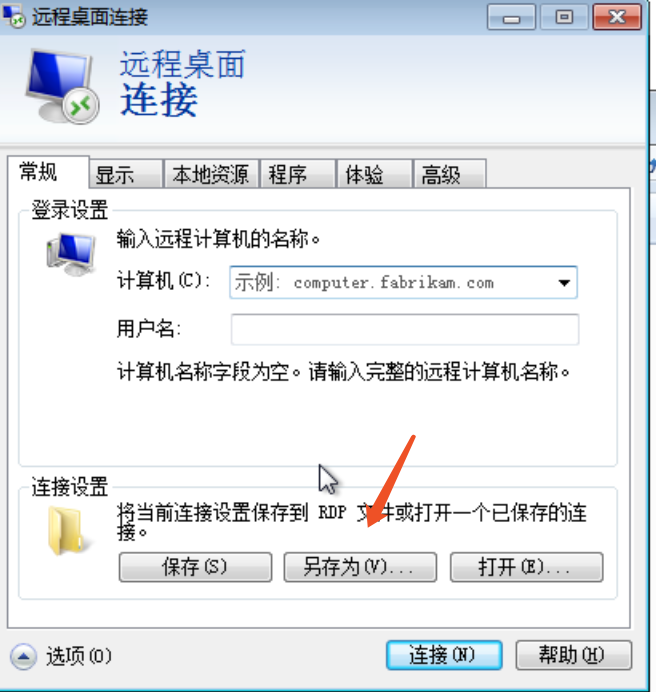
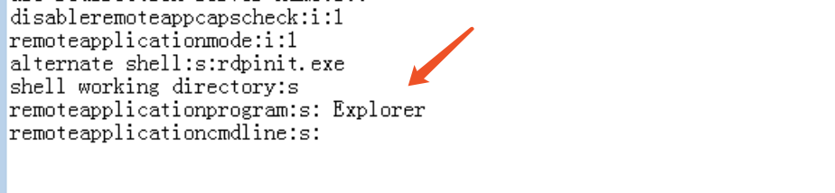
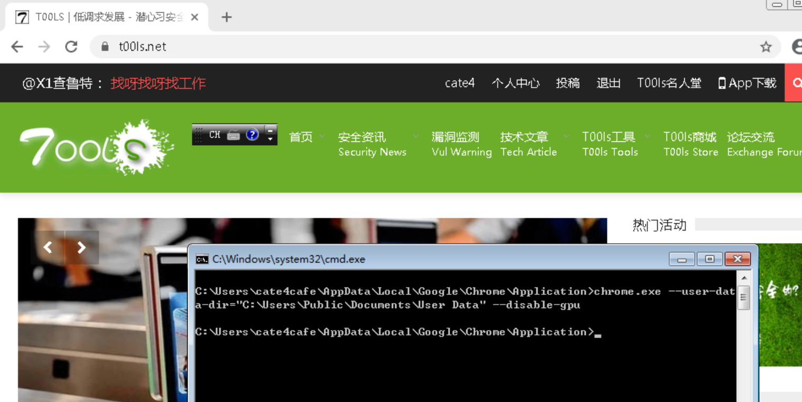

# Browser Pivot for Chrome

​		标题只是个噱头。文章介绍如何窃取当前chrome的session,以获取当前用户正在浏览的web的权限。根据[browser-pivot-for-chrome](https://ijustwannared.team/2019/03/11/browser-pivot-for-chrome/)复现。

#### 0x00 前言

​		在CS上有Browser Pivot功能,用于针对IE进行浏览器中间人攻击，劫持受感染用户的已验证Web会话。Cobalt Strike使用注入到32位和64位Internet Explorer中的代理服务器来实现浏览器透视。当浏览此代理服务器时，将继承Cookie，经过身份验证的HTTP会话和客户端SSL证书。对于chrome，作者提供使用RemoteAPP+命令行指定配置文件启动chrome的方式来达到类似效果。

#### 0x01 RemoteAPP

​		RemoteAPP是一种虚拟应用程序解决方案，无论用户使用什么操作系统，都可以使用户运行基于Windows的应用程序。它允许用户从出现在其计算机上的服务器启动虚拟应用程序，就像虚拟服务器是本地安装的一样，但实际上是在远程服务器上运行的。简而言之，RemoteAPP是RDP服务的一种，区别于远程桌面，它只在客户端打开服务端上指定的应用，如CMD。默认支持RemoteAPP服务端的系统要求最低win7 Enterprise和ULtimate，需要开启多用户登录支持，我使用[Rdpwrap](https://github.com/stascorp/rdpwrap)来实现。使用RemoteAPP可绕过chrome的校验。

#### 0x02 命令行启动Chrome

​		在终端里，可以用chrome.exe [options]的形式[指定参数](https://www.cnblogs.com/videring/articles/7243958.html)来开启chrome。通过使用chrome的远程调试模式，还可以[获取到页面cookie](https://mango.pdf.zone/stealing-chrome-cookies-without-a-password)。

#### 0x03 利用步骤

- **使用Rdpwrap开启多用户同时登录**

  `rdpwinst -i is`

- **修改注册表**

  ```
  Windows Registry Editor Version 5.00
  
  [HKEY_LOCAL_MACHINE\SOFTWARE\Microsoft\Windows NT\CurrentVersion\Terminal Server]
  
  [HKEY_LOCAL_MACHINE\SOFTWARE\Microsoft\Windows NT\CurrentVersion\Terminal Server\TSAppAllowList]
  "LicenseServers"=hex(7):00,00
  "CertificateIssuedBy"=""
  "LicensingType"=dword:00000005
  "fHasCertificate"=dword:00000000
  "CertificateExpiresOn"=""
  "CentralLicensing"=dword:00000000
  "fDisabledAllowList"=dword:00000001
  "CertificateIssuedTo"=""
  "CustomRDPSettings"="authentication level:i:2"
  
  [HKEY_LOCAL_MACHINE\SOFTWARE\Microsoft\Windows NT\CurrentVersion\Terminal Server\TSAppAllowList\Applications]
  
  [HKEY_LOCAL_MACHINE\SOFTWARE\Microsoft\Windows NT\CurrentVersion\Terminal Server\TSAppAllowList\Applications\Notepad]
  "Name"="Notepad"
  "Path"="C:\\\\windows\\\\system32\\\\notepad.exe"
  ```

- **配置rdp文件**

  在mstsc上另存为rdp文件

  

  编辑得到的rdp文件，在末尾添加配置

  

  注意箭头处要和上面注册表项里的"Name"项一致

- **卷影复制Chrome配置文件**

  在用户使用chrome时，由于占用了配置文件导致无法复制，需要使用卷影来复制。我使用[VolumeShadowCopyTools](https://github.com/PowerShellMafia/PowerSploit/blob/master/Exfiltration/VolumeShadowCopyTools.ps1)来实现。要复制的配置文件C:\Users\cate4cafe\AppData\Local\Google\Chrome\User Data，我把复制的文件放在C:\\users\\public目录下

- **使用RemoteAPP打开chrome**

  在Explorer进到chrome.exe所在目录，打开cmd，命令`chrome.exe --user-data-dir="C:\\users\\public\documents\User Data" --disable-gpu` 我在虚拟机下需要用--disable-gpu禁用chrome硬件加速才能正常启动，不然chrome会黑框。物理机上没测试。

  

  

#### 0x04 后记

​		在默认不支持RemoteAPP的系统上，或许可以参照[771-windows-7-professional-as-remoteapp-server](http://hardwarefetish.com/771-windows-7-professional-as-remoteapp-server)修改来使系统支持RemoteAPP。由于我只是个脚本菜鸡，没能成功实现。等我的偶像站长来实现吧，仰慕他！

