# Elastic EDR测试环境搭建

## 1.安装elasticsearch

```
apt-get install curl apt-transport-https
curl -s https://artifacts.elastic.co/GPG-KEY-elasticsearch | apt-key add -
echo "deb https://artifacts.elastic.co/packages/7.x/apt stable main" | tee /etc/apt/sources.list.d/elastic-7.x.list
apt-get update
apt-get install elasticsearch 
```

修改配置文件/etc/elasticsearch/elasticsearch.yml

```
network.host: <ip>
node.name: <node_name>
cluster.initial_master_nodes: ["<node_name>"]
service elasticsearch start
service elasticsearch status
```

访问http://ip:9200 检查elasticsearch是否正常启动

## 2.安装kibana

```
apt-get install kibana
server.host: "ip"
service elasticsearch start
```

访问http://ip:5601查看kibana是否正常启动

## 3.配置SSL

不配置启用SSL无法配置身份验证，无法使用fleet

新建instance.yml

```
instances:
    - name: "elasticsearch"
      ip:
        - "ip"
    - name: "kibana"
      ip:
        - "ip"
```

生成证书

```
/usr/share/elasticsearch/bin/elasticsearch-certutil cert ca --pem --in instances.yml --out certs.zip
```

解压之后配置证书

配置Elasticsearch SSL

```
mkdir /etc/elasticsearch/certs/ca -p
cp ca/ca.crt /etc/elasticsearch/certs/ca
cp elasticsearch/elasticsearch.crt /etc/elasticsearch/certs
cp elasticsearch/elasticsearch.key /etc/elasticsearch/certs
chown -R elasticsearch: /etc/elasticsearch/certs
chmod -R 770 /etc/elasticsearch/certs
```

修改配置文件

```
# Transport layer
xpack.security.transport.ssl.enabled: true
xpack.security.transport.ssl.verification_mode: certificate
xpack.security.transport.ssl.key: /etc/elasticsearch/certs/elasticsearch.key
xpack.security.transport.ssl.certificate: /etc/elasticsearch/certs/elasticsearch.crt
xpack.security.transport.ssl.certificate_authorities: [ "/etc/elasticsearch/certs/ca/ca.crt" ]

# HTTP layer
xpack.security.http.ssl.enabled: true
xpack.security.http.ssl.verification_mode: certificate
xpack.security.http.ssl.key: /etc/elasticsearch/certs/elasticsearch.key
xpack.security.http.ssl.certificate: /etc/elasticsearch/certs/elasticsearch.crt
xpack.security.http.ssl.certificate_authorities: [ "/etc/elasticsearch/certs/ca/ca.crt" ]
```

重启Elasticsearch

配置kibana SSL

```
mkdir /etc/kibana/certs/ca -p
cp ca/ca.crt /etc/kibana/certs/ca
cp kibana/kibana.crt /etc/kibana/certs
cp kibana/kibana.key /etc/kibana/certs
chown -R kibana: /etc/kibana/certs
chmod -R 770 /etc/kibana/certs
```

修改配置文件

```
elasticsearch.hosts: ["https://192.168.2.200:9200"]
elasticsearch.ssl.certificateAuthorities: ["/etc/kibana/certs/ca/ca.crt"]
elasticsearch.ssl.certificate: "/etc/kibana/certs/kibana.crt"
elasticsearch.ssl.key: "/etc/kibana/certs/kibana.key"
server.ssl.enabled: true
server.ssl.certificate: "/etc/kibana/certs/kibana.crt"
server.ssl.key: "/etc/kibana/certs/kibana.key"
```

添加身份验证

修改elasticsearch配置，添加

```
xpack.security.enabled: true
```

生成密码

```
/usr/share/elasticsearch/bin/elasticsearch-setup-passwords auto
```

修改kibana配置文件，添加

```
xpack.security.enabled: true
elasticsearch.username: "kibana_system"
elasticsearch.password: "kibana_system_password"
```

kibana其他还需要添加的其他配置

```
xpack.fleet.enabled: true        //启用fleet
xpack.fleet.agents.tlsCheckDisabled: true    //关闭fleet tls检测  可不设置这项
xpack.security.encryptionKey:"32位字符"     //需要配置才可以查看和创建检测规则
xpack.encryptedSavedObjects.encryptionKey："32位字符" //不知道干嘛的  猜测是为了重启之后维持状态的，不设置可能会重启失败
```

配置kibana语言为中文

```
i18n.locale: "zh-CN"
```

重启kibana

## 4.安装Elastic Agent

使用生成的elastic账号和密码登录elastic，在manaement选项栏里打开Fleet。打开fleet需要联网。在代理策略栏打开修改Fleet的默认策略，添加edr的策略集成

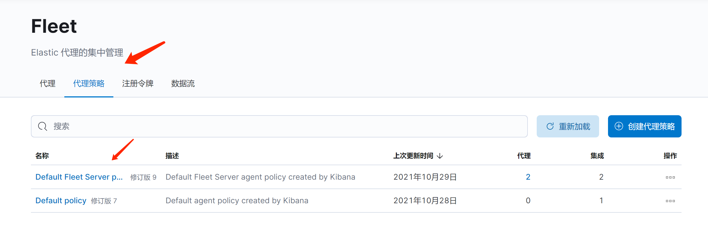

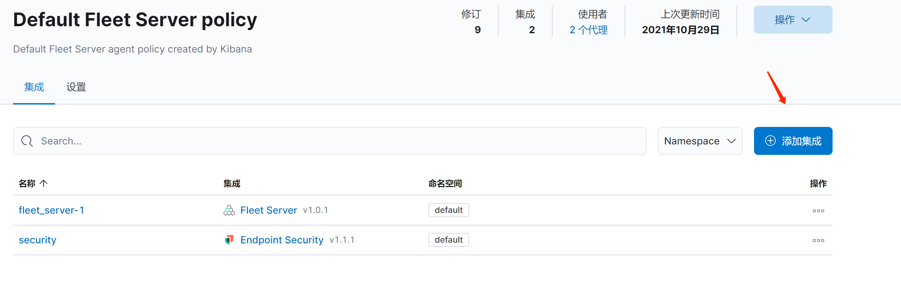

搜索 security，将EDR的策略集成进来

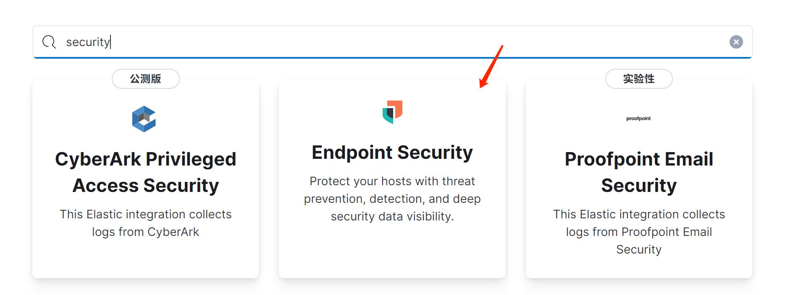

回到fleet，右上角点击**fleet设置**，设置elasticsearch主机

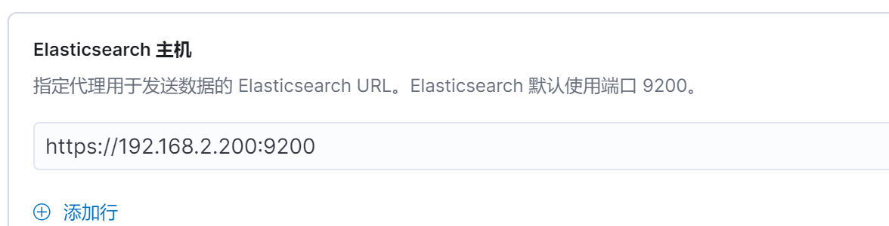

回到Fleet 代理栏，点击 **添加代理**，打开代理设置

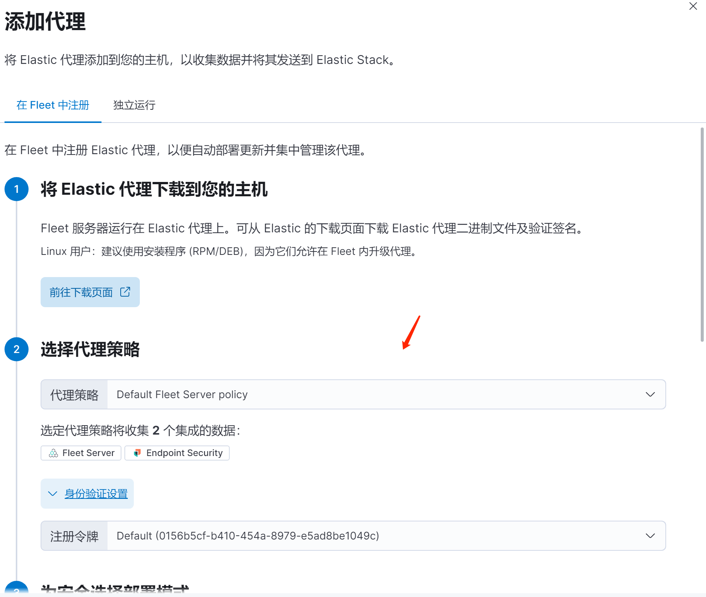

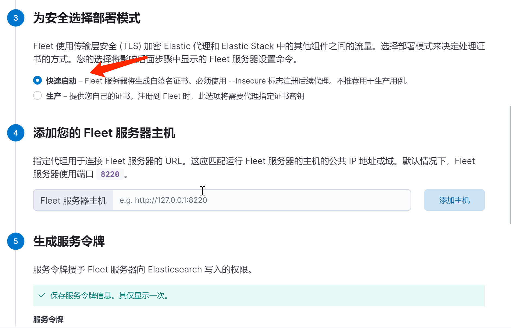

Fleet服务主机填写kibana主机的ip，端口号为8220，https。生成服务令牌。最后，fleet会给出安装agent的命令

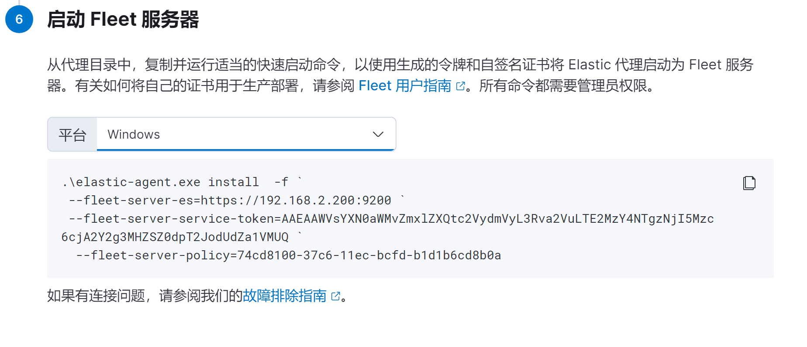

在https://www.elastic.co/downloads/past-releases/elastic-agent-7-15-1 下载对应平台的Agent。安装前需要系统信任elastic的证书

- windows

  本地安全策略-安全设置-公钥策略-证书路径验证设置-勾选 允许用户信任的根 CA 用于验证证书/允许用户信任对等信任证书/第三方根CA和企业根CA-确定

  复制配置SSL时生成的ca.crt到windows，双击将证书安装到**本地计算机** 受信任的颁发机构，为了不出错我还安装到了第三方根证书颁发机构

- linux

  证书放到/usr/local/share/ca-certificates路径，执行命令sudo update-ca-certificates

根据fleet给出的命令安装agent即可。安装成功可在fleet看到在线的agent

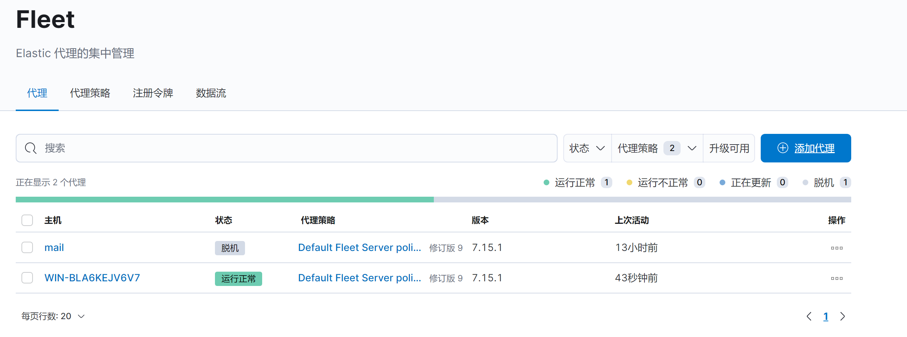

点击**数据流**，有数据说明agent已经正常工作

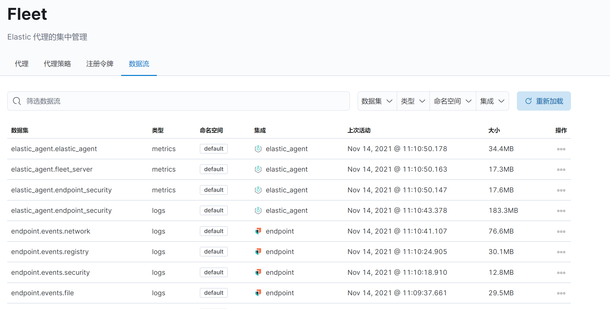

## 5.查看告警，搜索日志

kibana侧栏点击security-告警  可以看到当前的告警，分析告警事件，告警的检测规则，告警映射的ATT&CK

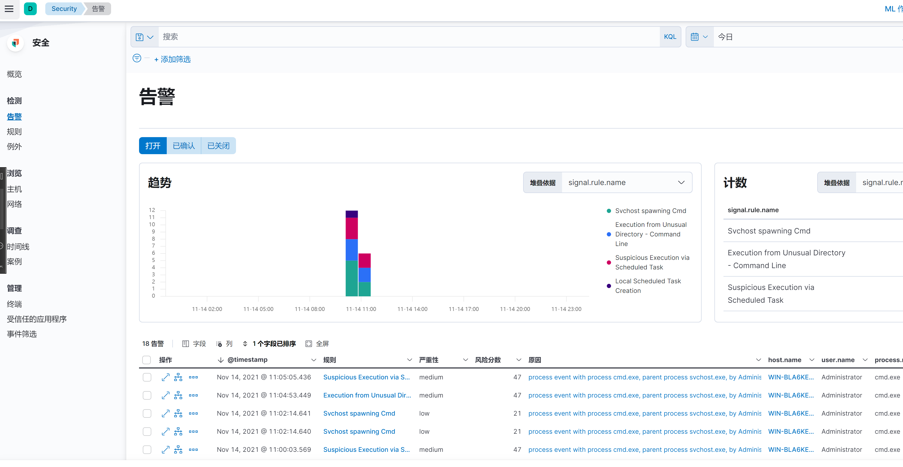

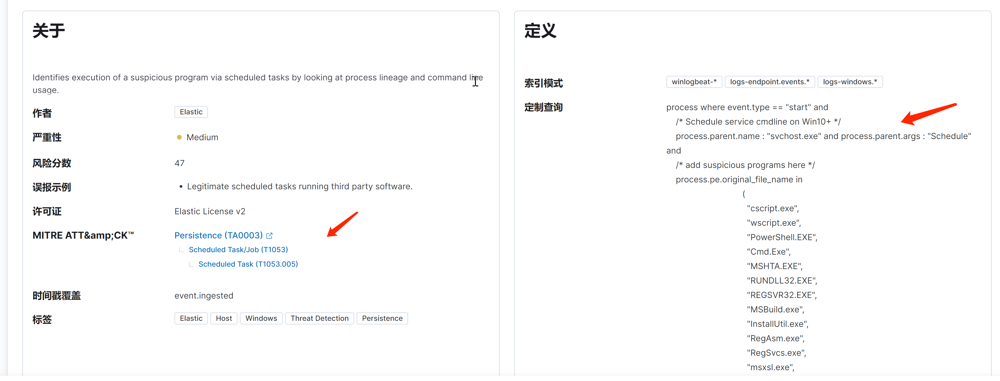

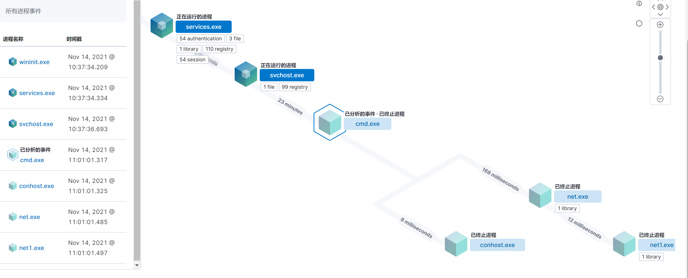

点击告警页面的**管理规则**，可以自行添加自定义的规则


kibana侧栏打开Analytics的Discover，可以根据需要搜索日志

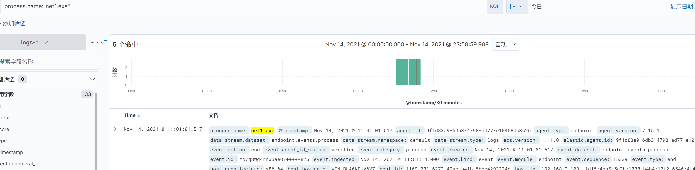


## 6.坑点

- kibana启动时需要用 -C 参数指定配置文件的路径

- agent安装时提示证书问题，则需要安装时添加参数指定证书路径  --fleet-server-es-ca=C:\Users\Administrator\Desktop\ca.crt

- fleet添加代理时无法选择策略。management-开发工具-控制台 

  ```
  POST .kibana/_delete_by_query?q=ingest-agent-policies.is_default_fleet_server:true
  ```

  发送请求

- 无法启动kibana服务    手动启动 /usr/share/kibana/bin/kibana -C 配置文件路径

- root身份启动kibana ./kibana --allow-root
