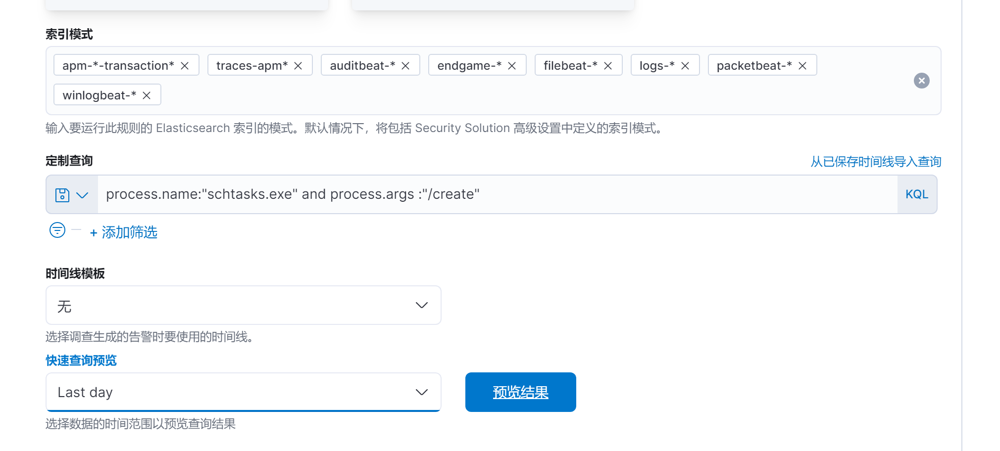
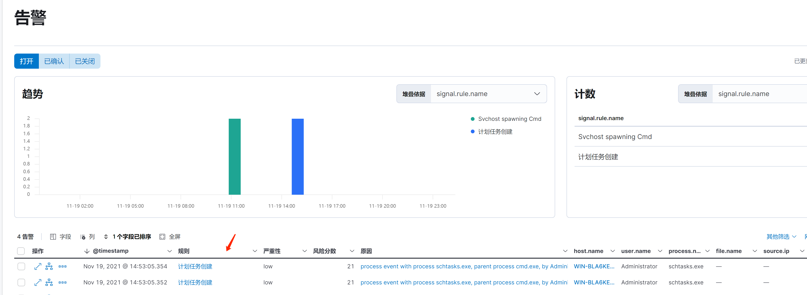

# Elastic威胁分析与规则编写

## 1.前言

在实际测试中，发现Elastic自带的告警规则其局限性且容易绕过。针对一些场景，比如通过注册表创建计划任务、诸如atexec类通过远程调用命名管道创建计划任务、powershell/iexplore远程落地文件等行为，会出现检测不到的情况。所以需要结合攻击手法以及攻击过程中产生的特征编写适合的规则

## 2.ECS

Elastic使用ECS规范了定义了EDR在 Elasticsearch 中存储事件数据时要使用的一组通用字段，遵从ECS规范的数据在kibana中可以使用简洁的语法筛选出匹配的数据。ECS定义了许多字段集，用于对Agent产生的数据源进行分类。例如：process集、agent集、file集、event集、network集等。顾名思义，process对应的是产生数据源的进程相关的数据，agent集是收集该数据源的agent相关数据，而file集则是该数据源或者说是产生数据源进程对文件系统操作的数据。event集和network集则是操作日志和网络活动产生的数据。在字段集下，还定义了字段名去区分每个字段代表的信息。字段集和字段之间用 . 号连接。例如：process.name字段对应的是进程名。直观展示如下


常用的字段：

```
process.name 进程名
process.pe.original_file_name 进程最终调用的PE镜像文件
process.parent.name  父进程
process.args 进程参数
dns.question.name dns解析域名
registry.key  注册表键
file.path 包含文件名的文件绝对路径
file.directory 文件路径
```

ECS详见:[Elastic Common Schema](https://www.elastic.co/guide/en/ecs/current/index.html)

## 3.kibana查询语法KQL

KQL是一种使用自由文本搜索或基于字段的搜索过滤 Elasticsearch 数据的简单语法。KQL 仅用于过滤数据，并没有对数据进行排序或聚合的作用。KQL是简化了的EQL。

**语法：**

1. 简单搜索

   ```
   process.name:"net.exe"  关键字匹配
   file.name:aaa bbb     空格会自动分词，语句会搜索出文件名是aaa或bbb的结果，要匹配包含空格的字段需要用双引号包起来
   ```

2. 条件运算符

   ```
   > >= < <=
   age >= 10
   ```

3. 逻辑运算符

   ```
   and or not
   和编程语言易一样
   ```

4. 优先级

   ```
   （）
   ```

5. 字段运算简化

   ```
   age:(10 or 20) 等价于 age=10 or age=20
   ```

6. 通配符

   ```
   *    匹配多个任意字符
   通配符支持字段名通配和值通配
   file.pat*:ddddd.txt
   file.path：*ddd*.txt
   ```

在kibana中，还可以使用[Lucene](https://www.cnblogs.com/xing901022/p/4974977.html)语法查询


## 4.创建自定义告警规则

进入kibana **Security**-**告警**-**管理规则**-**创建新规则**


kibana提供了五种规则类型，可以灵活使用。以KQL为例，创建一条检测schtasks.exe创建计划任务的简单规则。



创建查询规则


设置规则告警严重性以及分线分数、标签


高级设置里可以设置规则引用的来源，映射ATT&CK以及处理告警的调查指南


设置规则运行间隔时间

继续创建完规则之后可以在**定制规则**栏里查看新建的规则


效果展示




## 5.规则对比

以自带规则和自定义规则对比说明自定义规则的必要性，以创建计划任务为例，elastic给出检测计划任务的相关规则有9条，可在[rules/windows](rules/windows)页面下搜索scheduled查看。

### 5.1 自带规则的局限性

以比较详细的[persistence_local_scheduled_task_creation](https://github.com/elastic/detection-rules/blob/main/rules/windows/persistence_local_scheduled_task_creation.toml)分析，其规则如下([EQL语言](https://www.elastic.co/guide/en/elasticsearch/reference/current/eql-syntax.html#eql-basic-syntax))

```
sequence with maxspan=1m
  [process where event.type != "end" and
    ((process.name : ("cmd.exe", "wscript.exe", "rundll32.exe", "regsvr32.exe", "wmic.exe", "mshta.exe",
                      "powershell.exe", "pwsh.exe", "powershell_ise.exe", "WmiPrvSe.exe", "wsmprovhost.exe", "winrshost.exe") or
    process.pe.original_file_name : ("cmd.exe", "wscript.exe", "rundll32.exe", "regsvr32.exe", "wmic.exe", "mshta.exe",
                                     "powershell.exe", "pwsh.dll", "powershell_ise.exe", "WmiPrvSe.exe", "wsmprovhost.exe",
                                     "winrshost.exe")) or
    process.code_signature.trusted == false)] by process.entity_id
  [process where event.type == "start" and
    (process.name : "schtasks.exe" or process.pe.original_file_name == "schtasks.exe") and
    process.args : ("/create", "-create") and process.args : ("/RU", "/SC", "/TN", "/TR", "/F", "/XML") and
    /* exclude SYSTEM SIDs - look for task creations by non-SYSTEM user */
    not user.id : ("S-1-5-18", "S-1-5-19", "S-1-5-20")] by process.parent.entity_id
```

该规则的大意是按时间序列查找在1分钟内,拥有相同程序ID的cmd.exe、rundll32.exe之类的程序以及无签名文件，以不是system用户、本地服务用户、网络服务用户权限且拥有相同父进程调用schtasks.exe创建计划任务的动作。规则假想了攻击者在1分钟内执行完毕创建计划任务的命令，且攻击者只有调用schtasks.exe创建计划任务的一种方式。然而，在实际的攻击行为中，攻击者用于创建计划任务的手法还有直接调用API、atexe.exe等横向工具远程通过atsvc命名管道调用SchRpcRegisterTask创建计划任务、写注册表等。或者攻击者启动了cmd.exe却忘记了schtasks的用法需要去查询，等查询到再执行命令，已经过了一分钟。在上述两种情况下，规则无法检测出创建计划任务也就无法告警。

### 5.2 自建规则

上文说到攻击者用于创建计划任务的手法有调用API、通过atsvc命名管道调用SchRpcRegisterTask、写注册表、schtasks.exe等。这些方法除了写注册表直接注册任务之外，均会在C\:\\Windows\\System32\\Tasks路径下落地以计划任务名命名的文件。所以检测计划任务的更详细和全面的规则可以这么写(KQL)

```
(registry.key :*CurrentVersion\\Schedule\\TaskCache\\Tree* and process.name:(regedit.exe or cmd.exe or powershell.exe )) or (file.path:C\:\\Windows\\System32\\Tasks\\* and event.type:"creation")  and not user.id:(S-1-5-18* or S-1-5-19* or S-1-5-20*)
```

拆开来看

```
registry.key :*CurrentVersion\\Schedule\\TaskCache\\Tree* and process.name:(regedit.exe or cmd.exe or powershell.exe )   //监测写注册表创建计划任务 process.name可替换为process.pe.original_file_name
```

```
file.path:C\:\\Windows\\System32\\Tasks\\* and event.type:"creation"//监测非写注册表创建的加护任务。可以监测到atexec等远程执行命令程序在本机创建的计划任务，创建此类计划任务的进程为svchost.exe且一般没有参数。
```

```
  and not user.id:(S-1-5-18* or S-1-5-19* or S-1-5-20*)  监测非system、	LOCAL SERVICE 、NET SERVICE创建的计划任务。
```

### 5.3 对比

在两条规则都开启的前提下


查看告警，可以看到自带的规则无论是命令行执行schtasks(cmd和schtask命令间隔超过1分钟)还是atexec创建的计划任务都没有告警


箭头标注的第一条告警为atexec创建计划任务的告警，第二条为schtask的告警。查看告警详情

atexec的的告警详情


cmd调用schtasks的告警详情


注：这里需要在进程树里找到并点击schtask.exe查看进程参数等

## 6. 总结

本文介绍了Elastic Seim如何创建自定义告警规则，以及创建的规则和原有规则效果的对比，可以看到原有规则的不足之处。对某些攻击场景的监测，须要深入了解攻击者潜在的攻击手法，提炼攻击特征，才能写出更全面更精准的监测规则。未知攻，焉知防。
