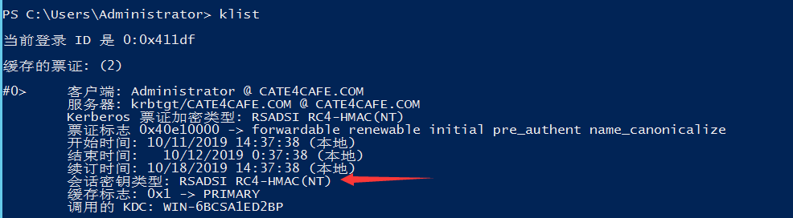

## SPN发现与利用

#### 0x00 关于SPN

服务主体名称（SPN）是Kerberos客户端用于唯一标识给特定Kerberos目标计算机的服务实例名称。	Kerberos身份验证使用SPN将服务实例与服务登录帐户相关联。如果在整个林中的计算机上安装多个服务实例，则每个实例都必须具有自己的SPN。如果客户端可能使用多个名称进行身份验证，则给定的服务实例可以具有多个SPN。通过SPN，可快速定位开启了关键服务的机器，这样就不需要去扫对应服务的端口，有效规避端口扫描动作。

#### 0x01 SPN格式


 服务类和FQDN是必需参数，端口和服务名是可选的

#### 0x02 setspn

setspn是系统自带的查找和设置spn的命令

- 2.1 列出注册的spn

  

  -l参数接受计算机名或者用户名

- 2.2 配置spn

  

- 2.3 在指定的域或林上查询SPN

  

  

#### 0x03 SPN扫描工具

[GetUserSPNS](https://github.com/nidem/kerberoast/blob/master/GetUserSPNs.ps1)


[Find-PSServiceAccounts](https://raw.githubusercontent.com/PyroTek3/PowerShell-AD-Recon/master/Find-PSServiceAccounts)


[Get-SPN2](https://raw.githubusercontent.com/nullbind/Powershellery/master/Brainstorming/ADS/Get-SPN2.psm1)


[GetUserSPNs.py](https://github.com/SecureAuthCorp/impacket/blob/master/examples/GetUserSPNs.py)

支持非域内机器扫描查找

#### 0x04 Kerberoasting

知道相关服务的SPN后，可以用SPN申请一张票据 ST，如果Kerberos 协议设置票据为 RC4加密，则可通过爆破的方式得到服务对应用户的密码。



首先，申请票据，在powershell上

```powershell
Add-Type -AssemblyName System.IdentityModel
New-Object System.IdentityModel.Tokens.KerberosRequestorSecurityToken -ArgumentList "MSSQLSvc/mssql.cate4cafe.com:1433"

```

使用klist查看票据申请是否成功。接着可使用mimikatz导出票据，再通过hashcat爆破即可。或者使用

[Invoke-Kerberoast.ps1](https://raw.githubusercontent.com/EmpireProject/Empire/master/data/module_source/credentials/Invoke-Kerberoast.ps1)导出转换成 John the Ripper 或者 HashCat 能够直接爆破的字符串。

在我们取得了 SPN 的修改权限后，可以为指定的域用户添加一个 SPN，这样可以随时获得该域用户的 TGS ，经过破解后获得明文口令，可以作为一个后门使用

