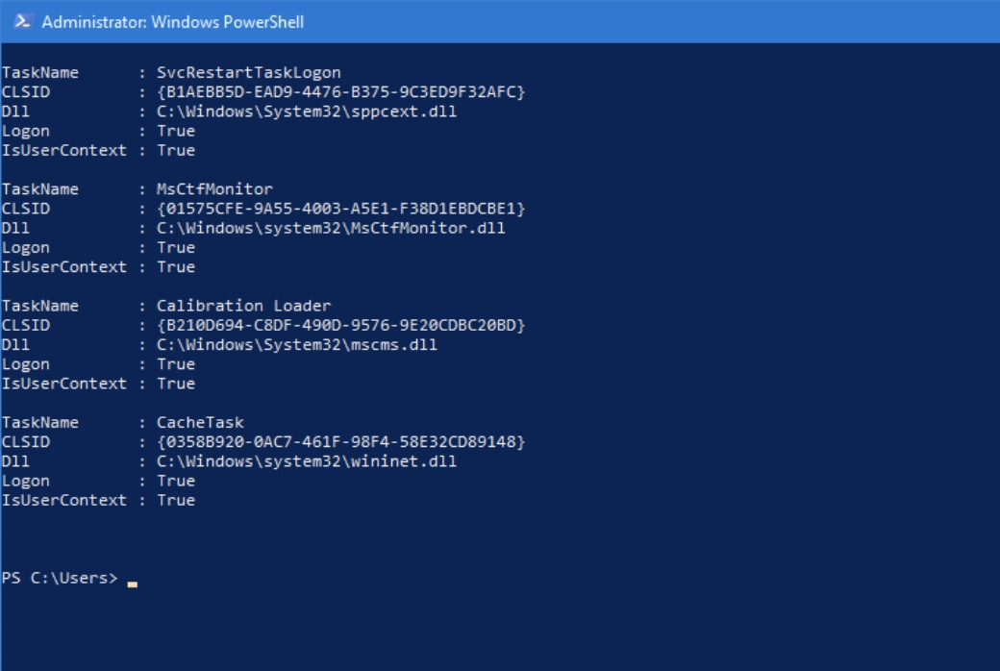

### Windows权限维持--劫持COM对象

#### 0x01 前言

Microsoft在Windows 3.11中引入了组件对象模型（COM），作为一种实现对象的方法，这些对象可以被不同的框架（ActiveX，COM +，DCOM等）使用，并且可以在不同的Windows环境中使用，从而实现互操作性，进程间通信和代码重用。滥用COM对象使攻击者可以代表受信任的进程执行任意代码。执行COM劫持不需要管理员特权，因为HKCU注册表配置单元中的类在HKLM中的类之前执行。COM已被用于持久性，横向移动和逃避防御的几种情况。根据恶意代码执行的方式，在COM劫持期间会使用各种注册表子键：

- **InprocServer/InprocServer32**
- **LocalServer/LocalServer32**
- **TreatAs**
- **ProgID**

上面的子键在以下注册表配置中：

- HKEY_CURRENT_USER\Software\Classes\CLSID
- HKEY_LOCAL_MACHINE\Software\Classes\CLSID

#### 0x02 发现可劫持COM对象

使用Process Monitor来发现缺少CLSID且不需要权限的COM服务，配置如下：

- 操作是RegOpenKey

- 结果: 找不到名字

- 路径: 以InprocServer32结尾

- 排除路径是否以HKLM开头

  

打开文件或执行操作，将得到带有COM对象的注册表键，这些列表可以被劫持，将任意库加载到收信任进程。

此外，可以使用[Get-ScheduledTaskComHandler](https://github.com/enigma0x3/Misc-PowerShell-Stuff/blob/master/Get-ScheduledTaskComHandler.ps1)来发现所有用户登录时执行且容易受到COM劫持的计划任务

`Get-ScheduledTaskComHandler -PersistenceLocations`

可以看到任务"**CacheTask** "在调用时使用“ *wininet.dll* ”并具有以下CLSID：{0358B920-0AC7-461F-98F4-58E32CD89148}。通过劫持该对象指向的DLL，便可以在计划任务启动时执行我们的代码。

#### 0x03 利用

- **InprocServer32**

**InprocServer32** （进程内服务器）注册表项指示COM库在磁盘上的位置，并定义线程模型。

下图展示**InprocServer32中**通常存在的注册表项。

在HKCU中修改上面发现的"**CacheTask** "计划任务对应COM对象的CLSID注册表项里的InProcServer32项指向任意DLL而不是“ *wininet.dll* ”，便可执行我们的dll。

- **LocalServer32**

  **LocalServer32** 指定32位本地服务器应用程序的完整路径。用任意可执行文件在磁盘上的位置替换应用程序的默认值将实现COM劫持。

需要激活对应ClassID

`[activator]::CreateInstance([type]::GetTypeFromCLSID("45EAE363-122A-445A-97B6-3DE890E786F8"))`

该COM对象被调用时，将会执行我们的可执行文件。