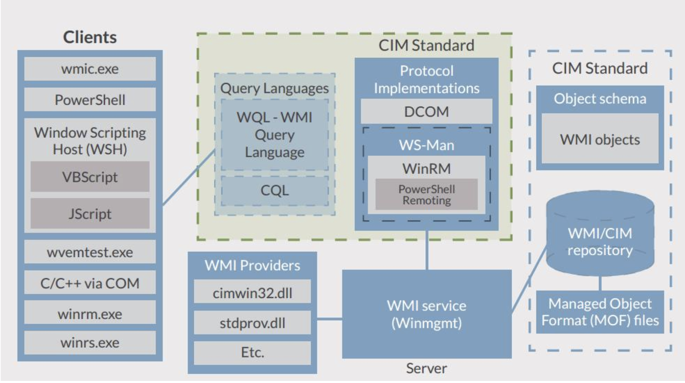
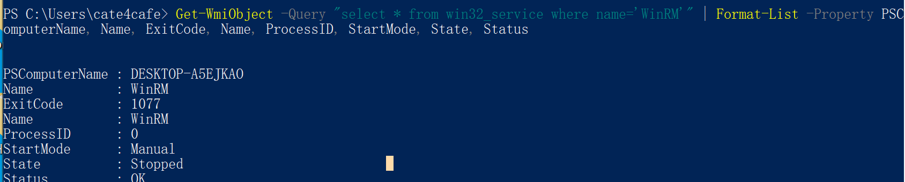
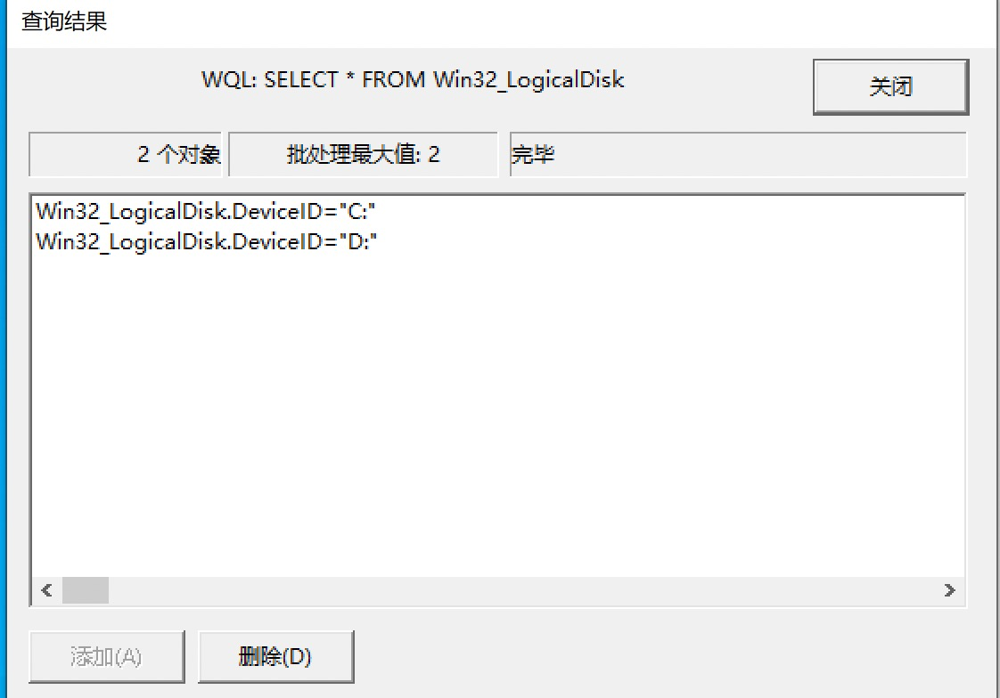
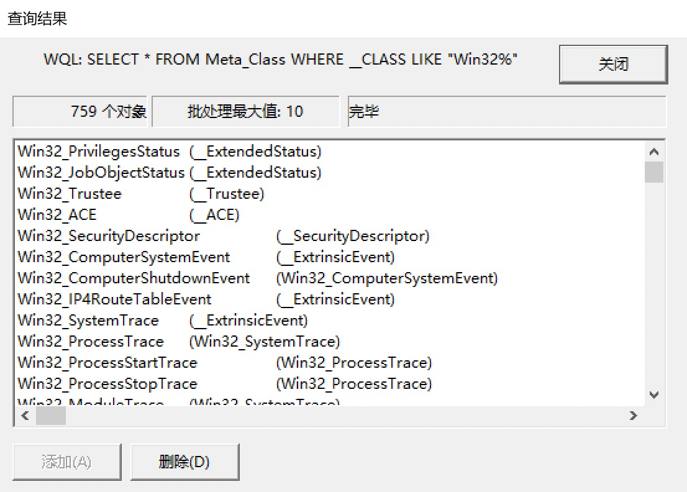
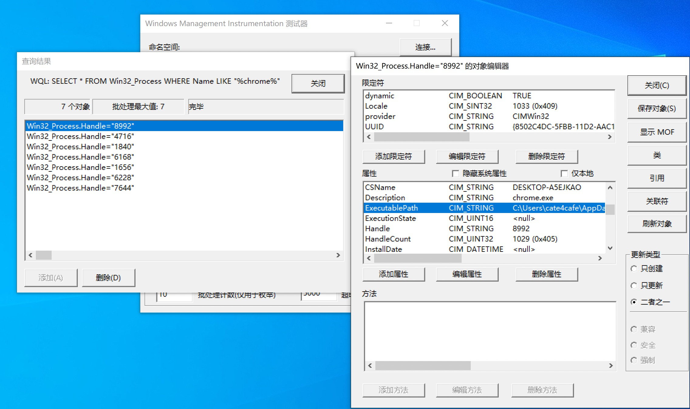
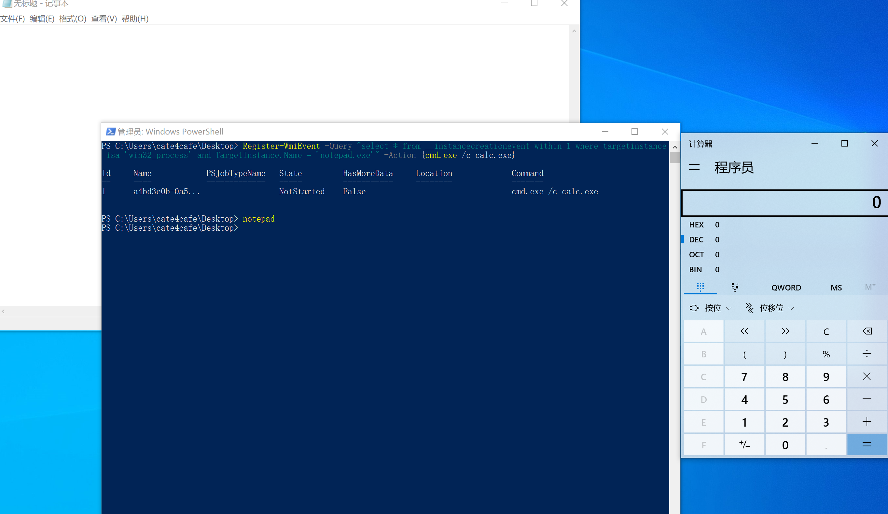

## Windows权限维持——WMI触发器

### wmi简介

**WMI（Windows Management Instrumentation,Windows 管理规范）**是一项核心的 Windows 管理技术。通过它可以访问、配置、管理和监视几乎所有的Windows资源，比如用户可以在远程计算机器上启动一个进程；设定一个在特定日期和时间运行的进程；远程启动计算机；获得本地或远程计算机的已安装程序列表；查询本地或远程计算机的Windows事件日志等等。WMI是对WBEM模型的一种实现。详细的wmi介绍可参考[wmi概述](https://yq.aliyun.com/articles/492860)

fireeye的图显示了wmi的工作结构



### 常用的wmi功能

wmic.exe 是一个与 WMI 进行交互的强大的命令行实用工具。它拥有大量的 WMI 对象的方便记忆的默认别名，但你还可以执行更为复杂的查询。wmic.exe 还可以执行 WMI 方法，攻击者经常用来通过调用 Win32_Process 的 Create 方法来进行横向运动。Wmic.exe 的局限性之一是不能接受调用嵌入的 WMI 对象的方法。

```
wmic qfe list #获取补丁信息
wmic startup list brief # 启动的程序
wmic startup list full # 自启动的程序
wmic process call create "calc.exe" # 在当前机器中执行指定程序
wmic process where name='*.exe' list full   #查询某个进程所对应某个具体的可执行程序是什么
wmic process where(description="rundll32.exe") # 查看rundll32所加载的dll
wmic cpu get DataWidth /format:list # 查询当前机器的操作系统位数
wmic share  get name,path,status  #利用wmic查找共享
wmic /namespace:\root\securitycenter2 path antivirusproduct GET displayName,productState, pathToSignedProductExe     #查看安装的杀软
wmic /node:192.168.17.138 /user:test /password:!@#123QWE process call create "cmd.exe /c net user test1 !@#123QWE /add && net localgroup administrators test1 /add #在远程计算机上执行命令
```

### wmi触发器

#### 前置知识

wmi提供了WQL来查询类和命名空间。下图是以powershell提供的接口查询进程信息



WQL类似于数据库查询语句，wmi中的类，可以理解为数据库中的表，常见的类如下

```
Win32_DiskDrive	系统的硬盘
Win32_PhysicalMedia	任何存储设备，在一般的机器上，包含CD-ROM，物理硬盘，软驱，磁带机等
Win32_BIOS	系统BIOS
Win32_CacheMemory	系统的Cache内存
Win32_MemoryDevice	内存，含相关联的映射地址
Win32_PhysicalMemory	物理内存
Win32_Processor	CPU
Win32_NetworkAdapter	网络适配器，含物理网卡
Win32_NetworkAdapterConfiguration	网络适配器配置
Win32_NetworkAdapterSetting	网络适配器以及其相关设定
Win32_Printer	打印/传真设备
Win32_DesktopMonitor	显示设备
Win32_DisplayConfiguration	显示设备配置
Win32_Desktop	桌面
Win32_Environment	系统环境
Win32_Directory	文件目录，所有的目录
Win32_DiskPartition	磁盘分区
Win32_LogicalDisk	逻辑磁盘
Win32_Process	进程信息
Win32_Account	账户信息
Win32_PerfFormattedData	格式化后的性能数据
Win32_Service	系统服务
```

可以使用系统自带的WQL测试器测试WQL语句



WMI命名空间用于对相同环境中存在的类进行分组，也用于加强安全限制。当请求连接到一个命名空间时会检查用户的权限，这决定命名空间级别的权限。命名空间是一个层次结构，类似文件系统中文件夹的层次结构。常见的命名空间：

```
root

所有命名空间均在这个命名空间下，此命名空间只包含WMI系统类，这些类也会在其它命名空间中出现。（WMI系统类是在名称前面有两个下划线("_")组成，可以非常方便的查询）

root\Default

与windows注册表操作有关的主机类 ，读取、写入、枚举、监视、创建、删除注册表项和值。

root\Security

用于与windows安全有关的类

root\CIMV2

包含从CIM Schema派生的类，它们代表着我们最常工作的win32环境。比如：获取系统信息，管理 Windows 事件日志等

root\MicrosoftIISv2

 IIS WMI 提供程序。 .NET下管理 IIS的API在Microsoft.Web.Administration这个命名空间下。

root\RSOP	策略的结果集
root\Policy	组策略
root\directory\ldap	Active Directory提供程序
```

WQL可以分为三种查询方式：

- Schema: 获取类定义，使用的基本语法的形式与其他类型的查询一样

  

- DATA: 用于获取类实例,它返回特定类的所有实例，包括各自的请求属性集

  

- Event:用于过滤出一个特定事件通知的属性,通常用来在一个WMI对象实例创建/修改/删除的时候给用户发送一个消息。事件表征被管理环境的变更。每个查询允许添加一些附加的操作符，如：
  WITHIN：指定轮询
  GROUP：分组相同的事件
  HAVING：过滤WITHIN和GROUP子句收集事件的通知。一般与NumberofEvents属性（收集事件数量）一起。这样可以侦测何时特定事件的数量超过了时间间隔中设置的极限。

  使用Event查询，可以指定事件过滤后送的消息：

  ```
  LogFileEventConsumer： 将事件数据写入到指定的日志文件
  ActiveScriptEventConsumer： 用来执行VBScript/JScript程序
  NTEventLogEventConsumer：创建一个包含事件数据的日志入口点
  SMTPEventConsumer：将事件数据用邮件发送
  CommandLineEventConsumer：执行一条命令
  ```

  #### 利用

  #### 事件触发条件

  1. 事件筛选器

     事件筛选器描述事件并且执行WQL事件查询。
  
  2. 事件消费者
  
     事件消费者是什么呢？事件消费是一个派生自 __EventConsumer 系统类的类，它表示了在事件触发时的动作。我们常用的消费类有下面两个：
  
     1. ActiveScriptEventConsumer - 执行嵌入的 VBScript 或 JScript 脚本 payload
     2. CommandLineEventConsumer - 执行一个命令行程序
  
  3. 消费者绑定筛选器
  
     消费者绑定筛选器就是将筛选器绑定到消费者的注册机制。
  
  有关WMI事件可查阅https://docs.microsoft.com/en-us/windows/win32/wmisdk/--event
  
  以__InstanceCreationEvent类（监听进程创建）为例，使用powershell绑定一个触发事件。

`Register-WmiEvent -Query "select * from __instancecreationevent within 1 where targetinstance isa 'win32_process' and TargetInstance.Name = 'notepad.exe'" -Action {cmd.exe /c calc.exe}   `

当打开一个notepad进程时，将会打开一个calc



相关利用脚本[WMIBackdoor](https://github.com/mattifestation/WMI_Backdoor/blob/master/WMIBackdoor.ps1)、[Persistence](https://raw.githubusercontent.com/PowerShellMafia/PowerSploit/master/Persistence/Persistence.psm1)

