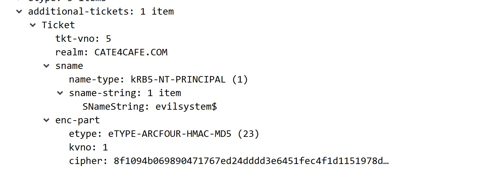

## 1. 流程图


kerberos认证过程涉及四个请求与响应，分别是

```
AS-REQ
AS-REP
TGS-REQ
TGS-REP
```


## 2. 身份预验证阶段

身份预验证阶段，客户端以用户名和密码加密过的身份验证数据（Authenticator）向KDC请求TGT。KDC收到请求后从AD数据库中寻找该用户密码，使用该密码解密Authenticator，如果解密后的Authenticator和KDC上的Authenticator一致，则确认用户身份。之后，生成一个由用户密码加密的Logon Session key以及使用krbtgt用户hash加密的包含用户信息和Logon Session key的TGT并返回给客户端。客户端收到返回后，使用密码解密得到Logon Session key，将Logon Session key和TGT缓存在本地。

### 2.1.AS-REQ

AS-REQ分为四个部分：

```
pvno
msg-type
padata
req-body
```


pvno表示kerberos版本号

Msg-type表示包类型

padata存放了身份认证数据列表

req-body是请求主体

#### padata


padata包含type和value两部分。在as-req阶段，主要涉及**PA-DATA PA-ENC-TIMESTAMP**和**PA-PAC-REQUEST**两种类型

```
PA-ENC-TIMESTAMP是使用存储在本地的用户hash加密的时间戳。etype字段标明了使用的加密方式。在AS接收到as-req之后，使用KDC上存储的用户hash解密这段密文得到一个时间戳，如果时间戳在规定范围内，则验证通过，AS验证了登录用户的有效性。
```

```
PAC是用于访问服务的权限验证扩展。True表示开启了PAC验证，False表示关闭
```

#### Req-body


Kdc-options是32位0/1开关标志位


cname表示此次请求用户的主体名


Name-type:

```
KRB_NT_PRINCIPAL表示用户名
KRB_NT_SRV_INST 表示服务名
KRB_NT_ENTERPRISE_PRINCIPAL表示FDQN
```

realm表示域名称

sname表示服务主体和域名称


etype表示Client支持的加密算法


### 2.2 AS-REP

as-rep相较于as-req，多了ticket和enc-part，没了body


ticket存放了使用krbtgt用户hash加密的数据，用于下一步请求服务时作为身份验证。

Enc-part是使用用户hash加密的Logon session key

### 2.3 涉及攻击手法

#### 2.3.1 用户名枚举

在as-req阶段，如果请求的用户名不存在，会返回指定的错误代码，利用这点可以枚举域用户


#### 2.3.2 AS-REPRoasting

域用户在配置了”不需要kerberos预身份验证)“属性时，在进行Kerberos身份验证时就不需要进行AS_REQ 和AS_REP预身份验证。使用该用户请求票据时，域控不会作任何验证就将 TGT票据 和 该用户Hash加密的Session Key返回。攻击者可以离线破解Session Key,进而得到密码明文。


查找开启"不要求kerberos预身份验证"的用户

```
Get-ADUser -Filter 'useraccountcontrol -band 4194304' -Properties useraccountcontrol | Format-Table name
```

利用rubeus.exe可获得用户hash

```
rubeus.exe asreproast


[*] Action: AS-REP roasting

[*] Target Domain          : cate4cafe.com

[*] Searching path 'LDAP://WIN-BLA6KEJV6V7.cate4cafe.com/DC=cate4cafe,DC=com' for AS-REP roastable users
[*] SamAccountName         : test
[*] DistinguishedName      : CN=test,CN=Users,DC=cate4cafe,DC=com
[*] Using domain controller: WIN-BLA6KEJV6V7.cate4cafe.com (192.168.2.123)
[*] Building AS-REQ (w/o preauth) for: 'cate4cafe.com\test'
[+] AS-REQ w/o preauth successful!
[*] AS-REP hash:

      $krb5asrep$test@cate4cafe.com:1831E1C0B27472。。。。。。
```

#### 2.3.3 密码爆破

as-req在密码不正确时会返回错误状态码24,可以据此爆破用户密码


#### 2.3.4 pth

在as-req里得到身份验证数据段padata里的数据是使用用户hash加密的，因此在有hash的情况下也可以进行身份验证。

#### 2.3.5 黄金票据

在as-rep返回的ticket采用的是krbtgt用户hash加密，所以只要拥有krbtgt账户hash就可以构造任意用户的TGT

### 2.4 插一句

在每次预身份验证请求之前，都会有一次预身份验证失败的返回


查了资料说是因为不支持的加密方式导致认证失效，但这次请求在AS-REQ包里的padata字段是没有有效内容的


猜测这个包是用来协商两端加密算法的。

## 3. 服务票据授予阶段

此阶段，客户端向TGS请求ST，请求内容包括用户名、经Logon Session Key加密的Authenticator、请求访问的服务名、TGT。接受到请求后，TGS使用krbtgt用户密钥解密TGT得到用户信息和Logon Session Key，然后使用Logon Session Key解密出Authenticator并与KDC的Authenticator比对，一致后确认用户身份。之后，TGS生成一个经Logon Session Key加密的Service Session Key，生成ST（包含请求用户的信息以及原始Logon Session Key），然后将Service Session Key和ST返回给客户端。

### 3.1 TGS-REQ

TGS-REQ数据包主要分为padata和req-body两个字段


其中req-body和AS-REQ的相差不多，不做赘述。而padata则是包含了AS-REP中得到的ticket和经过Logon session key加密的Authenticator


### 3.2 TGS-REP

TGS-REP包含了TGS返回的经由所请求服务密钥加密过Service Ticket以及经由Logon Session Key加密的Service Session Key。


这里的ticket是Service Ticket，也叫TGS。enc-part是Service Session Key。

### 3.3 涉及攻击手法

#### 3.3.1 kerberosting

在TGS-REP中的ticket是使用所请求服务的NTLM hash加密的，如果获取到服务ticket，在一定条件下(RC4_HMAC_MD5加密类型)是可以爆破出服务的hash。

#### 3.3.2 白银票据

由于服务票据由服务主体的hash加密，在拥有服务hash之后，可为任意用户颁发TGS票据(白银票据)而不用经过KDC。这个tgs票据只能访问该服务，一般作为后门使用。

#### 3.3.3 PTT

票据传递。在kerberos协议中，只有第一步身份预认证阶段需要到用户的ntlm hash，剩下的都是通过TGT和TGS校验身份。拿到票据之后，可以通过PTT来进行身份校验。

## 4. S4U扩展协议

S4U是是微软为Kerberos做的协议转换扩展协议，主要有S4U2self和S4U2proxy。将非kerberos协议的身份验证转换为kerberos。

### 4.1 S4U2self

当用户以其他方式(如NTLM认证，基于表单的认证等方式)与Web服务器进行认证后，用户是无法向Web服务器提供请求该服务的服务票据TGS的。而被设置为*TrustedToAuthForDelegation*的服务能够调用S4U2Self向认证服务器为任意用户请求访问自身的可转发的服务票据。

### 4.2 S4U2proxy

S4U2proxy允许服务账户或主机账户使用S4U2self请求的可转发票证向msds-allowedtodelegateto属性中指定的SPN对应的服务请求TGS，并且代表用户访问该服务，且只能访问该服务。

### 4.3 流程


1. 用户登录
2. KDC返回TGT
3. 请求可转发的TGT
4. 返回可转发TGT
5. 向KDC请求Service1 TGS
6. KDC返回Service1 TGS
7. 请求Service1
8. Service1向KDC请求Service2的TGS
9. KDC返回Service2的TGS给Service1
10. Service1请求Service2
11. Service2返回请求结果到Service1
12. Service1将Service2返回请求结果返回给用户

### 4.4 协议包分析

协议包是使用rubeus复现基于资源委派攻击时抓到的数据包


这里没有涉及到用户，直接是计算机账户去请求KDC获取可转发TGT。AS-REQ和AS-REP是向KDC验证计算机账户的身份和获得自身的可转发的TGT。


**第一次TGS-REQ&TGS-REP**

此次请求是s4u2self，是服务(这里是计算机账户evilsystem$)向KDC请求任意用户(这里是administrator)访问自身的可转发TGS。


相较于没有s4u扩展的TGS-REQ，这里多了PA-FOR-USER字段。这个字段用于向KDC标志本次s4u2self是请求administrator用户请求访问自身服务的TGS。同时设置了请求TGS可转发标志。相应的，TG-REP也标志了请求的用户

**第二次TGS-REQ&TGS-REP**

此次请求是s4u2proxy,用上一步获得的TGS请求访问指定服务(这里是cifs/mail.cate4cafe.com)的TGS。


这里多了PA-PAC-OPTIONS字段，标志本次是基于资源的委派。


sname标志此次申请的对cifs/mail.cate4cafe.com访问的TGS。



在最后，附加了上一步中获得可转发tickets。TGS-REP则是返回了以administrator访问cifs/mail.cate4cafe.com的TGS


### 4.5 涉及的攻击手法

委派是指服务账户或者计算机用户可以代理用户去访问其他服务。换个说法就是用户委托服务账户或者计算机用户以用户身份去访问其他服务。

#### 4.5.1 非约束委派攻击

当用户发送TGS来访问设置了非约束委派的服务，它将在同一个请求中附加其TGT，服务提取用户的TGT并将其保存在服务器的LSASS中，以备后用。然后，该服务将能够模拟用户请求网络内（AD林）的任何服务。当拥有配置了非约束委派的服务账户权限，可以诱导域管访问该服务，此时域管会将自身TGT发送到服务并被服务缓存在本地。将域管TGT导出就拥有了域管的权限。

#### 4.5.2 约束委派攻击

允许系统管理员限制模拟帐户可以连接的服务。它依赖于服务主体名称（SPN）来标识哪些服务可以接收委托凭据。系统管理员必须在运行前端应用程序的安全主体上注册SPN，并确保林中没有重复的SPN。由于约束委派是在前端服务器上管理的，因此后端服务器管理员无法控制谁可以访问其资源。约束为派需要域管理员权限来管理受约束的委派，仅限于同一域中的安全主体，即没有跨域或跨林范围。当拥有配置了约束委派的服务账户权限，就可以利用这个服务代表任意用户调用s4u2self请求一个针对特定服务的可转发票据。进而调用s4u2proxy获取一个可访问该特定服务的TGS。

#### 4.5.3 基于资源的委派攻击

Windows Server 2012中的基于资源的约束委派通过消除对SPN的依赖，对域管理员权限的需求，允许资源所有者控制委派并提供跨域委派来改进约束委派模型。它适用于计算机帐户，用户帐户和服务帐户。基于资源的委派允许服务自身设置可接受委派的来源而不需要管理员配置。这意味着在拥有普通域用户权限的前提下，可以新建一个服务或者计算机账户，为其配置基于资源的委派，从而利用S4U协议来获取对指定服务的访问权限。

#### 4.5.4 约束委派和基于资源的委派区别

- 权限：约束委派的配置需要域管权限，基于资源的委派只需要对服务有GenericAll、GenericWrite、WriteProperty、WriteDacl等可修改账户属性的权限
- SPN：约束委派需要SPN，基于资源的委派不需要SPN
- 委派方向：约束委派规定了服务可以委派到哪些服务；基于资源的委派是服务设置了哪些服务可以委派给自身。
