## `利用DNS协议SOA记录作为C2通道

### 0x01 前置知识

#### DNS域名系统和区域

**域名系统**是域的层次结构。 该层次结构从名为“ **.** ”的“根”域开始。 根域的下面是顶级域，例如“com”、“net”、“org”、“uk”或“jp”。 再往下是二级域，例如“org.uk”或“co.jp”。 DNS 层次结构中的域遍布全球，由世界各地的 DNS 名称服务器托管。

**DNS 区域**用来管理某些特定域的 DNS 记录。

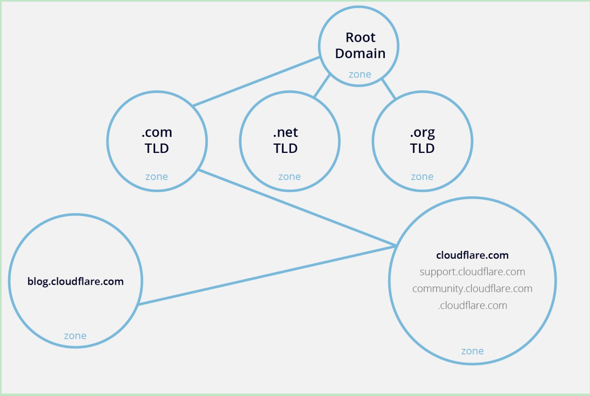

如图所示，cloudflare.com区域管理着support、community区域。每个层级由大小写字母、数字、连接符组成，每个层级长度不超过63个字符，整个域名长度不能超过253个字符。整个DNS协议长度一般不超过512字符。

#### DNS常用记录

**A**    **记录**    -- 用于指定域名对应的IP地址记录

**NS  记录**   -- 域名服务器记录，用来指定该域名由哪些DNS服务器来进行解析

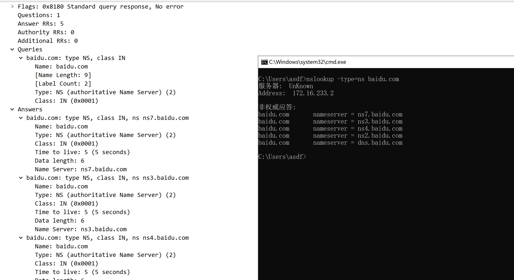

**TXT记录**   -- 为域名做的说明，常用于[SPF](https://service.exmail.qq.com/cgi-bin/help?subtype=1&id=20012&no=1000580)

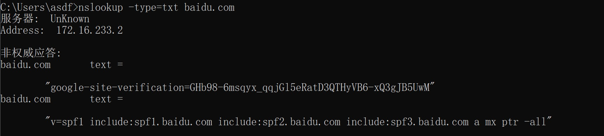

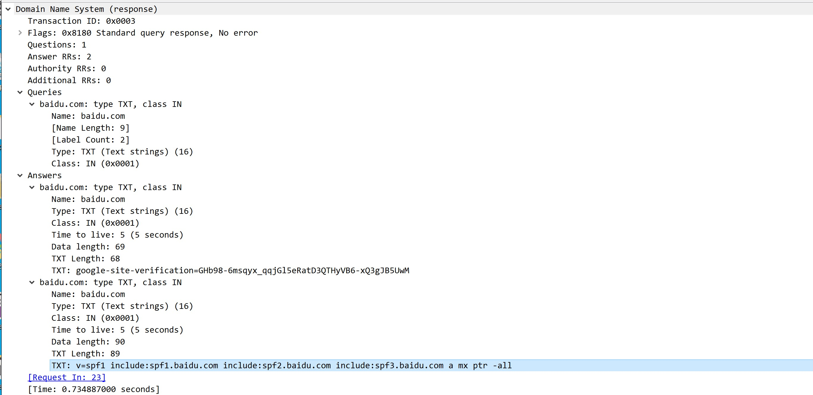

**SOA记录**  -- 起始授权机构记录(权威应答)。记录了该DNS区域的ns记录中主dns服务器信息

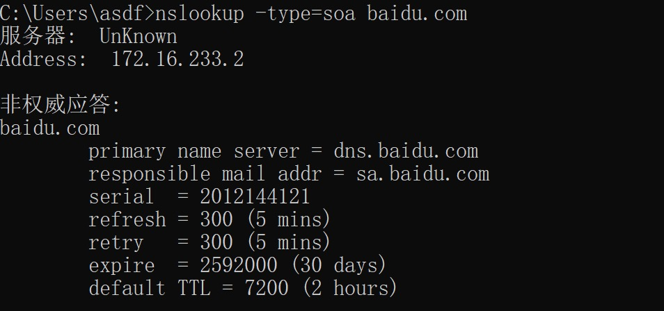

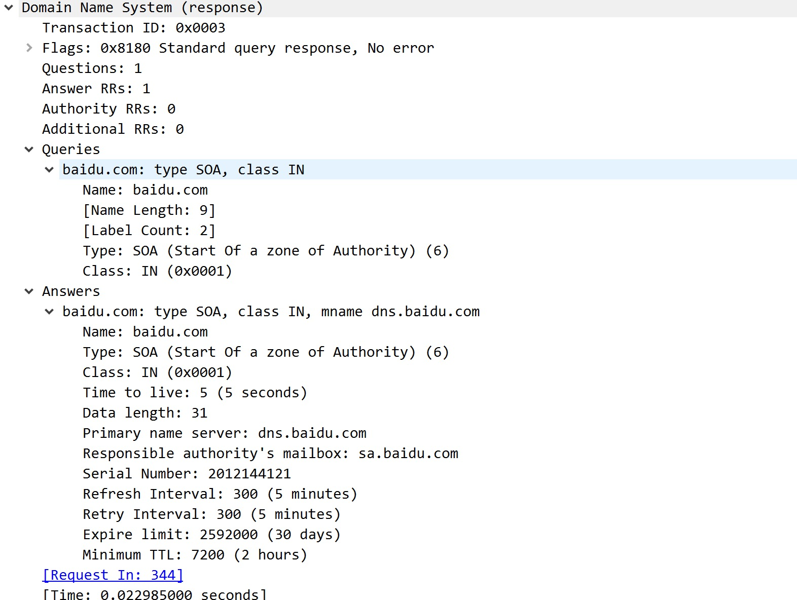

当我们指定SOA记录指向的DNS服务器来解析时，返回的应答就是权威应答，nslookup的返回结果就没有 **非权威应答** 字样

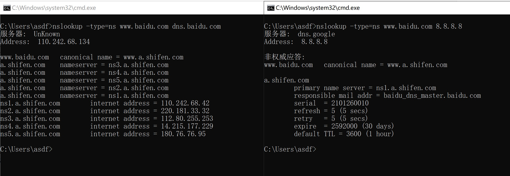

#### DNS协议格式

### 0x02 Cobalt Strike隧道信道分析

#### 上线配置

以CS 4.0为例。首先配置一个A记录指向NS记录指向CS服务器，然后配置NS记录指向A记录

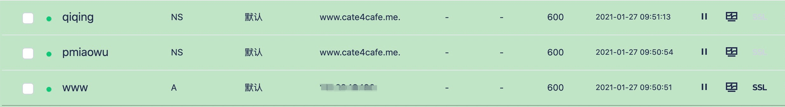

CS上配置如下

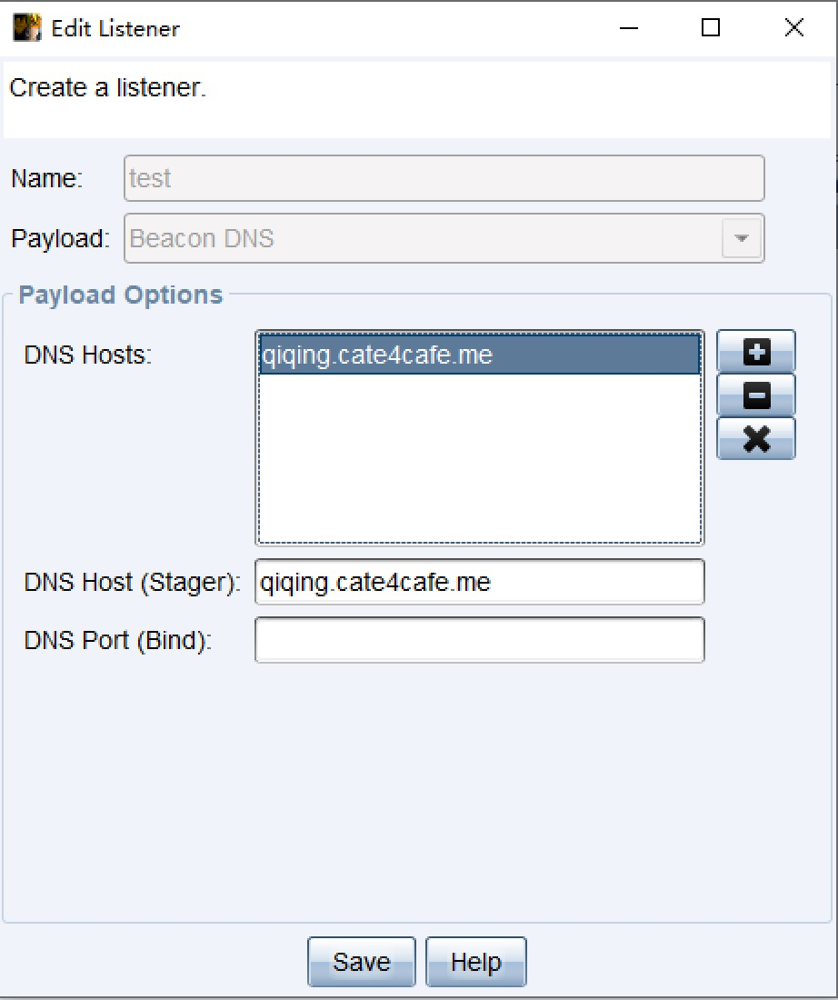

#### 上线过程

执行生成的可执行文件之后，beacon会向CS服务器请求下发stage。通过wireshark抓包，看到请求stage下发是通过txt记录

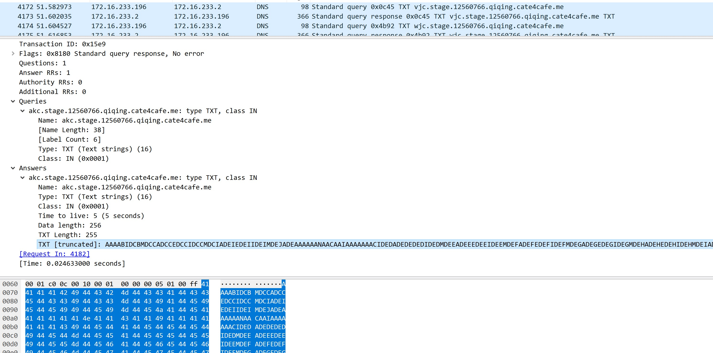

在beacon上线之后，执行checkin，使beacon强制回连CS，beacon就会发送心跳到CS上。通过wireshark可以看到，beacon在心跳间隔以A记录请求的方式来作为心跳标志告知CS。在当前没有任务执行时，CS以0.0.0.0应答beacon心跳的A请求。当有任务需要执行时，CS以0.0.0.242应答beacon。beacon收到该应答后，向CS请求api.xxx.xxx.qiqing.cate4cafe.me的A记录，CS则以0.0.0.64应答之，并将要执行的任务准备以TXT记录应答的形式下发。beacon收到应答之后，向CS 请求api.xxx.xxx.qiqing.cate4cafe.me的TXT记录，CS则以命令应答。beacon收到txt应答，解析出命令并执行，将结果以A请求的方式回传CS。为了区分回传数据和心跳的A请求，回传数据的A请求以post作为标志(post.回传数据.qiqing.cate4cafe.me)。

下图为心跳包

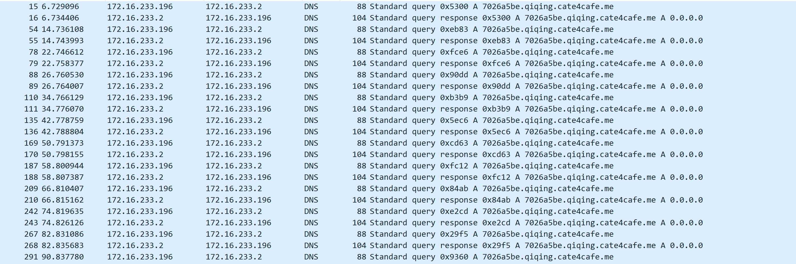

下图为执行命令

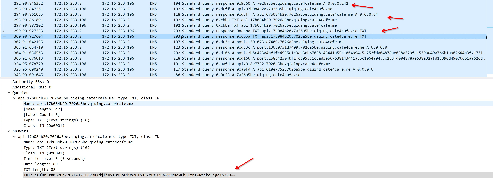

#### 流程图

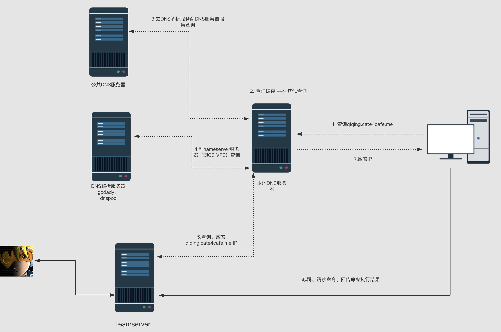

### 0x03 利用SOA记录作为通道

看一个正常的SOA请求

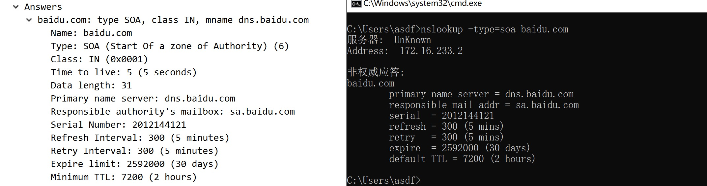

cmd里非权威应答下的baidu.com，表示区域根是baidu.com。

**primary name server**  表示负责解析该域名的主dns服务器；

**responsible mail addr**  表示该区域管理人的邮箱，sa.baidu.com等价于sa@baidu.com;

**Serial number**  反映域名信息变化的序列号，每次域名信息变化该项数值需要增加，从服务器将检查主服务器的区域序列号是否大于它们在系统上的序列号，如果是，它请求新的区域文件(区域文件是存储在 DNS 服务器中的纯文本文件，其包含区域的实际表示，并且包含区域内每个域的所有记录，区域文件必须始终从区域根开始)，如果不是，它继续使用原始文件。

**Refresh Number** 从DNS服务器隔一定时间会查询主DNS服务器中的序列号是否增加，即域文件是否有变化。这项内容就代表这个间隔的时间，单位为秒

**Retry Interval** 表示如果备用服务器无法连上主服务器，过多久再重试，单位为秒

**Expire limit** 当备用DNS服务器无法联系上主DNS服务器时，备用DNS服务器可以在多长时间内认为其缓存是有效的，并供用户查询

**Minimum TTL** 缓存DNS服务器可以缓存记录多长时间，单位为秒

其中，**primary name server**和**responsible mail addr**可以作为携带数据的载体，从而替换TXT记录请求。**Serial number**这些记录则可以作为标志位来指示客户端这个应该是心跳应答还是需要执行命令的应答

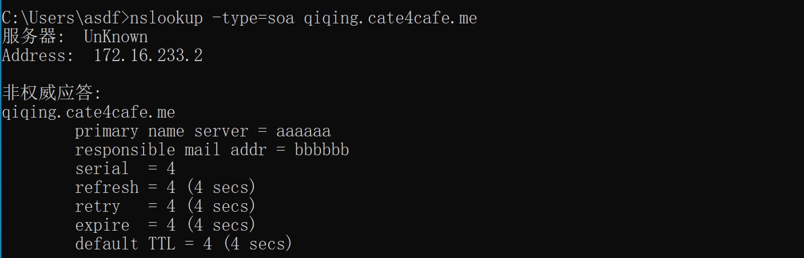

demo

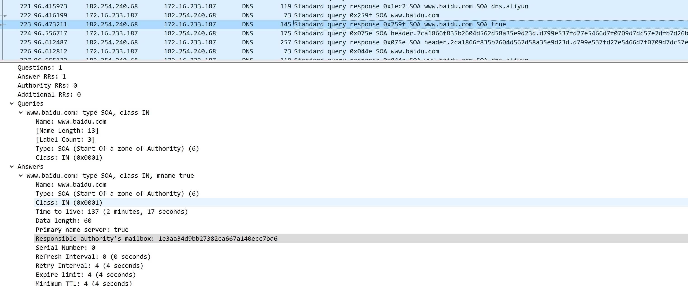