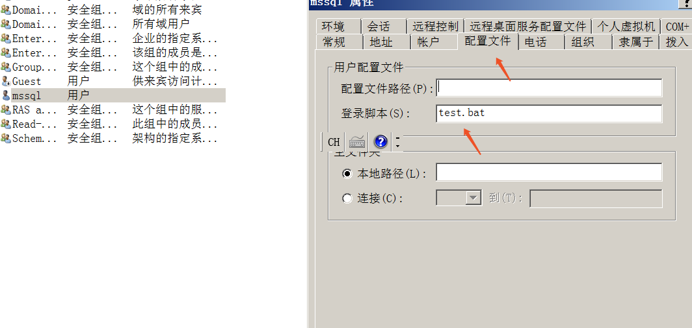

### 内网横向系列 ——域脚本

​	设置了域登录脚本的用户，在登录域时，会自动在当前登录机器触发脚本。域脚本存放在`\\域控\SYSVOL\sysvol\域名\SCRIPTS\`目录下，该目录为域共享目录，域内主机皆有访问权限。在拥有域管权限的前提下，知道域用户而不知道其登录机器、无法使用其他如psexec、wmi、smbexec等方式都可以尝试使用域脚本横向。以及，在给某个用户配置了黄金票据后，可以设置该用户的域脚本，其每次登录触发，以作权限维持用。以下介绍三种为域用户设置域脚本的方法：

- **域控上设置域用户属性**

直接登录域控为域用户设置登录脚本属性，比较暴力



配置文件路径默认为NETLOGON目录，即`\\域控\Windows\SYSVOL\sysvol\域名\SCRIPTS\`，域内机器可通过Admin$访问到该目录

- **net user**

  ```
  net user mssql /domain /scriptpath:test.bat //有域管权限即可，不必在域控上执行
  gpupdate /force //立即刷新组策略使配置生效
  ```

- **RSAT**

RSAT是微软的一套远程服务器管理工具，包含有域管理部分，可在win7-win10上通过powershell运行相关配置命令。

```powerhell
Import-Module Microsoft.ActiveDirectory.Management.dll
Set-ADUser -Identity ADUSER -ProfilePath "filepath" -ScriptPath "filename"
```

RSAT还可用于域内信息的收集、配置域，参考[Active Directory](https://ss64.com/ps/ad.html)

- ### dsmod

  ```
  dsmod -loscr "test.bat" "CN=mssql,CN=Users,DC=cate4cafe,DC=com"
  ```

  