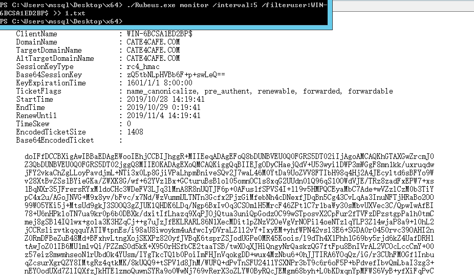

# 防御域内委派攻击

## 1. 前置

### 0x00委派

​		Kerberos 委派允许一个帐户模拟另一个帐户来访问资源。 例如，用户通过Web服务器请求数据，但是所需的数据存储在其他数据库服务器中，此时，web服务器可利用委派功能来模拟用户去访问数据库服务器。委派有三种类型：无约束委派、约束委派、基于资源的委派。

- 无约束委派：当用户发送TGS来访问设置了无约束委派的服务，它将在同一个请求中附加其TGT，服务提取用户的TGT并将其保存在服务器的LSASS中，以备后用。然后，该服务将能够模拟用户请求网络内（AD林）的任何服务。涉及到Kerberos认证流程，请参考[Kerberos原理](http://www.ahathinking.com/archives/243.html)

  

- 约束委派： Windows Server 2003中引入了约束委派，它允许系统管理员限制模拟帐户可以连接的服务。它依赖于服务主体名称（SPN）来标识哪些服务可以接收委托凭据。系统管理员必须在运行前端应用程序的安全主体上注册SPN，并确保林中没有重复的SPN。由于约束委派是在前端服务器上管理的，因此后端服务器管理员无法控制谁可以访问其资源。约束为派需要域管理员权限来管理受约束的委派，仅限于同一域中的安全主体，即没有跨域或跨林范围。

- 基于资源的委派：Windows Server 2012中的基于资源的约束委派通过消除对SPN的依赖，对域管理员权限的需求，允许资源所有者控制委派并提供跨域委派来改进约束委派模型。它适用于计算机帐户，用户帐户和服务帐户。


  ### 0x01 MS-RPRN

  ​		MS-RPRN--打印系统远程协议，基于RPC（Remote Procedure Call）的一种协议，支持客户端和服务器之间的同步打印和联机操作，包括打印任务控制以及打印系统管理。此外，打印系统远程协议只使用了基于命名管道的RPC。因此，源和目标服务器会通过445端口建立网络连接。可以利用[SpoolSample](https://github.com/leechristensen/SpoolSample) 通过 MS-RPRN RPC 接口来强制到其他 Windows 主机的身份验证。

### 0x03 S4U2self 和 S4U2proxy

​		S4U2self 和 S4U2proxy是对Kerberos 的扩展，详细内容可参考[微软说明文档](https://docs.microsoft.com/en-us/openspecs/windows_protocols/ms-sfu/36d103d2-61a6-42d5-a725-74de3205cdaf)

## 2.无约束委派存在威胁

​			本段以测试环境演示无约束委派存在的威胁。

​			环境：域控 WIN-6BCSA1ED2BP.cate4cafe.com

​						域机器 mssql.cate4cafe.com

### 0x01环境配置

​			环境设置，为机器账户设置无约束委派

​			

使用powerview或者ADModule等工具可以枚举出域内设置了委派的用户。


域控默认开启无约束委派设置。

### 0x02攻击步骤

以攻击机器用户为例，攻击前提需要我们先获得mssql.cate4cafe.com机器的管理员或system权限。假设我们已获取到system权限，以该权限启动执行rubeus.exe monitor /interval:5 /filteruser:域控$   。下一步利用SpoolSample强制域控连接MSSQL进行身份认证，rubeus就可以获得DC的认证请求，导出其中的TGT。


有时需要多执行两三次。



上图看到已经导出了base64编码的Ticket，再利用Rubeus将Ticket导入mssql，就有了dcsync权限


​		假如域内服务用户开启了无约束委派，在服务用户运行服务的主机上会存储用户的TGT，直接用mimikatz便可导出。这种攻击方法，除了可以用于攻击域内机器获取相应TGT，还可以在获得域控权限的条件下，用于作为后门以持续控制。

## 3.约束委派存在的威胁

​	本段以测试环境演示约束委派存在的威胁。

​	环境：域控 WIN-6BCSA1ED2BP.cate4cafe.com

​				域用户 mssql

​	前提：已有约束委派用户的密码或NTLM

### 	0x01环境配置

​	域内服务用户才可以开启委派，可使用SETSPN或者ADSI为域用户设置SPN使其成为服务账户。以ADSI为例，选中用户-属性-servicePrincipalName-编辑，添加一个服务


设置userAccountControl,添加TRUSTED_TO_AUTH_FOR_DELEGATION属性使其能使用s4u协议


属性值对照表如下：


这里只要在原有值上加上TRUSTED_TO_AUTH_FOR_DELEGATION对应的十进制值即可。比如我原始值是66048(512+65536,表示是典型默认账户+密码永不过期)，加上TRUSTED_TO_AUTH_FOR_DELEGATION值16777216就是前面对应的16843264。

设置msds-allowedtodelegateto值为要委派的服务，比如cifs(访问目标文件)，ldap(dcsync)。这里委派域控上的cifs服务。


设置完后是这样


所以，我们可以通过Get-DomainUser来获取域内开启了约束委派的用户

```powershell
Get-DomainUser -TrustedToAuth -Properties distinguishedname,useraccountcontrol,msds-allow
edtodelegateto | fl
```

​	

### 0x02攻击步骤

- 为用户申请TGT

  

  这里可以用/key参数代替/password使用ntlm申请票据。

- 执行执行 S4U2Proxy，以cate4cafe\administrator用户身份请求访问CIFS的TGS

  

- mimikatz导入TGS后，可以访问到域控文件

  

## 4.防御

​		查找为所有类型的委派配置的用户帐户，计算机帐户和托管服务帐户。在“ Active Directory用户和计算机（ADUC）”中分别配置帐户，使用“帐户敏感且无法委派”标志来阻止各种委派。在所有域控制器的高级审核策略中启用Kerberos审核，并监视从委派帐户到未批准服务的票证，在使用无限制的委托帐户服务器上设置出站防火墙规则。